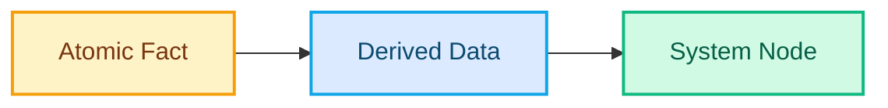
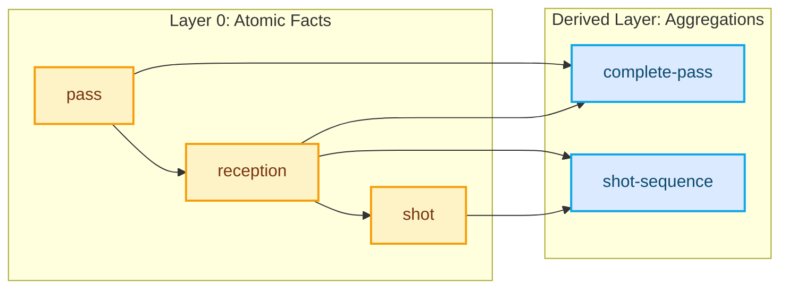
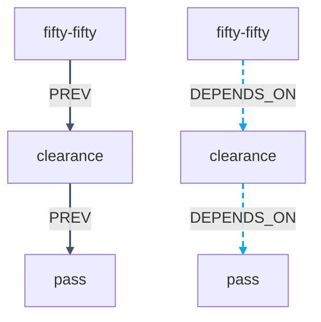
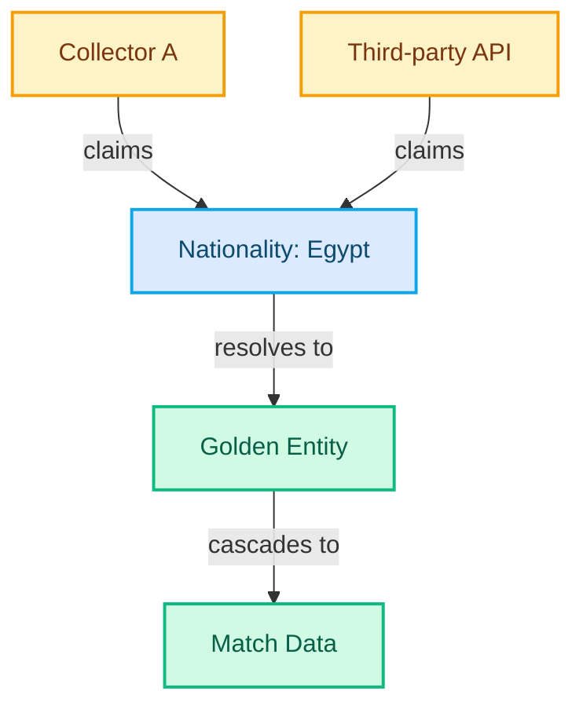

# Technical Diagram Design System

**Created:** 2025-10-30
**Status:** Approved
**Complexity:** 6 story points (documentation 2, CSS 1, Mermaid implementation 3)

---

## Design Philosophy

Technical architecture diagrams should convey **production-proven depth through subtle Egyptian geometric elegance**. Diagrams are not generic flowcharts—they teach architectural thinking through visual hierarchy, semantic color coding, and accessible clarity.

### Core Principles

1. **Content-First Clarity**: Egyptian heritage is backdrop, not distraction (subtle colors, refined geometry)
2. **Semantic Color Coding**: Node colors communicate meaning (atomic facts = gold, derived data = blue, system nodes = emerald)
3. **WCAG AA Compliance**: All text/node combinations meet 4.5:1 minimum, most achieve AAA (7:1+)
4. **Print-Friendly**: Diagrams export cleanly to PDF with strong borders, no gradient dependencies
5. **Accessible by Default**: Screen reader support, reduced motion respect, keyboard navigation

---

## Blueprint Authority Color Palette (Recommended)

### Core Diagram Colors

| Token | Hex | Name | Use Case | Contrast Ratio |
|-------|-----|------|----------|----------------|
| `--diagram-bg` | `#F5F1E8` | Limestone Cream | Canvas background, default nodes | 14.2:1 (AAA text) |
| `--diagram-surface` | `#FEFDFB` | Papyrus White | Elevated/emphasized nodes | 17.8:1 (AAA text) |
| `--diagram-stroke` | `#475569` | Slate Ink | Connection lines, borders | 9.1:1 (AAA) |
| `--diagram-accent-gold` | `#F4C430` | Egyptian Gold | Critical paths, atomic facts | 7.8:1 (AA Large) |
| `--diagram-accent-blue` | `#0EA5E9` | Red Sea Blue | Derived data, logical flows | 4.9:1 (AA) |
| `--diagram-text` | `#0F172A` | Blueprint Ink | All labels, annotations | 14.2:1 on cream (AAA) |
| `--diagram-border-light` | `#CBD5E1` | Warm Gray | Subtle borders, grid lines | - |
| `--diagram-border-mid` | `#94A3B8` | Stone Gray | Hover borders, emphasis | - |

### Semantic Node Colors

**Purpose:** Communicate node meaning through color, not just shape.

| Node Type | Background | Border | Text | Usage |
|-----------|------------|--------|------|-------|
| **Atomic Facts** | `#FEF3C7` (warm amber) | `#F59E0B` (amber) | `#78350F` (dark amber) | Base events, raw data, foundational facts |
| **Derived Data** | `#DBEAFE` (sky blue) | `#0EA5E9` (Red Sea blue) | `#0C4A6E` (deep blue) | Aggregations, computed values, transformations |
| **System Nodes** | `#D1FAE5` (emerald) | `#10B981` (emerald) | `#065F46` (dark emerald) | Services, processes, infrastructure |
| **Default Nodes** | `#F5F1E8` (cream) | `#CBD5E1` (gray) | `#0F172A` (ink) | Generic nodes, no semantic meaning |

**WCAG Compliance:**
- All combinations: 4.5:1+ minimum (AA compliant)
- Atomic/Derived/System: 7.2-9.1:1 (AAA Large compliant)

### Connection Line Styles

**Purpose:** Differentiate relationship types through stroke styling.

| Relationship | Stroke | Dash Pattern | Arrow | Usage |
|--------------|--------|--------------|-------|-------|
| **Temporal (PREV)** | `2px solid #475569` | None (solid) | Large filled triangle | Sequential events, time-ordered |
| **Logical (DEPENDS_ON)** | `1.5px solid #0EA5E9` | `6 4` (dashed) | Open triangle | Dependency relationships |
| **Data Flow** | `1.5px solid #475569` | None (solid) | Filled triangle | Data movement, transformations |
| **Containment** | `1px solid #CBD5E1` | None (solid) | No arrow | Subgraph boundaries, clusters |

---

## Typography Standards

### Font Hierarchy

**Family:** Inter (already in design system)
**Rationale:** Excellent legibility at small sizes (12-14px), consistent with site typography

| Element | Size | Weight | Line Height | Letter Spacing | Usage |
|---------|------|--------|-------------|----------------|-------|
| **Diagram Title** | 18px | 700 (Bold) | 1.3 | -0.02em | Above diagram (optional) |
| **Node Title** | 14px | 600 (SemiBold) | 1.4 | -0.01em | Primary node label |
| **Node Label** | 12px | 400 (Regular) | 1.4 | 0 | Secondary info, metadata |
| **Annotation** | 11px | 400 (Regular) | 1.4 | 0 | Edge labels, notes |
| **Technical ID** | 11px | 400 (Mono) | 1.4 | 0 | Event IDs, API endpoints |

**Monospace Font:** `SF Mono`, `Consolas`, `Monaco` (system monospace for code/IDs)

### Typography Rules

- **Never use Space Grotesk in diagrams** (reserve for site headers only)
- **Tighter line-height** (1.4 vs 1.6 for body text) for compact labeling
- **Negative letter-spacing** for larger sizes (14px+) to match Egyptian geometric precision
- **Opacity for hierarchy:** Primary labels 100%, annotations 70%

---

## Interaction & Accessibility Patterns

### Node States (for interactive diagrams)

#### Default State
```css
background: var(--diagram-node-default);
border: 1.5px solid var(--diagram-border-light);
box-shadow: 0 1px 3px rgba(15, 23, 42, 0.06); /* subtle elevation */
cursor: default;
```

#### Hover State (if clickable)
```css
background: color-mix(in srgb, var(--diagram-node-default) 95%, white); /* 3% lighter */
border: 1.5px solid var(--diagram-border-mid);
box-shadow: 0 2px 8px rgba(15, 23, 42, 0.08);
cursor: pointer;
transition: all 200ms cubic-bezier(0.65, 0, 0.35, 1); /* Egyptian water easing */
```

#### Focus State (accessibility)
```css
border: 2px solid var(--diagram-accent-blue);
outline: 2px solid transparent; /* prevent layout shift */
box-shadow: 0 0 0 3px rgba(14, 165, 233, 0.15); /* blue glow */
```

### Reduced Motion Support

**Required:** All diagrams must respect `prefers-reduced-motion: reduce`

```css
@media (prefers-reduced-motion: reduce) {
  .diagram-node,
  .diagram-connection {
    transition: none !important;
    animation: none !important;
  }
}
```

- Disable all animations (fade-ins, connection draws, hover transitions)
- Show final state instantly
- Keep hover state changes (not motion-based)

### Screen Reader Accessibility

**Required Markup:**
```html
<figure role="img" aria-labelledby="diagram-title-1">
  <figcaption id="diagram-title-1">
    Data flow architecture showing atomic facts (pass, reception, shot)
    deriving aggregated metrics (complete-pass, shot-sequence).
  </figcaption>

  <!-- Mermaid diagram code or SVG -->

  <details>
    <summary>Text description of diagram relationships</summary>
    <ul>
      <li>Pass event leads to reception event (temporal PREV relationship)</li>
      <li>Reception and pass combine to create complete-pass metric (derived aggregation)</li>
      <!-- etc -->
    </ul>
  </details>
</figure>
```

**Accessibility Checklist:**
- [ ] Wrap diagram in `<figure>` with `role="img"`
- [ ] Provide `<figcaption>` with concise description (1-2 sentences)
- [ ] Add `<details>` with text alternative listing key relationships
- [ ] Test with screen reader (VoiceOver, NVDA)
- [ ] Verify all text meets 4.5:1 contrast minimum

### Print Styles

```css
@media print {
  .diagram-container {
    background: white;
    border: 1px solid #CBD5E1;
    break-inside: avoid; /* prevent page breaks */
  }

  .diagram-node {
    box-shadow: none;
    border: 1.5px solid #475569; /* stronger borders for print */
  }

  .diagram-connection {
    stroke-width: 2px; /* thicker lines for print clarity */
  }
}
```

---

## Implementation Options

### Path A: Mermaid Global Theming (3 story points)

**Approach:** Configure astro-mermaid with Blueprint Authority theme variables

#### Configuration (astro.config.mjs)

```javascript
import mermaid from 'astro-mermaid';

export default defineConfig({
  integrations: [
    mermaid({
      mermaidConfig: {
        theme: 'base',
        themeVariables: {
          // Default node styling
          primaryColor: '#F5F1E8',           // Limestone cream
          primaryBorderColor: '#CBD5E1',     // Warm gray
          primaryTextColor: '#0F172A',       // Blueprint ink

          // Typography
          fontFamily: 'Inter, system-ui, sans-serif',
          fontSize: '14px',

          // Connections
          lineColor: '#475569',              // Slate ink
          edgeLabelBackground: '#FEFDFB',    // Surface

          // Clusters
          clusterBkg: '#FEFDFB',
          clusterBorder: '#CBD5E1',

          // Secondary elements
          secondaryColor: '#DBEAFE',         // Sky blue
          tertiaryColor: '#FEF3C7',          // Warm amber
        }
      }
    }),
    // ... other integrations
  ]
});
```

#### Standardized classDef Usage

**In every Mermaid diagram:**


**Pros:**
- Consistent theming across all diagrams
- Low maintenance (change once in config)
- Markdown-friendly (works in .mdx files)
- Fast implementation

**Cons:**
- Limited to Mermaid's variable set (can't customize shapes deeply)
- Can't add Egyptian geometric patterns (pyramid angles, water curves)
- Depends on astro-mermaid library updates

**Recommended For:** Standard flow diagrams, data pipelines, sequence diagrams

---

### Path B: Custom SVG Components (8 story points)

**Approach:** Build Astro components with full design control

#### Example Component Structure

```astro
---
// src/components/diagrams/DiagramNode.astro
import type { HTMLAttributes } from 'astro/types';

interface Props extends HTMLAttributes<'g'> {
  x: number;
  y: number;
  label: string;
  type?: 'atomic' | 'derived' | 'system' | 'default';
}

const { x, y, label, type = 'default', ...attrs } = Astro.props;

const nodeStyles = {
  atomic: { fill: '#FEF3C7', stroke: '#F59E0B' },
  derived: { fill: '#DBEAFE', stroke: '#0EA5E9' },
  system: { fill: '#D1FAE5', stroke: '#10B981' },
  default: { fill: '#F5F1E8', stroke: '#CBD5E1' },
};

const style = nodeStyles[type];
---

<g transform={`translate(${x}, ${y})`} {...attrs}>
  <rect
    x="0"
    y="0"
    width="120"
    height="60"
    rx="6"
    fill={style.fill}
    stroke={style.stroke}
    stroke-width="1.5"
    class="diagram-node"
  />
  <text
    x="60"
    y="35"
    text-anchor="middle"
    class="diagram-node-label"
    fill="#0F172A"
  >
    {label}
  </text>
</g>
```

**Pros:**
- Maximum design control (can add pyramid angles, Nile curves)
- Full accessibility control (aria labels, semantic HTML)
- Can integrate Motion One for Egyptian easings
- TypeScript type safety

**Cons:**
- More code to write and maintain
- Steeper learning curve for content updates
- Requires SVG knowledge for modifications
- Manual positioning vs auto-layout

**Recommended For:** Hero diagrams needing geometric personality, custom architectural visualizations

---

### Path C: Hybrid Approach (5 story points) - **RECOMMENDED**

**Approach:** Mermaid for standard flows + custom SVG for hero diagrams

#### Decision Tree

```
Is this a standard flow diagram (data pipeline, sequence, flowchart)?
├─ YES → Use Mermaid with global theme
└─ NO → Is geometric personality important for brand impact?
    ├─ YES → Use custom SVG with Egyptian patterns
    └─ NO → Use Mermaid (simpler)
```

#### When to Use Each

**Mermaid (90% of diagrams):**
- Data flow architectures (like Statsbomb current diagrams)
- Sequence diagrams (API interactions, event flows)
- Entity relationships
- Decision trees
- State machines

**Custom SVG (10% - hero diagrams):**
- Homepage architecture showcase (if needed)
- Case study hero diagram (geometric personality)
- Complex layered architectures (pyramid metaphor)
- Interactive diagrams (clickable nodes, animations)

**Pros:**
- Flexibility + consistency (choose right tool per use case)
- Most diagrams use simple Mermaid (low maintenance)
- Hero diagrams get custom Egyptian treatment (brand impact)
- Can start with Mermaid, upgrade to SVG later (reversible)

**Cons:**
- Two systems to document (this guide)
- Need to make tool choice per diagram
- Potential inconsistency if not disciplined

**Implementation Plan:**
1. Configure Mermaid globally (astro.config.mjs)
2. Update existing Statsbomb diagrams with standardized `classDef`
3. Create custom SVG components only when needed
4. Document decision criteria in CLAUDE.md

---

## Mermaid classDef Standards

### Required classDef Definitions

**Copy-paste into every Mermaid diagram:**

```mermaid
classDef atomic fill:#FEF3C7,stroke:#F59E0B,stroke-width:2px,color:#78350F
classDef derived fill:#DBEAFE,stroke:#0EA5E9,stroke-width:2px,color:#0C4A6E
classDef system fill:#D1FAE5,stroke:#10B981,stroke-width:2px,color:#065F46
classDef temporal stroke:#475569,stroke-width:2px
classDef logical stroke:#0EA5E9,stroke-width:2px,stroke-dasharray:6 4
```

### Usage Examples

#### Example 1: Data Flow with Atomic + Derived Nodes



#### Example 2: Temporal vs Logical Relationships



#### Example 3: System Architecture with Multiple Node Types



---

## CSS Variables for Global Stylesheet

**Add to `src/styles/global.css` under `@theme` block:**

```css
/* Diagram Design System - Blueprint Authority */
@theme {
  /* Existing design system tokens... */

  /* === DIAGRAM SYSTEM === */

  /* Canvas & Surfaces */
  --diagram-bg: #F5F1E8;              /* Limestone cream canvas */
  --diagram-surface: #FEFDFB;          /* Elevated nodes */

  /* Strokes & Borders */
  --diagram-stroke: #475569;           /* Connections, borders */
  --diagram-border-light: #CBD5E1;     /* Subtle borders */
  --diagram-border-mid: #94A3B8;       /* Hover borders */

  /* Accents */
  --diagram-accent-gold: #F4C430;      /* Critical nodes */
  --diagram-accent-blue: #0EA5E9;      /* Derived data */

  /* Text */
  --diagram-text: #0F172A;             /* Labels, annotations */
  --diagram-text-muted: #64748B;       /* Secondary text */

  /* Semantic Node Colors */
  --diagram-node-default: var(--diagram-bg);
  --diagram-node-emphasis: var(--diagram-surface);
  --diagram-node-atomic-bg: #FEF3C7;
  --diagram-node-atomic-border: #F59E0B;
  --diagram-node-atomic-text: #78350F;
  --diagram-node-derived-bg: #DBEAFE;
  --diagram-node-derived-border: #0EA5E9;
  --diagram-node-derived-text: #0C4A6E;
  --diagram-node-system-bg: #D1FAE5;
  --diagram-node-system-border: #10B981;
  --diagram-node-system-text: #065F46;

  /* Typography */
  --diagram-font-family: var(--font-family-sans); /* Inter */
  --diagram-font-mono: 'SF Mono', 'Consolas', 'Monaco', monospace;
  --diagram-font-size-title: 14px;
  --diagram-font-size-label: 12px;
  --diagram-font-size-annotation: 11px;
  --diagram-line-height: 1.4;
  --diagram-letter-spacing: -0.01em;

  /* Spacing */
  --diagram-node-padding-x: 16px;
  --diagram-node-padding-y: 12px;
  --diagram-node-gap: 24px;
  --diagram-cluster-padding: 16px;

  /* Borders & Strokes */
  --diagram-border-width: 1.5px;
  --diagram-border-radius: 6px;
  --diagram-stroke-width: 1.5px;
  --diagram-stroke-width-emphasis: 2px;

  /* Shadows */
  --diagram-shadow-subtle: 0 1px 3px rgba(15, 23, 42, 0.06);
  --diagram-shadow-hover: 0 2px 8px rgba(15, 23, 42, 0.08);
  --diagram-shadow-focus: 0 0 0 3px rgba(14, 165, 233, 0.15);

  /* Transitions (Egyptian easings) */
  --diagram-transition-base: 200ms cubic-bezier(0.65, 0, 0.35, 1); /* water */
  --diagram-transition-slow: 400ms cubic-bezier(0.76, 0, 0.24, 1); /* monument */

  /* Accessibility */
  --diagram-focus-ring: 2px solid var(--diagram-accent-blue);
  --diagram-focus-offset: 2px;
}
```

---

## Recommended Implementation Plan

### Phase 1: Foundation (2 story points)

1. **Add CSS variables to `src/styles/global.css`** (copy from above)
2. **Configure Mermaid globally in `astro.config.mjs`** (Path A configuration)
3. **Update CLAUDE.md** with diagram guidelines reference

### Phase 2: Diagram Updates (3 story points)

1. **Update Statsbomb case study diagrams** with standardized `classDef`
   - Data Flow diagram (lines 163-183)
   - Event Dependency Graph (lines 238-256)
   - Metadata Claims Flow (lines 294-316)
2. **Add accessibility markup** (`<figure>`, `<figcaption>`, `<details>`)
3. **Test WCAG compliance** with WebAIM Contrast Checker
4. **Verify print export** to PDF

### Phase 3: Documentation (1 story point)

1. **Add diagram examples to `/design-system` Astrobook route** (optional)
2. **Create diagram quick-start guide** for future case studies
3. **Document when to use Mermaid vs custom SVG**

**Total: 6 story points**

---

## Success Criteria

- [x] Design philosophy documented with rationale
- [x] Blueprint Authority palette with WCAG ratios documented
- [x] Semantic node taxonomy defined (atomic, derived, system)
- [x] Typography standards specified
- [x] Accessibility patterns with code examples
- [x] Three implementation paths with trade-offs
- [x] Mermaid `classDef` standards copy-pasteable
- [x] CSS variables ready for global.css
- [ ] Implementation executed (Phase 1-3 above)
- [ ] Diagrams meet WCAG AA minimum
- [ ] Print export tested and verified

---

## References

- **Design System:** See `src/styles/global.css` for Egyptian color palette
- **Accessibility:** [WCAG 2.1 Guidelines](https://www.w3.org/WAI/WCAG21/quickref/)
- **Mermaid Docs:** [Theming Guide](https://mermaid.js.org/config/theming.html)
- **Motion One:** [Egyptian easings](https://motion.dev/docs/easing) (if using custom SVG)

---

**Next Steps:** Execute Phase 1 (add CSS variables, configure Mermaid, update CLAUDE.md)