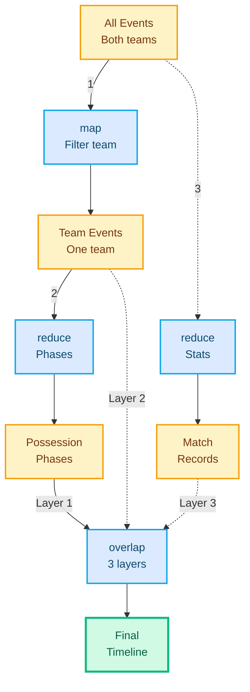
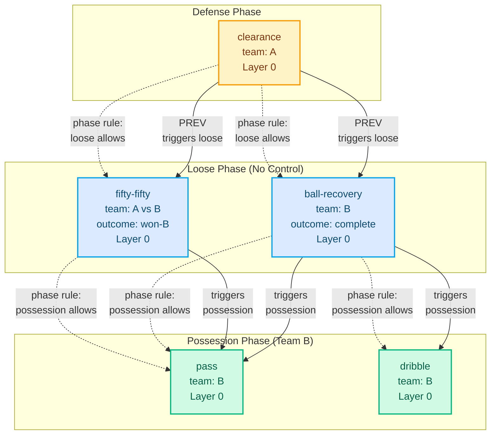
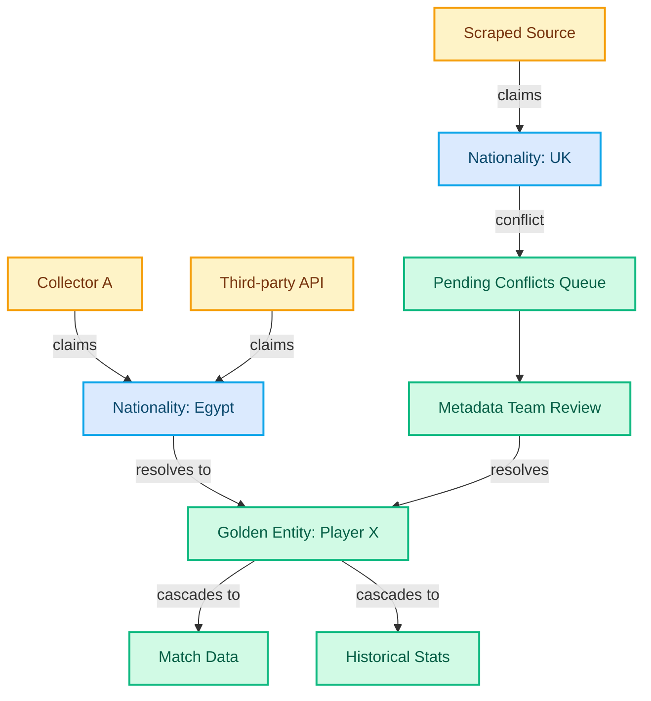

import Button from '../../components/Button.astro';
import Badge from '../../components/Badge.astro';
import Callout from '../../components/Callout.astro';
import Heading from '../../components/typography/Heading.astro';
import Body from '../../components/typography/Body.astro';
import MermaidDiagram from '../../components/MermaidDiagram.astro';
import Accordion from '../../components/Accordion.astro';

<div class="max-w-4xl mx-auto px-4 md:px-6 py-20">
  <div class="mb-8">
    <Button variant="secondary" href="/portfolio/statsbomb" class="mb-8">
      ← Back to Case Study
    </Button>

    <p class="text-sm text-neutral font-medium uppercase tracking-wide mb-1">Technical Deep Dive</p>
    <h1 class="text-base md:text-lg text-navy font-medium mb-2">Statsbomb Architecture: Implementation Details</h1>
    <Body size="base" as="p" class="text-neutral mb-6">Code examples, state machine configurations, functional pipeline patterns, and technical specifications from the real-time sports data collection system.</Body>
  </div>

  <Callout variant="context" size="default" title="Prerequisites">
    <p>This appendix assumes you've read the <a href="/portfolio/statsbomb" class="text-primary hover:underline">main case study</a>. It provides implementation details for engineers interested in DSL design, state machine architecture, and functional data pipelines.</p>
  </Callout>

  {/* Table of Contents */}
  <nav class="my-12 p-6 bg-surface rounded-lg border border-neutral-light" aria-label="Table of contents">
    <h2 class="text-sm uppercase tracking-wide text-neutral font-semibold mb-4">Contents</h2>
    <ul class="space-y-2 text-sm">
      <li><a href="#dsl-implementation" class="text-text-lighter hover:text-primary transition-colors">DSL Implementation</a></li>
      <li><a href="#state-machines" class="text-text-lighter hover:text-primary transition-colors">State Machine Architecture</a></li>
      <li><a href="#functional-pipelines" class="text-text-lighter hover:text-primary transition-colors">Functional Data Pipelines</a></li>
      <li><a href="#event-graphs" class="text-text-lighter hover:text-primary transition-colors">Event Dependency Graphs</a></li>
      <li><a href="#metadata-claims" class="text-text-lighter hover:text-primary transition-colors">Claims-Based Metadata</a></li>
      <li><a href="#keyboard-mappings" class="text-text-lighter hover:text-primary transition-colors">Keyboard Shortcut System</a></li>
      <li><a href="#computer-vision" class="text-text-lighter hover:text-primary transition-colors">Computer Vision Integration</a></li>
    </ul>
  </nav>

  <hr class="border-neutral-light my-16" />

  {/* DSL Implementation Section */}
  <section class="mb-16" id="dsl-implementation">
    <Heading level={3} as="h2" class="mb-6">DSL Implementation: From Parser to Execution</Heading>

    <Body size="base" as="p" class="mb-6 text-neutral leading-relaxed">
      The Domain-Specific Language (DSL) evolved through three stages: hand-written rules (week one), minimal parser (month one), ANTLR grammar (year two). This section shows the final ANTLR-based implementation and execution model.
    </Body>

    <Callout variant="technical" size="default" title="System 1 of 3: Domain Logic as Configuration">
      <p><strong>Bounded context:</strong> Event collection dataspec</p>
      <p>The DSL separated validation rules from execution logic. Product managers wrote declarative rules ("pass THEN reception"), which compiled to runtime constraints in the collection UI.</p>
    </Callout>

    <Heading level={4} as="h3" class="mb-4">Grammar Structure</Heading>

    <Body size="sm" as="p" class="mb-4 text-neutral">
      The DSL grammar separated three concerns: **entry validation** (dataspec), **sequencing logic** (rule definitions), and **aggregation rules** (grouping). Product managers wrote rules in readable syntax that compiled to execution logic.
    </Body>

    <Accordion summary="Example: Soccer Possession Rules (DSL Syntax)">

```antlr
// Possession rule: Team has active carry, received fouls, or forced ball out
possession_rule:
  team_has(
    active_carry OR
    foul_received OR
    forced_out_of_play
  )
  THEN possession_phase(team)
;

// Carry rule: Multiple dribbles by same player
carry_rule:
  sequence(
    dribble(player: P, team: T),
    dribble(player: P, team: T)+ // One or more consecutive
  )
  THEN carry(player: P, team: T, duration: time_span)
;

// Turnover rule: Possession changes
turnover_rule:
  transition(
    possession_phase(team: A),
    possession_phase(team: B)
  )
  WHERE A != B
  THEN turnover(from: A, to: B)
;
```

**Key Design Decisions:**

- **Declarative syntax**: Rules describe WHAT (possession = carry OR foul), not HOW (imperative checks)
- **Temporal operators**: `sequence()`, `transition()`, `time_span` make temporal logic explicit
- **Pattern matching**: `dribble(player: P)+` uses regex-style repetition for patterns
- **Type inference**: Parser infers team/player types from context

</Accordion>

    <Accordion summary="ANTLR Grammar Fragment">

```antlr
grammar Dataspec;

// Top-level rule definition
rule_definition
    : IDENTIFIER ':' rule_body ';'
    ;

rule_body
    : sequence_expr
    | condition_expr
    | aggregation_expr
    ;

// Sequence expressions (PREV/NEXT temporal relationships)
sequence_expr
    : 'sequence' '(' event_pattern (',' event_pattern)+ ')'
    | event_pattern ('THEN' | 'NEXT') event_pattern
    ;

// Condition expressions (logical dependencies)
condition_expr
    : 'team_has' '(' logical_expr ')'
    | 'WHERE' comparison_expr
    ;

logical_expr
    : logical_expr ('OR' | 'AND') logical_expr
    | event_type
    ;

// Event patterns with property bindings
event_pattern
    : IDENTIFIER ('(' property_bindings ')')? cardinality?
    ;

property_bindings
    : property_binding (',' property_binding)*
    ;

property_binding
    : IDENTIFIER ':' (IDENTIFIER | STRING | NUMBER)
    ;

cardinality
    : '+'  // One or more
    | '*'  // Zero or more
    | '?'  // Optional
    ;

// Aggregation (derived facts from atomic events)
aggregation_expr
    : 'THEN' derived_fact '(' property_bindings ')'
    ;

derived_fact
    : 'carry' | 'possession_phase' | 'turnover'
    ;

// Lexer rules
IDENTIFIER: [a-zA-Z_][a-zA-Z0-9_]*;
STRING: '"' (~["\r\n])* '"';
NUMBER: [0-9]+;
WS: [ \t\r\n]+ -> skip;
```

**Why ANTLR Instead of Minimal Parser:**

- **Complex patterns**: Regex-style cardinality (`+`, `*`, `?`) required recursive descent
- **Type safety**: Generated TypeScript types from grammar caught errors at compile time
- **Maintainability**: Grammar-first approach meant adding new operators didn't require parser rewrites
- **Trade-off**: ANTLR added build complexity (Java dependency), but paid off when expanding to American football

</Accordion>

    <Callout variant="insight" size="compact" title="Why this order matters">
      <p>Each system's constraints shaped the others. The DSL drove UI validation. State machines constrained invalid workflows. Metadata resolution enabled concurrent collection. Understanding how they connect reveals why separation creates leverage.</p>
    </Callout>

    <Heading level={4} as="h3" class="mb-4 mt-8">Execution Model: Rule Engine Architecture</Heading>

    <Body size="sm" as="p" class="mb-4 text-neutral">
      The rule engine consumed parsed DSL rules and atomic events, emitting derived facts. It maintained three data structures: **event stream** (immutable log), **active states** (mutable phase tracker), and **derived facts** (computed aggregations).
    </Body>

    <Accordion summary="Rule Engine Core Logic (TypeScript)">

```typescript
// Rule engine maintains event stream, phase state, and derived facts
interface RuleEngine {
  eventStream: readonly AtomicEvent[]; // Immutable append-only log
  activePhases: Map<TeamId, Phase>; // Mutable phase state machine
  derivedFacts: DerivedFact[]; // Computed aggregations
}

// Atomic events (Layer 0)
type AtomicEvent =
  | { type: "pass"; player: PlayerId; team: TeamId; timestamp: number }
  | { type: "dribble"; player: PlayerId; team: TeamId; timestamp: number }
  | { type: "shot"; player: PlayerId; team: TeamId; timestamp: number };

// Derived facts (computed from atomic events)
type DerivedFact =
  | { type: "carry"; player: PlayerId; team: TeamId; duration: number }
  | { type: "possession"; team: TeamId; start: number; end: number }
  | { type: "turnover"; from: TeamId; to: TeamId; timestamp: number };

// Rule execution: Process event, update phases, emit derived facts
function processEvent(
  engine: RuleEngine,
  event: AtomicEvent,
  rules: CompiledRule[]
): DerivedFact[] {
  // 1. Append event to immutable stream
  const newStream = [...engine.eventStream, event];

  // 2. Evaluate phase transitions (stateful)
  const newPhases = evaluatePhaseTransitions(
    engine.activePhases,
    event,
    rules.filter(r => r.type === "phase")
  );

  // 3. Evaluate aggregation rules (pure functions over stream)
  const newDerivedFacts = evaluateAggregations(
    newStream,
    rules.filter(r => r.type === "aggregation")
  );

  // 4. Update engine state
  return newDerivedFacts;
}

// Phase transition example: Clearance → Loose phase
function evaluatePhaseTransitions(
  currentPhases: Map<TeamId, Phase>,
  event: AtomicEvent,
  phaseRules: PhaseRule[]
): Map<TeamId, Phase> {
  const nextPhases = new Map(currentPhases);

  for (const rule of phaseRules) {
    // Pattern match against rule conditions
    if (matchesPattern(event, rule.trigger)) {
      // State machine transition
      nextPhases.set(event.team, rule.targetPhase);
    }
  }

  return nextPhases;
}

// Aggregation example: Consecutive dribbles → Carry
function evaluateAggregations(
  eventStream: readonly AtomicEvent[],
  aggRules: AggregationRule[]
): DerivedFact[] {
  const derivedFacts: DerivedFact[] = [];

  for (const rule of aggRules) {
    // Sliding window over event stream
    const matches = findSequenceMatches(eventStream, rule.pattern);

    for (const match of matches) {
      // Compile derived fact from matched events
      derivedFacts.push(compileDerivedFact(rule, match));
    }
  }

  return derivedFacts;
}
```

**Key Design Decisions:**

- **Immutable event stream**: Append-only log enables time-travel debugging and replay
- **Separation of phase state and aggregations**: Phase transitions are stateful (mutable Map), aggregations are pure functions over immutable stream
- **Pattern matching over imperative checks**: Rules declaratively specify patterns, engine finds matches
- **Incremental evaluation**: Only evaluate rules against new events, not entire stream (performance optimization added year two)

</Accordion>
  </section>

  <hr class="border-neutral-light my-16" />

  {/* State Machines Section */}
  <section class="mb-16" id="state-machines">
    <Heading level={3} as="h2" class="mb-6">State Machine Architecture with XState</Heading>

    <Body size="base" as="p" class="mb-6 text-neutral leading-relaxed">
      The live-collection-app used XState to model collection workflows as explicit finite state machines. Five major machines orchestrated the app: **video mode**, **collection flow**, **freeze frame handling**, **player customization**, and **batch validation**.
    </Body>

    <Callout variant="technical" size="compact" title="System 2 of 3: State Machines as UI Controller">
      <p><strong>Bounded context:</strong> Collection workflow UI</p>
      <p>XState machines made illegal UI states impossible. Can't submit without required fields. Can't enter edit mode while video plays. State transitions became testable without rendering components.</p>
    </Callout>

    <Accordion summary="Collection Flow State Machine (XState Configuration)">

```typescript
import { createMachine, assign } from 'xstate';

// Collection flow: Watching → Collecting → Adding Details → Submitted
const collectionFlowMachine = createMachine({
  id: 'collectionFlow',
  initial: 'watching',
  context: {
    currentEvent: null,
    requiredFields: [],
    completedFields: [],
  },
  states: {
    watching: {
      on: {
        CREATE_EVENT: {
          target: 'collectingBase',
          actions: assign({
            currentEvent: (_, event) => event.data,
            requiredFields: (_, event) => getRequiredFields(event.data.type),
          }),
        },
      },
    },
    collectingBase: {
      on: {
        ADD_FIELD: {
          actions: assign({
            completedFields: (context, event) => [
              ...context.completedFields,
              event.field,
            ],
          }),
        },
        SUBMIT_BASE: [
          {
            target: 'addingDetails',
            cond: 'allRequiredFieldsCompleted',
          },
          {
            target: 'collectingBase', // Stay if incomplete
          },
        ],
        CANCEL: 'watching',
      },
    },
    addingDetails: {
      on: {
        ADD_DETAIL: {
          actions: 'attachDetail',
        },
        SUBMIT_COMPLETE: 'submitting',
        SKIP_DETAILS: 'submitting',
      },
    },
    submitting: {
      invoke: {
        id: 'submitEvent',
        src: 'submitEventToBackend',
        onDone: {
          target: 'watching',
          actions: 'clearContext',
        },
        onError: {
          target: 'error',
          actions: 'logError',
        },
      },
    },
    error: {
      on: {
        RETRY: 'submitting',
        CANCEL: 'watching',
      },
    },
  },
}, {
  guards: {
    allRequiredFieldsCompleted: (context) => {
      return context.requiredFields.every(field =>
        context.completedFields.includes(field)
      );
    },
  },
  actions: {
    attachDetail: assign({
      currentEvent: (context, event) => ({
        ...context.currentEvent,
        details: [...(context.currentEvent?.details || []), event.detail],
      }),
    }),
    clearContext: assign({
      currentEvent: null,
      requiredFields: [],
      completedFields: [],
    }),
    logError: (context, event) => {
      console.error('Submission failed:', event.data);
    },
  },
  services: {
    submitEventToBackend: async (context) => {
      const response = await fetch('/api/events', {
        method: 'POST',
        body: JSON.stringify(context.currentEvent),
      });
      if (!response.ok) throw new Error('Submission failed');
      return response.json();
    },
  },
});
```

**Why XState Over Traditional Event Handlers:**

- **Illegal states impossible**: Can't submit without required fields (guarded transition)
- **Explicit transitions**: All state changes visible in machine config (debugging)
- **Testability**: Machine behavior testable without UI (pure state transitions)
- **Trade-off**: Added ceremony for simple flows, but paid off for complex workflows with 10+ states

</Accordion>

    <Accordion summary="Video Mode State Machine">

```typescript
// Video mode: Manual playback, loop mode, editing
const videoModeMachine = createMachine({
  id: 'videoMode',
  initial: 'manual',
  states: {
    manual: {
      on: {
        TOGGLE_LOOP: 'loop',
        ENTER_EDIT_MODE: 'editing',
      },
    },
    loop: {
      entry: 'startLoopPlayback',
      exit: 'stopLoopPlayback',
      on: {
        TOGGLE_LOOP: 'manual',
      },
    },
    editing: {
      on: {
        EXIT_EDIT: 'manual',
      },
    },
  },
}, {
  actions: {
    startLoopPlayback: (context) => {
      // Repeat 5-second window around active event
      const video = document.querySelector('video');
      const loopStart = context.activeEvent.timestamp - 2.5;
      const loopEnd = context.activeEvent.timestamp + 2.5;

      video.currentTime = loopStart;
      video.play();

      video.addEventListener('timeupdate', function loopHandler() {
        if (video.currentTime >= loopEnd) {
          video.currentTime = loopStart;
        }
      });
    },
    stopLoopPlayback: () => {
      const video = document.querySelector('video');
      video.pause();
      // Remove event listener
    },
  },
});
```

**UX Pattern: Loop Mode for Focus**

Collectors pressed `/` to toggle loop mode—video replayed 5-second window while they filled fields. No manual rewinding. Hands stayed on keyboard. Eyes stayed on video.

</Accordion>
  </section>

  <hr class="border-neutral-light my-16" />

  {/* Functional Pipelines Section */}
  <section class="mb-16" id="functional-pipelines">
    <Heading level={3} as="h2" class="mb-6">Functional Data Pipelines: Map, Reduce, Overlap</Heading>

    <Body size="base" as="p" class="mb-6 text-neutral leading-relaxed">
      Event aggregation followed functional programming patterns: **map** (filter to team), **reduce** (derive phases), **overlap** (combine layers). This made data transformations composable and testable.
    </Body>

    <Callout variant="technical" size="compact" title="System 3 of 3: Functional Pipelines for Data Transformation">
      <p><strong>Bounded context:</strong> Event aggregation and analytics</p>
      <p>Pure functions over immutable streams. Map filtered to teams, reduce derived phases, overlap combined layers. Same pattern scaled from soccer to American football without rewriting core logic.</p>
    </Callout>

    <MermaidDiagram
      id="functional-pipeline"
      caption="Functional data pipeline: atomic events (Layer 0) flow through map/reduce transformations to derive team-specific facts, durational states, and compound metrics"
      relationships={[
        "Layer 0: Atomic event stream (pass, reception, dribble, shot, goal-keeper) with team colors",
        "Map transformation: teamAFacts = map(getTeamFacts(teamA), layer-0) filters to black team only",
        "Reduce transformation: teamADurationalFacts = reduce(durationalFactsReducer, teamAFacts) derives possession phases (carry, defense)",
        "Reduce transformation: officialRecords = reduce(officialRecordsReducer, layer-0) creates match records",
        "Overlap transformation: teamACompoundFacts = overlap(teamAFacts, teamADurationalFacts, officialRecords) combines all layers"
      ]}
    >



    </MermaidDiagram>

    <Accordion summary="Pipeline Implementation (TypeScript)">

```typescript
// Composable transformation functions
type Transform<A, B> = (input: A) => B;

// Layer 0: Atomic events
type AtomicEvent = {
  id: string;
  type: "pass" | "dribble" | "shot" | "reception";
  team: "A" | "B";
  player: string;
  timestamp: number;
};

// Layer 1: Team-filtered events
type TeamEvent = AtomicEvent & { team: "A" | "B" };

// Layer 2: Durational facts (possession phases)
type DurationalFact = {
  type: "carry" | "possession";
  team: "A" | "B";
  startTime: number;
  endTime: number;
};

// Layer 3: Match-level records
type MatchRecord = {
  type: "goal" | "foul" | "substitution";
  timestamp: number;
  details: Record<string, unknown>;
};

// Map: Filter events by team
const getTeamFacts: Transform<AtomicEvent[], TeamEvent[]> = (events) =>
  (team: "A" | "B") =>
    events.filter(event => event.team === team);

// Reduce: Derive durational facts from atomic events
const durationalFactsReducer = (
  acc: DurationalFact[],
  event: TeamEvent
): DurationalFact[] => {
  // Example: Consecutive dribbles → Carry
  const lastFact = acc[acc.length - 1];

  if (event.type === "dribble") {
    if (lastFact?.type === "carry" && lastFact.team === event.team) {
      // Extend existing carry
      return [
        ...acc.slice(0, -1),
        { ...lastFact, endTime: event.timestamp },
      ];
    } else {
      // Start new carry
      return [
        ...acc,
        {
          type: "carry",
          team: event.team,
          startTime: event.timestamp,
          endTime: event.timestamp,
        },
      ];
    }
  }

  return acc;
};

// Reduce: Create match-level records
const officialRecordsReducer = (
  acc: MatchRecord[],
  event: AtomicEvent
): MatchRecord[] => {
  // Example: Shot → Goal detection logic
  if (event.type === "shot" && isGoal(event)) {
    return [
      ...acc,
      {
        type: "goal",
        timestamp: event.timestamp,
        details: { team: event.team, player: event.player },
      },
    ];
  }
  return acc;
};

// Overlap: Combine multiple layers
type CompoundTimeline = {
  atomic: TeamEvent[];
  durational: DurationalFact[];
  records: MatchRecord[];
};

const overlap = (
  teamEvents: TeamEvent[],
  durationalFacts: DurationalFact[],
  matchRecords: MatchRecord[]
): CompoundTimeline => ({
  atomic: teamEvents,
  durational: durationalFacts,
  records: matchRecords,
});

// Full pipeline composition
const processSoccerMatch = (atomicEvents: AtomicEvent[]) => {
  // Layer 1: Filter to team A
  const teamAEvents = getTeamFacts(atomicEvents)("A");

  // Layer 2: Derive durational facts
  const teamADurationalFacts = teamAEvents.reduce(
    durationalFactsReducer,
    []
  );

  // Layer 3: Create match records
  const officialRecords = atomicEvents.reduce(
    officialRecordsReducer,
    []
  );

  // Overlap: Combine all layers
  return overlap(teamAEvents, teamADurationalFacts, officialRecords);
};
```

**Why Functional Pipelines:**

- **Composability**: Each transformation is pure function—testable in isolation
- **Immutability**: No side effects—easy to reason about data flow
- **Reusability**: Same `map`/`reduce`/`overlap` patterns for soccer → American football
- **Debugging**: Can inspect intermediate layers (teamAEvents, durationalFacts, records)

</Accordion>
  </section>

  <hr class="border-neutral-light my-16" />

  {/* Event Graphs Section */}
  <section class="mb-16" id="event-graphs">
    <Heading level={3} as="h2" class="mb-6">Event Dependency Graphs: Beyond Sequential Processing</Heading>

    <Body size="base" as="p" class="mb-6 text-neutral leading-relaxed">
      Events don't just flow sequentially—they form directed acyclic graphs with **temporal** (PREV/NEXT) and **logical** (DEPENDS_ON) relationships. Phase-driven validation meant atomic events determined legal next states.
    </Body>

    <MermaidDiagram
      id="event-dependency-graph"
      caption="Phase-driven event validation: clearance (Layer 0) triggers 'loose' phase, enabling ball-recovery or fifty-fifty (Layer 0). Successful recovery triggers 'possession' phase, enabling pass/dribble (Layer 0). Only atomic events determine phases."
      relationships={[
        "clearance (team A, Layer 0 atomic) triggers loose phase - neither team controls ball",
        "Loose phase allows: ball-recovery or fifty-fifty (Layer 0 atomic temporal successors)",
        "ball-recovery (outcome: complete, Layer 0) triggers possession phase - team B controls ball",
        "Possession phase allows: pass, dribble, reception (Layer 0 atomic events only)",
        "fifty-fifty (outcome: won-B, Layer 0) also triggers possession phase - alternative path",
        "Phase state machine uses only Layer 0 events - derived events (carry, turnover) computed separately"
      ]}
    >



    </MermaidDiagram>

    <Accordion summary="Graph Representation (TypeScript)">

```typescript
// Event graph: Nodes are events, edges are relationships
type EventId = string;

type EventRelationship =
  | { type: "PREV"; target: EventId } // Temporal predecessor
  | { type: "NEXT"; target: EventId } // Temporal successor
  | { type: "DEPENDS_ON"; target: EventId }; // Logical dependency

type EventNode = {
  id: EventId;
  event: AtomicEvent;
  relationships: EventRelationship[];
};

type EventGraph = Map<EventId, EventNode>;

// Phase-driven validation: Check if event type is legal given current phase
const isLegalTransition = (
  currentPhase: Phase,
  proposedEvent: AtomicEvent
): boolean => {
  const phaseRules: Record<Phase, string[]> = {
    defense: ["clearance", "interception", "tackle"],
    loose: ["ball-recovery", "fifty-fifty"],
    possession: ["pass", "dribble", "shot", "reception"],
  };

  return phaseRules[currentPhase].includes(proposedEvent.type);
};

// Build event graph from atomic events
const buildEventGraph = (events: AtomicEvent[]): EventGraph => {
  const graph: EventGraph = new Map();

  events.forEach((event, index) => {
    const relationships: EventRelationship[] = [];

    // Add PREV relationship to previous event
    if (index > 0) {
      relationships.push({
        type: "PREV",
        target: events[index - 1].id,
      });
    }

    // Add NEXT relationship to next event
    if (index < events.length - 1) {
      relationships.push({
        type: "NEXT",
        target: events[index + 1].id,
      });
    }

    // Add DEPENDS_ON relationships based on domain logic
    // Example: reception depends on prior pass
    if (event.type === "reception") {
      const priorPass = findPriorPass(events, index);
      if (priorPass) {
        relationships.push({
          type: "DEPENDS_ON",
          target: priorPass.id,
        });
      }
    }

    graph.set(event.id, {
      id: event.id,
      event,
      relationships,
    });
  });

  return graph;
};
```

**Why Graphs Over Sequential Processing:**

- **Captures domain reality**: Events have multiple relationship types (temporal, logical, causal)
- **Validation**: Can check if proposed event is legal given graph state
- **Querying**: "Find all passes that led to goals" = graph traversal
- **Debugging**: Visualize event chains to understand data quality issues

</Accordion>
  </section>

  <hr class="border-neutral-light my-16" />

  {/* Metadata Claims Section */}
  <section class="mb-16" id="metadata-claims">
    <Heading level={3} as="h2" class="mb-6">Claims-Based Metadata: Automated Conflict Resolution</Heading>

    <Body size="base" as="p" class="mb-6 text-neutral leading-relaxed">
      Rather than key-value pairs, metadata became **claims from actors** with provenance (who), confidence (reliability), and temporality (when). When multiple sources asserted conflicting facts, the graph structure made conflicts explicit and queryable.
    </Body>

    <Callout variant="insight" size="compact" title="Architectural Leverage">
      <p>Claims-based metadata turned data quality from bottleneck into asset. Five-person team reviewed only 1-2% ambiguous conflicts. Automatic resolution handled 98% of updates. Provenance made bugs traceable to source.</p>
    </Callout>

    <MermaidDiagram
      id="metadata-claims-graph"
      caption="Metadata claims flow showing data sources (collectors, scrapers, APIs) submitting claims that resolve into golden entities with automatic conflict resolution"
      relationships={[
        "Data sources (amber): Collector A, Scraped Source, and Third-party API submit nationality claims",
        "Claims (blue): \"Nationality: Egypt\" and \"Nationality: UK\" represent conflicting data",
        "Conflict resolution: Conflicting claim (Nationality: UK) routes to Pending Conflicts Queue",
        "System nodes (emerald): Metadata Team Review resolves conflicts and updates Golden Entity",
        "Cascade: Golden Entity (Player X) automatically updates dependent systems (Match Data, Historical Stats)",
        "Agreed claims resolve directly to golden entity; conflicts require human review"
      ]}
    >



    </MermaidDiagram>

    <Accordion summary="Claims Model Implementation (TypeScript)">

```typescript
// Claim: Assertion about entity property with provenance
type Claim = {
  id: string;
  entityId: string; // Player, club, referee ID
  property: string; // "nationality", "full_name", "jersey_number"
  value: string | number;
  source: {
    type: "collector" | "scraper" | "api" | "manual";
    actorId: string; // Who made the claim
    confidence: number; // 0-1 reliability score
    timestamp: number;
  };
};

// Golden entity: Resolved truth from multiple claims
type GoldenEntity = {
  id: string;
  type: "player" | "club" | "referee";
  properties: Record<string, ResolvedProperty>;
};

type ResolvedProperty = {
  value: string | number;
  resolvedFrom: Claim[]; // All claims that support this value
  conflictingClaims: Claim[]; // Claims with different values
  confidence: number; // Weighted average of source confidence
};

// Automatic conflict detection
const detectConflicts = (claims: Claim[]): Claim[][] => {
  const grouped = new Map<string, Claim[]>();

  // Group claims by entity + property
  for (const claim of claims) {
    const key = `${claim.entityId}:${claim.property}`;
    if (!grouped.has(key)) grouped.set(key, []);
    grouped.get(key)!.push(claim);
  }

  // Find groups with conflicting values
  return Array.from(grouped.values()).filter(group => {
    const uniqueValues = new Set(group.map(c => c.value));
    return uniqueValues.size > 1; // Conflict if multiple values
  });
};

// Resolve golden entity from claims
const resolveGoldenEntity = (
  entityId: string,
  claims: Claim[]
): GoldenEntity => {
  const properties: Record<string, ResolvedProperty> = {};

  // Group claims by property
  const byProperty = claims.reduce((acc, claim) => {
    if (!acc[claim.property]) acc[claim.property] = [];
    acc[claim.property].push(claim);
    return acc;
  }, {} as Record<string, Claim[]>);

  // Resolve each property
  for (const [property, propertyClaims] of Object.entries(byProperty)) {
    // Find most common value weighted by confidence
    const valueCounts = propertyClaims.reduce((acc, claim) => {
      const key = String(claim.value);
      if (!acc[key]) acc[key] = { count: 0, confidence: 0, claims: [] };
      acc[key].count += 1;
      acc[key].confidence += claim.source.confidence;
      acc[key].claims.push(claim);
      return acc;
    }, {} as Record<string, { count: number; confidence: number; claims: Claim[] }>);

    // Select value with highest weighted score
    const winner = Object.entries(valueCounts).reduce((best, [value, data]) => {
      const score = data.count * data.confidence;
      const bestScore = best ? best.data.count * best.data.confidence : 0;
      return score > bestScore ? { value, data } : best;
    }, null as { value: string; data: typeof valueCounts[string] } | null);

    if (winner) {
      // Find conflicting claims (different values)
      const conflicting = propertyClaims.filter(
        c => c.value !== winner.value
      );

      properties[property] = {
        value: winner.value,
        resolvedFrom: winner.data.claims,
        conflictingClaims: conflicting,
        confidence: winner.data.confidence / winner.data.count, // Average
      };
    }
  }

  return { id: entityId, type: "player", properties };
};

// Metadata team workflow
const getPendingConflicts = (entities: GoldenEntity[]): ConflictReview[] => {
  return entities.flatMap(entity =>
    Object.entries(entity.properties)
      .filter(([_, prop]) => prop.conflictingClaims.length > 0)
      .map(([property, prop]) => ({
        entityId: entity.id,
        property,
        resolvedValue: prop.value,
        resolvedClaims: prop.resolvedFrom,
        conflictingClaims: prop.conflictingClaims,
      }))
  );
};
```

**Why Claims Over Key-Value:**

- **Provenance**: Every data point traceable to source (debugging data quality)
- **Confidence scoring**: Weight claims by source reliability (scraped data < manual entry)
- **Conflict detection**: Automatically surface disagreements for human review
- **Temporal reasoning**: Can query "what did we believe about this player on date X?"
- **Scalability**: 5-person team reviewed only the 1-2% ambiguous conflicts, not all 100% of data

</Accordion>
  </section>

  <hr class="border-neutral-light my-16" />

  {/* Keyboard Mappings Section */}
  <section class="mb-16" id="keyboard-mappings">
    <Heading level={3} as="h2" class="mb-6">Keyboard Shortcut System: Context-Aware Mappings</Heading>

    <Body size="base" as="p" class="mb-6 text-neutral leading-relaxed">
      Contextual keyboard mappings with module scoping meant the same key could trigger different actions depending on context. Collectors touch-typed events like Vim users touch-type code—hands stayed on keyboard, eyes stayed on video.
    </Body>

    <Accordion summary="Keyboard Mapping Examples by Context">

**Main Collection View:**
- `t` - Create new event (pass/shot/tackle)
- `p` - Mark event as pass
- `s` - Mark event as shot
- `/` - Toggle video loop mode
- `Arrow keys` - Control playback (frame-by-frame)
- `Space` - Pause/play video
- `Esc` - Cancel current event

**Freeze Frame Mode:**
- `t` - Toggle team view (show only one team's players)
- `1-9` - Select player by jersey number
- `0` - Select goalkeeper
- `b` - Select ball position
- `Enter` - Confirm positions
- `Esc` - Exit freeze frame mode

**Event Details Mode:**
- `Tab` - Move to next required field
- `Shift+Tab` - Move to previous field
- `Enter` - Submit event
- `Esc` - Return to main view

</Accordion>

    <Accordion summary="Implementation: Module-Scoped Keybindings (TypeScript)">

```typescript
// Keyboard context: Active module determines key mappings
type KeyboardContext = "main" | "freezeFrame" | "eventDetails";

type KeyBinding = {
  key: string;
  modifiers?: ("shift" | "ctrl" | "alt")[];
  action: () => void;
  description: string;
};

type KeyBindingMap = Record<KeyboardContext, KeyBinding[]>;

// Context-aware keyboard handler
class KeyboardManager {
  private context: KeyboardContext = "main";
  private bindings: KeyBindingMap;

  constructor(bindings: KeyBindingMap) {
    this.bindings = bindings;
    this.setupEventListener();
  }

  setContext(context: KeyboardContext) {
    this.context = context;
  }

  private setupEventListener() {
    document.addEventListener("keydown", (event) => {
      const activeBindings = this.bindings[this.context];

      for (const binding of activeBindings) {
        if (this.matchesBinding(event, binding)) {
          event.preventDefault();
          binding.action();
          break;
        }
      }
    });
  }

  private matchesBinding(event: KeyboardEvent, binding: KeyBinding): boolean {
    // Check key match
    if (event.key.toLowerCase() !== binding.key.toLowerCase()) return false;

    // Check modifiers
    const requiredModifiers = binding.modifiers || [];
    const hasShift = requiredModifiers.includes("shift");
    const hasCtrl = requiredModifiers.includes("ctrl");
    const hasAlt = requiredModifiers.includes("alt");

    return (
      event.shiftKey === hasShift &&
      event.ctrlKey === hasCtrl &&
      event.altKey === hasAlt
    );
  }
}

// Example bindings configuration
const keyBindings: KeyBindingMap = {
  main: [
    {
      key: "t",
      action: () => createNewEvent(),
      description: "Create new event",
    },
    {
      key: "p",
      action: () => markEventAsPass(),
      description: "Mark as pass",
    },
    {
      key: "/",
      action: () => toggleLoopMode(),
      description: "Toggle video loop",
    },
  ],
  freezeFrame: [
    {
      key: "t",
      action: () => toggleTeamView(),
      description: "Toggle team view",
    },
    {
      key: "1",
      action: () => selectPlayerByJersey(1),
      description: "Select player #1",
    },
    {
      key: "Enter",
      action: () => confirmPositions(),
      description: "Confirm positions",
    },
  ],
  eventDetails: [
    {
      key: "Tab",
      action: () => moveToNextField(),
      description: "Next field",
    },
    {
      key: "Tab",
      modifiers: ["shift"],
      action: () => moveToPreviousField(),
      description: "Previous field",
    },
    {
      key: "Enter",
      action: () => submitEvent(),
      description: "Submit event",
    },
  ],
};

const keyboardManager = new KeyboardManager(keyBindings);

// Context switching
collectionFlowMachine.onTransition((state) => {
  if (state.matches("collectingBase")) {
    keyboardManager.setContext("main");
  } else if (state.matches("freezeFrame")) {
    keyboardManager.setContext("freezeFrame");
  } else if (state.matches("addingDetails")) {
    keyboardManager.setContext("eventDetails");
  }
});
```

**Why Context-Aware Mappings:**

- **Cognitive load reduction**: Same key (`t`) means different things in different contexts—brain learns "press t when in this view" not "memorize 50 arbitrary global shortcuts"
- **Muscle memory**: Collectors touch-type events after ~20 hours of training (similar to Vim proficiency)
- **Scalability**: Adding new contexts doesn't pollute global keybinding namespace
- **Discoverability**: UI shows available shortcuts for current context

</Accordion>
  </section>

  <hr class="border-neutral-light my-16" />

  {/* Computer Vision Section */}
  <section class="mb-16" id="computer-vision">
    <Heading level={3} as="h2" class="mb-6">Computer Vision Integration: Semi-Automated Positioning</Heading>

    <Body size="base" as="p" class="mb-6 text-neutral leading-relaxed">
      Freeze frames (positioning data for all 22 players) were semi-automated. Collectors triggered frame extraction, CV service detected players and ball, system overlaid predictions on pitch canvas, collectors corrected misidentifications. Hybrid approach: 80-90% automation, human correction for edge cases.
    </Body>

    <Callout variant="warning" size="compact" title="Trade-off: Full Automation vs. Quality">
      <p>Full automation would require 10x model complexity for diminishing returns. Edge cases (occlusion, unusual angles, poor lighting) failed ~10-20% of the time. Semi-automated approach: 30 seconds vs. 2-3 minutes manual, 99%+ accuracy with human verification.</p>
    </Callout>

    <Accordion summary="CV Pipeline Architecture">

**Pipeline Stages:**

- **Frame Extraction**: Collector presses `f` to capture current video frame
- **Player Detection**: CV service (YOLO-based model) detects bounding boxes for all visible players
- **Team Classification**: Secondary model classifies players by jersey color (team A vs. team B)
- **Ball Detection**: Separate model for ball (smaller, faster-moving object)
- **Pitch Mapping**: Project detected positions from camera view to tactical pitch coordinates (homography transformation)
- **UI Overlay**: Display predictions on pitch canvas with confidence scores
- **Human Correction**: Collector drags mispositioned players, confirms result

**Why Semi-Automated Instead of Fully Automated:**

- **Edge cases**: Occlusion (players overlapping), unusual camera angles, poor lighting—CV fails ~10-20% of the time
- **Cost-benefit**: Full automation would require 10x model complexity for diminishing returns
- **Speed**: Semi-automated freeze frames took ~30 seconds vs. 2-3 minutes fully manual
- **Quality**: Human verification ensured 99%+ accuracy (critical for client SLAs)

</Accordion>

    <Accordion summary="Technical Implementation Notes">

```typescript
// CV service API contract
type FreezeFrameRequest = {
  videoFrame: ImageData; // Captured from HTML5 video element
  matchId: string;
  timestamp: number;
};

type FreezeFrameResponse = {
  players: DetectedPlayer[];
  ball: DetectedBall | null;
  confidence: number; // Overall detection confidence
};

type DetectedPlayer = {
  id: string;
  team: "A" | "B";
  jerseyNumber: number | null; // Null if OCR failed
  position: { x: number; y: number }; // Pitch coordinates (0-100 scale)
  boundingBox: { x: number; y: number; width: number; height: number };
  confidence: number; // Detection confidence (0-1)
};

type DetectedBall = {
  position: { x: number; y: number };
  confidence: number;
};

// Client-side correction workflow
const processFreezeFrame = async (videoFrame: ImageData) => {
  // 1. Send frame to CV service
  const detections = await cvService.detectPlayers(videoFrame);

  // 2. Render on pitch canvas
  renderDetectionsOnPitch(detections);

  // 3. Enter correction mode (drag-and-drop)
  const corrected = await collectUserCorrections(detections);

  // 4. Submit finalized positions
  await submitFreezeFrame(corrected);
};
```

**Model Details:**

- **Player Detection**: YOLOv5 fine-tuned on soccer broadcast footage (~50k annotated frames)
- **Team Classification**: ResNet-18 on cropped player bounding boxes (jersey color + pattern)
- **Ball Detection**: Separate YOLO model (ball is smaller, different aspect ratio than players)
- **Inference Time**: ~200ms on GPU, ~1.5s on CPU (Electron app ran on collector laptops)
- **Fallback**: If CV service unavailable, collectors placed all 22 players manually (3-4 minutes)

</Accordion>
  </section>

  <hr class="border-neutral-light my-16" />

  {/* Footer Navigation */}
  <div class="flex flex-col md:flex-row gap-4 md:justify-between md:items-center">
    <Button variant="secondary" href="/portfolio/statsbomb" class="w-full md:w-auto">
      ← Back to Case Study
    </Button>
    <Button variant="primary" href="/contact" class="w-full md:w-auto">
      Start a Conversation →
    </Button>
  </div>
</div>
