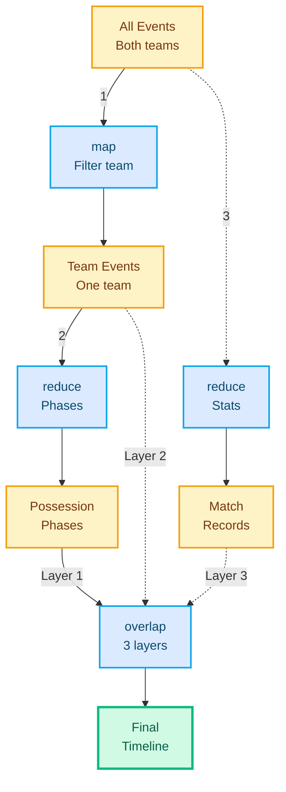
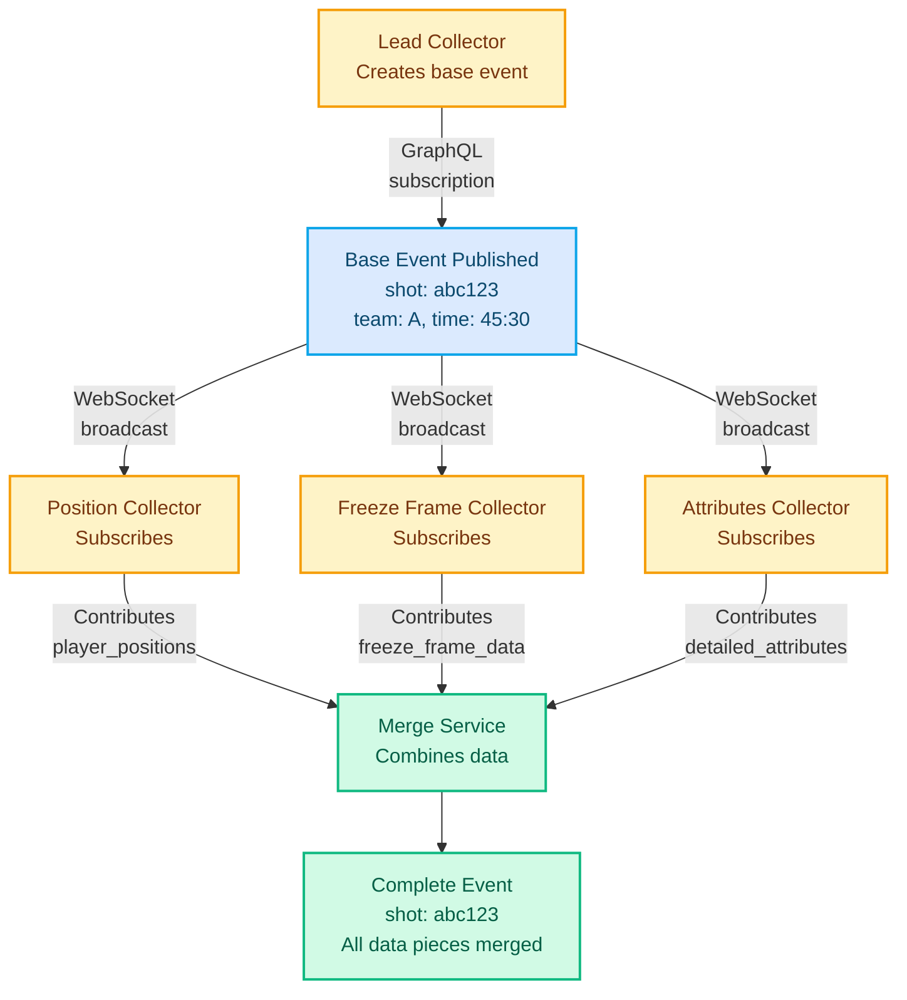
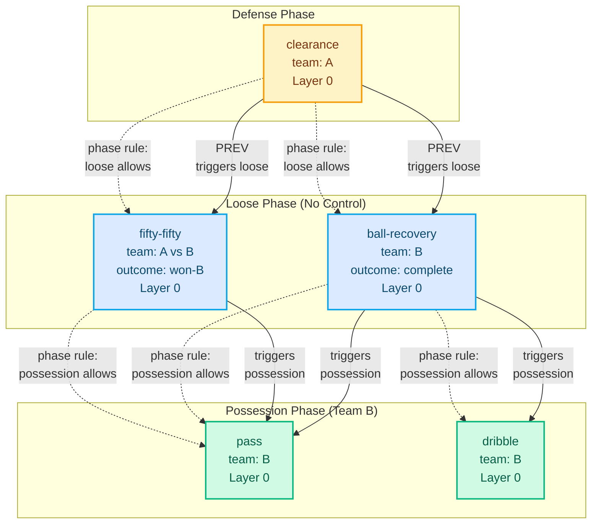
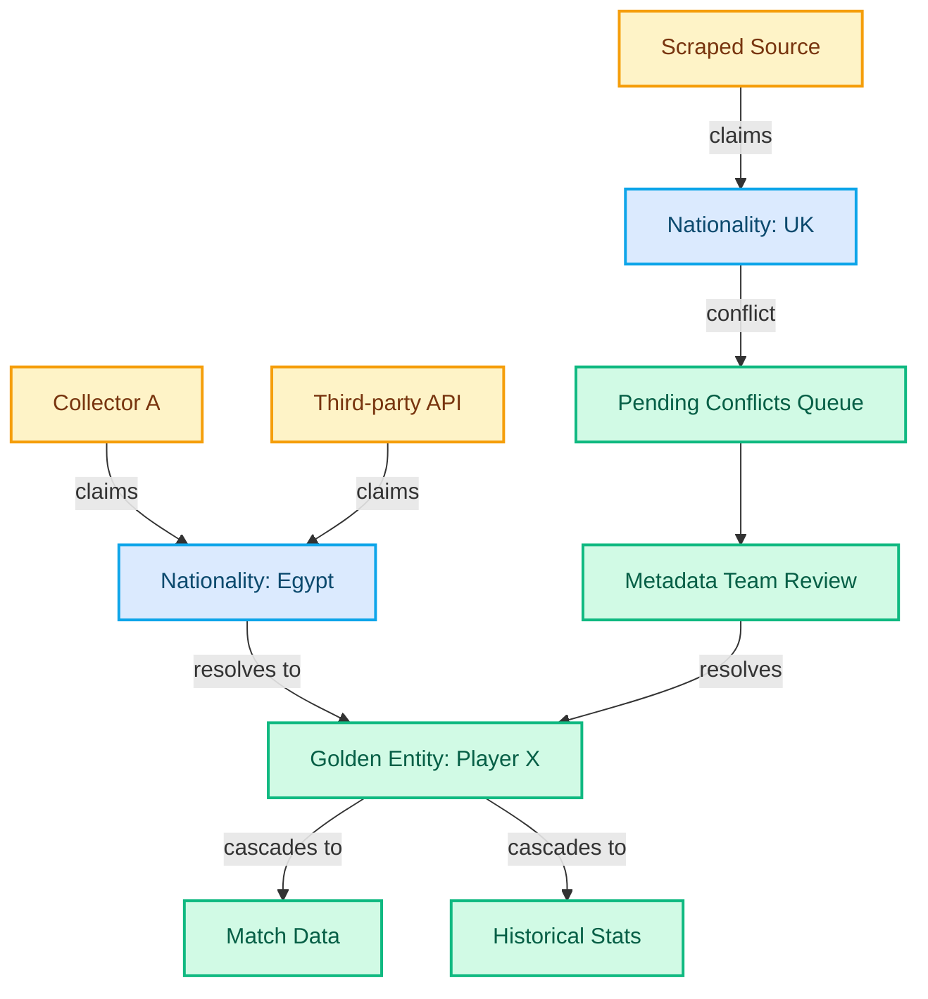

import Button from '../../components/Button.astro';
import Badge from '../../components/Badge.astro';
import Heading from '../../components/typography/Heading.astro';
import Body from '../../components/typography/Body.astro';
import MermaidDiagram from '../../components/MermaidDiagram.astro';
import PhotoGallery from '../../components/PhotoGallery.astro';
import statsbombPhotos from '../../data/statsbomb-photos.json';
import Accordion from '../../components/Accordion.astro';

  {/* Hero Section */}
  

    <Button variant="secondary" href="/portfolio" class="mb-8">
      ← Back to Portfolio
    </Button>

    <Heading level={1} as="h1" class="mb-4">Statsbomb Sports Data Collection</Heading>
    <Body size="lg" as="p" class="text-neutral mb-6">Real-time sports data collection achieved 10x growth through architecture-as-data: domain logic as configuration, UI workflows as state machines, and claims-based metadata. What we built worked—expanding to new sports without rewriting code. The lesson came from what took longer: building distributed team ownership two years late meant racing time when external constraints intervened.</Body>

    

      {/* System Characteristics */}
      <Badge variant="category">Real-Time Data Collection</Badge>
      <Badge variant="category">Collaborative Workflows</Badge>
      
      {/* Key Technologies */}
      <Badge variant="status">XState</Badge>
      <Badge variant="status">Kafka</Badge>
      <Badge variant="skill">ANTLR</Badge>
    

    <Body size="sm" as="div" class="text-neutral">
      Timeline: 2018-2022 • Founding engineer leading data collection system, Cairo team of 20
    </Body>
  

  

  {/* TL;DR Executive Summary */}
  <section class="mb-12 p-6 bg-surface rounded-lg border border-neutral-light">
    <Heading level={2} as="h2" class="mb-4">TL;DR: What We Built</Heading>

    <Body size="base" as="p" class="mb-4">
      Real-time sports data collection system that scaled from 100 to 1000+ collectors while reducing collection time by 75% (16 hours → 4 hours). Achieved through architecture-as-data: domain logic as configuration (DSLs), UI workflows as state machines, and claims-based metadata resolution. Expanded from soccer to American football with minimal code changes.
    </Body>

    <Body size="base" as="p" class="mb-4">
      <strong>Key Results:</strong> 99% error prevention, near real-time latency (~20s), 10x collector scale without proportional staffing.
    </Body>

    <Body size="base" as="div" class="mb-0">
      <strong>Core Lesson:</strong> Team building multiplies architectural leverage—waiting until year three to expand beyond two-person partnership meant racing external constraints before completing customer-facing features.
    </Body>
  </section>

  {/* Problem Section */}
  <section class="mb-8">
    <Heading level={2} as="h2" class="mb-6">Problem: How Do You Scale Without Choosing Between Speed and Correctness?</Heading>

Week one. Ali and I sat down with paper. We hand-wrote sequencing rules for soccer matches—which events could follow which, what validated as legal, how phases transitioned. It was painful. But necessary.

**The business stakes:** Statsbomb's revenue model depended on data velocity and granularity—every hour saved in collection = more matches analyzed = higher data quality premium for professional clubs and broadcasters. Collector efficiency wasn't just operational; it was the constraint on market expansion.

The industry-standard tool—Dartfish—couldn't scale to what we needed. Button-heavy interface forced mouse clicks for every selection. It had keyboard shortcuts, but they weren't contextual. Each key could only map to one event type—globally, across the entire data spec. No overlap possible. With 50+ event types but only 40 usable keys, we hit a ceiling. Collectors memorized which arbitrary key triggered which event, at all times, regardless of game context. Cognitive overload.

Two collectors per match, each following a team, manually entering 3000+ events over 16 hours. Duplicated effort. No prevention, only validation after mistakes happened.

Years of daily conversations with collectors revealed their actual workflows and friction points. They needed keyboard flows that built muscle memory. Contextual mappings that reduced cognitive load. Collaboration patterns that eliminated rework.

The dataspec itself needed to be data, not code, so product managers could express rules in one place that drove the entire system.

Event storming sessions mapped the domain. Five bounded contexts emerged: match metadata, event collection, people coordination, media management, contextual aggregation. One insight stood out: arbitrary aggregation from atomic facts. Individual
passes and dribbles were atomic events. Multiple dribbles by the same player became a
"carry"—a player-level durational fact. Team possession spanned all team durational facts
(carry, foul-won, opponent-out) into a higher-level aggregation. Turnovers derived from possession changes.
The system needed to support any aggregation pattern, not just what we knew upfront.

**Match Metadata was different.** Players, clubs, referees, stadiums—reference data that
thousands of collectors needed but only 5 people managed. Crowd-sourced data meant conflicting
information: same player, different spellings; same club, multiple sources. The system required
automated golden entity resolution—5 people couldn't manually reconcile metadata for thousands
of collectors across hundreds of matches weekly.

Product managers couldn't define new collection requirements without engineering bottlenecks. Collectors waited weeks for tooling updates. Operations needed to scale from 100 collectors to thousands without proportional support staff.
  </section>

  {/* Business Context Section */}
  <section class="mb-8">
    <Heading level={2} as="h2" class="mb-6">Why This Mattered to Statsbomb's Business</Heading>

Statsbomb provided granular sports analytics to professional clubs, broadcasters, and betting operators—markets where data velocity creates competitive advantage. Teams analyzing opponent patterns hours after matches finished fell behind. Broadcasters needed live insights for real-time commentary. Betting markets priced during play, not after final whistle.

The 75% efficiency gain wasn't just operational—it unlocked new revenue streams. Real-time collection enabled incremental analysis during live matches—broadcasters could comment on possession patterns as they emerged, teams could track opponent tactics in-match. Multi-sport expansion (soccer to American football) without proportional engineering cost meant entering adjacent markets with existing infrastructure. 10x operational scale without linear staffing growth preserved margins while growing coverage.

The architectural separation between rules and execution created a strategic moat: product managers could customize data specifications per client without engineering rewrites. A Premier League club wanting detailed positioning data and a Championship club needing only basic events both ran on the same system—different configurations, same codebase.
  </section>

  {/* Architecture Section */}
  <section class="mb-8">
    <Heading level={2} as="h2" class="mb-6">Architecture: Separation as First Principle</Heading>

Architecture emerges when you chase why/where users struggle, not what features they request.

**We built three systems in parallel, not sequentially:**

1. **Domain Logic as Configuration** → Rules without code deploys
2. **Live-Collection-App** → UX that makes errors impossible
3. **Backend Evolution** → Event graphs + claims-based metadata

**Why this order matters:** Each system's constraints shaped the others. The DSL drove UI validation. State machines constrained invalid workflows. Metadata resolution enabled concurrent collection. Understanding how they connect reveals why separation creates leverage.

    {/* DSL Subsection */}
    

      <Heading level={3} as="h3" class="mb-4">Domain Logic as Configuration</Heading>

We separated three concerns: **entry validation** (dataspec), **sequencing logic**
(DSL), and **aggregation rules** (grouping DSL). Product managers wrote rules in readable
syntax. The system compiled to execution logic.

The DSL let product managers define domain logic as sequences and dependencies. For soccer, they could express that possession meant a team had active carry (player dribbling), received fouls, or forced the ball out—spans of time aggregated from atomic events. Individual passes became complete-pass metrics. Multiple dribbles by the same player became a carry. Turnovers derived from possession changes. The rules formed dependency layers: atomic events (passes, shots), player-level facts (carries), team-level aggregations (possession), and higher-level derivatives (turnovers).

When we expanded to American football, product managers wrote drive segmentation rules using the same DSL patterns. Offensive drives derived from snap sequences until scoring or turnover. Red zone conversions tracked touchdown efficiency. Third-down success measured possession maintenance. The execution engine didn't change—new sport, same architectural separation. No engineering bottleneck.

<Accordion summary="Visualizing the Data Flow" class="mb-6">

<Body size="sm" as="p" class="mb-4 text-neutral">
  Domain experts don't think in code—they think in sequences. We used visual timelines to translate
  their mental models into technical architecture. This diagram shows how atomic events (Layer 0)
  flow through time, and higher-level facts derive from event patterns. Color key: <Badge variant="skill" size="xs">amber</Badge> = data layers, <Badge variant="category" size="xs">blue</Badge> = transformations, <Badge variant="status" size="xs">emerald</Badge> = final output.
</Body>

<MermaidDiagram
  id="data-flow"
  caption="Functional data pipeline: atomic events (Layer 0) flow through map/reduce transformations to derive team-specific facts, durational states, and compound metrics"
  relationships={[
    "Layer 0: Atomic event stream (pass, reception, dribble, shot, goal-keeper) with team colors",
    "Map transformation: teamAFacts = map(getTeamFacts(teamA), layer-0) filters to black team only",
    "Reduce transformation: teamADurationalFacts = reduce(durationalFactsReducer, teamAFacts) derives possession phases (carry, defense)",
    "Reduce transformation: officialRecords = reduce(officialRecordsReducer, layer-0) creates match records",
    "Overlap transformation: teamACompoundFacts = overlap(teamAFacts, teamADurationalFacts, officialRecords) combines all layers"
  ]}
>

</MermaidDiagram>

</Accordion>
    

    {/* Live-Collection-App Subsection */}
    

      <Heading level={3} as="h3" class="mb-4">The Live-Collection-App: UX as First Principle</Heading>

The first thing we built wasn't backend architecture. It was the tool collectors would use every day—an Electron desktop app that replaced Dartfish's rigid forms with keyboard-first workflows.

**Real-Time Collaboration**

GraphQL subscriptions via WebSocket enabled Google Docs-style collaboration. Multiple collectors worked concurrently—one collector led by publishing the base event name, others contributed their assigned data pieces (player positions, freeze frames, detailed attributes). Role separation by design meant no conflicts were possible. Freeze frame positioning and manual location data coexisted as valid refinements at different granularities.

        <Body size="sm" as="p" class="mb-4 text-neutral">
          Concurrent collection follows a pub-sub pattern: lead collector establishes base event identity,
          specialized collectors subscribe and contribute domain-specific data. Role separation prevents conflicts—
          each collector owns distinct data fields, no overlapping writes. Color key: <Badge variant="skill" size="xs">amber</Badge> = collectors, <Badge variant="category" size="xs">blue</Badge> = subscription layer, <Badge variant="status" size="xs">emerald</Badge> = merge service.
        </Body>

        <MermaidDiagram
          id="concurrent-collection"
          caption="Real-time collaborative collection: lead collector publishes base event via GraphQL subscription, concurrent collectors contribute specialized data pieces (positions, freeze frames, attributes) without conflicts"
          relationships={[
            "Lead Collector (amber) publishes base event (shot, event_id: abc123, timestamp, team)",
            "GraphQL Subscription (blue) broadcasts base event to all active collectors via WebSocket",
            "Position Collector (amber) subscribes and contributes player_positions data field",
            "Freeze Frame Collector (amber) subscribes and contributes freeze_frame_data field",
            "Attributes Collector (amber) subscribes and contributes detailed_attributes field",
            "Merge Service (emerald) combines all contributions into complete event record",
            "No conflicts possible: each collector writes to distinct data fields (role separation by design)"
          ]}
        >

        </MermaidDiagram>

**State Machines for Impossible States**

We used XState to model collection workflows as explicit finite state machines. Five major state machines orchestrated the app: video mode (manual playback, loop, editing), collection flow (watching, collecting base event, adding details), freeze frame handling (idle, active, reviewing), player customization, and batch validation. This prevented illegal states by design—you couldn't enter a freeze frame without an active event, couldn't submit without required fields. In our context, traditional event handlers created implicit state explosions—tracking state across event handlers made correctness fragile. State machines helped us make transitions explicit and testable, though this added complexity that only paid off at scale.

**30+ Keyboard Shortcuts: Muscle Memory Over Mouse Clicks**

Contextual keyboard mappings with module scoping meant the same key could trigger different actions depending on context. In the main collection view, `t` created new events (pass, shot, tackle), `/` toggled video loop mode, and arrow keys controlled playback. In freeze frame mode, `t` toggled team view, number keys selected players by jersey, Enter confirmed positions. Collectors touch-typed events like Vim users touch-type code. Hands stayed on keyboard. Eyes stayed on video.

**Contextual UI Adaptation**

The interface adapted based on game state and previous decisions. When a collector selected "Pass," the system showed only valid pass types for that player's position. DSL sequence rules determined valid next options. If only one option remained valid, the system auto-filled and skipped the question entirely. Cognitive load minimization—collectors never saw irrelevant options.

<Accordion summary="Video Loop Mode">

Press `/` to toggle between manual playback and auto-replay. In loop mode, the system repeated a 5-second window around the active event. No manual rewinding. Collectors filled fields while watching the replay, then pressed `/` to move forward.

</Accordion>

<Accordion summary="Computer Vision Assistance" class="mb-6">

Freeze frames (positioning data for all 22 players) were semi-automated. Collectors triggered frame extraction, CV service detected players and ball, system overlaid predictions on pitch canvas, collectors corrected misidentifications. Hybrid approach: 80-90% automation, human correction for edge cases.

</Accordion>

This tool became the foundation. The dataspec drove UI validation, the DSL defined legal event sequences, the state machines constrained invalid states. We still found edge cases in production, but the architecture caught most errors before they reached collectors. Concurrent collection during live matches with sub-minute latency. The backend scaled to support what the UX tool showed collectors needed.
    

    {/* Event Collection Subsection */}
    

      <Heading level={3} as="h3" class="mb-4">Backend Evolution: From Batch to Real-Time</Heading>

Breaking matches down by decision rather than team increased correctness while reducing collector coordination overhead. Computer vision assisted input, contextual keyboard mappings reduced cognitive load, and automated linting caught preventable errors. Collectors focused on judgment over correction—handling edge cases where human expertise mattered rather than catching mistakes.

**Beyond Simple Sequences: Event Dependency Graphs**

        <Body size="sm" as="p" class="mb-4 text-neutral">
          Events don't just flow sequentially—they form directed acyclic graphs. A foul-committed event
          might depend on a previous clearance, which itself connects to atomic pass events. The system
          modeled both temporal relationships (PREV/NEXT) and logical dependencies (DEPENDS_ON). Color key: <Badge variant="skill" size="xs">amber</Badge> = defense phase, <Badge variant="category" size="xs">blue</Badge> = loose phase, <Badge variant="status" size="xs">emerald</Badge> = possession phase.
        </Body>

        <MermaidDiagram
          id="event-dependency"
          caption="Phase-driven event validation: clearance (Layer 0) triggers 'loose' phase, enabling ball-recovery or fifty-fifty (Layer 0). Successful recovery triggers 'possession' phase, enabling pass/dribble (Layer 0). Only atomic events determine phases."
          relationships={[
            "clearance (team A, Layer 0 atomic) triggers loose phase - neither team controls ball",
            "Loose phase allows: ball-recovery or fifty-fifty (Layer 0 atomic temporal successors)",
            "ball-recovery (outcome: complete, Layer 0) triggers possession phase - team B controls ball",
            "Possession phase allows: pass, dribble, reception (Layer 0 atomic events only)",
            "fifty-fifty (outcome: won-B, Layer 0) also triggers possession phase - alternative path",
            "Phase state machine uses only Layer 0 events - derived events (carry, turnover) computed separately"
          ]}
        >

        </MermaidDiagram>
    

    {/* Metadata Management Subsection */}
    

      <Heading level={3} as="h3" class="mb-4">Match Metadata: Temporal Stages with Automated Entity Resolution</Heading>

The metadata challenge required different architectural thinking. Match metadata had **temporal stages** that preceded live collection:

**Stage 1: Competition Schedules (Days/Weeks Before Kickoff)**

We organized competition schedules daily and observed the web for updates—fixtures announced, kickoff times changed, venues moved. Web scrapers monitored official sources. Any schedule changes propagated automatically.

**Stage 2: Matchday Lineups (Hours Before Kickoff)**

Ahead of kickoff, we scraped matchday lineups and match details—starting XI, formations, referees, stadium conditions. This is where most new entities entered the system.

**Stage 3: Automatic Entity Streaming**

Whenever scrapers or collectors encountered a new entity—player spelling variant, unknown referee, club name mismatch—the system automatically streamed it to the **info resolution team** (5 people managing metadata for thousands of collectors). No manual data entry. No waiting for batch imports.

With thousands of collectors crowd-sourcing data across multiple sources, conflicts were inevitable: same player, different spellings; same club, multiple sources. The system needed to resolve golden entities automatically—5 people couldn't manually reconcile every conflict.

Rather than key-value pairs, metadata became **claims from actors** with provenance
(who), confidence (reliability), and temporality (when). Each claim carried its source context.
When multiple sources asserted conflicting facts, the graph structure made conflicts explicit
and queryable.

        <Body size="sm" as="p" class="mb-4 text-neutral">
          The 5-person metadata team's workflow: query for pending conflicts → review side-by-side with
          full context → resolve once → system cascades to all dependent data. Color key: <Badge variant="skill" size="xs">amber</Badge> = data sources, <Badge variant="category" size="xs">blue</Badge> = claims, <Badge variant="status" size="xs">emerald</Badge> = resolution system.
        </Body>

        <MermaidDiagram
          id="metadata-claims"
          caption="Metadata claims flow showing data sources (collectors, scrapers, APIs) submitting claims that resolve into golden entities with automatic conflict resolution"
          relationships={[
            "Data sources (amber): Collector A, Scraped Source, and Third-party API submit nationality claims",
            "Claims (blue): \"Nationality: Egypt\" and \"Nationality: UK\" represent conflicting data",
            "Conflict resolution: Conflicting claim (Nationality: UK) routes to Pending Conflicts Queue",
            "System nodes (emerald): Metadata Team Review resolves conflicts and updates Golden Entity",
            "Cascade: Golden Entity (Player X) automatically updates dependent systems (Match Data, Historical Stats)",
            "Agreed claims resolve directly to golden entity; conflicts require human review"
          ]}
        >

        </MermaidDiagram>

The system's design reduced duplicate entities, caught most conflicts automatically, and escalated true ambiguity. The 5-person team focused on the 1-2% of ambiguous cases requiring domain expertise (is "FC Barcelona" the same as "Barcelona FC"? yes; but "Manchester United" vs "Manchester City"? no).
    

  </section>

  {/* Impact Section */}
  <section class="mb-16">
    <Heading level={2} as="h2" class="mb-6">Impact: What Changed When Architecture Met Distributed Ownership?</Heading>

    <Heading level={3} as="h3" class="mb-4">The 80/20 Lesson</Heading>

    <Body size="base" as="p" class="mb-8">
      Design for the 80% common case; production iteration reveals the 20% edge cases. This principle drove every architectural decision—from DSL syntax to state machine transitions to metadata resolution logic.
    </Body>

<Accordion summary="Quantitative Results">

**Real-time collection:** Concurrent collection during live matches replaced post-match sequential processing.

**Minimal engineering bottleneck:** When we expanded to American football, product managers wrote new dataspecs and grouping rules with minimal code changes.

**Automated validation:** Linting and contextual validation caught errors automatically.
Collectors focused on judgment calls where human expertise mattered—event type conflicts,
ambiguous data points—rather than catching preventable mistakes.

**Non-linear leverage:** Operations scaled 10x without proportional staffing increases.

The system scaled horizontally as load increased. Product managers could ship new dataspecs without engineering bottlenecks, though some edge cases still required technical collaboration.

</Accordion>

<Accordion summary="Qualitative Changes" class="mb-6">

**Collector experience:** Keyboard flows built muscle memory. Contextual mappings reduced cognitive load. Computer vision assisted input.

**Client customization:** Different granularity requirements—basic event tracking or advanced positioning data—handled through configuration.

**Metadata team stayed small:** The 5-person team queried pending conflicts, reviewed side-by-side, resolved once, and the system cascaded updates.

</Accordion>
  </section>

  {/* Team Building Section */}
  <section class="mb-16">
    <Heading level={2} as="h2" class="mb-6">The Team Building Challenge: Learning to Lead</Heading>

The technical architecture above—DSLs, state machines, claims-based metadata—took three years to evolve. **But technical patterns without team transmission = bottleneck.**

The harder lesson wasn't about architecture. It was about building a team that could iterate beyond my initial vision.

<Accordion summary="Year One: Finding the Core Partnership">

Week one: Ali and I hand-wrote sequencing rules. Early months: Adham joined as co-architect. The foundational architecture—data as configuration, state machines, DSLs—emerged from our collaborative exploration. Adham pushed me to chase ideas I wasn't confident enough to pursue alone.

Month one backend: a single Go endpoint called `sync`—batch, offline. We started building the live-collection-app with a junior engineer transitioning from aerospace. No formal process. Just the urgent need to replace Dartfish.

</Accordion>

<Accordion summary="Years Two-Three: Scaling from Partnership to Distributed Team" class="mb-6">

Adham and I could execute together, but the domain kept expanding. The transition from two-person partnership to distributed team took longer than it needed—I was learning how to lead engineers while building production systems. The tension: we were protective of architectural integrity while the domain kept expanding, and limiting that thinking to just us became a bottleneck. Every new subsystem, every architectural decision, required our direct involvement.

By year three, we had built the hiring and mentoring systems needed to scale beyond the core partnership.

</Accordion>

**The Breakthrough: Distributed Ownership**

When Waheed, Hadeel, and Abdallah joined, something shifted. They didn't just implement—they took ownership and iterated beyond what we started with:

<Accordion summary="Adham (Services Architecture Lead)">

<ul class="list-disc ml-6 space-y-2">
<li>Designed all backend services architecture</li>
<li>Led Kafka event streaming implementation</li>
<li>Built GraphQL-based web scraper (modeled DOM operations as GraphQL queries—querying the web like an API)</li>
</ul>

</Accordion>

<Accordion summary="Waheed (Metadata System)">

<ul class="list-disc ml-6 space-y-2">
<li>Implemented claims-based entity resolution</li>
<li>Built automatic conflict detection</li>
<li>Owned golden entity cascade logic</li>
</ul>

</Accordion>

<Accordion summary="Hadeel (Collection Service and Dataspec)">

<ul class="list-disc ml-6 space-y-2">
<li>Implemented real-time collection service</li>
<li>Owned Kafka integration and GraphQL subscriptions</li>
<li>Built WebSocket infrastructure for concurrent collaboration</li>
<li>Collaborated with PMs on evolving the dataspec capabilities</li>
</ul>

</Accordion>

<Accordion summary="Abdallah (Desktop Application and Dataspec)" class="mb-6">

<ul class="list-disc ml-6 space-y-2">
<li>Maintained the Electron live-collection-app</li>
<li>Collaborated with PMs on evolving the dataspec capabilities</li>
</ul>

</Accordion>

They took the foundational concepts and applied them to contexts we hadn't explored yet.

<Accordion summary="The External Constraint" class="mb-6">

In 2022, I left Egypt. By then: 1000+ collectors, internal DSLs shipped, American football expansion worked. The customer-facing DSL that would let clients define their own derived facts remained unfinished when I left—team scaling became the bottleneck, not the architecture.

</Accordion>

**The Lesson**

Team building isn't separate from technical work. It's the multiplier that makes ambitious architecture sustainable. Waiting until year three to expand beyond the two-person partnership meant racing against time when external constraints intervened.

The lesson: distributed ownership from day one, not year three. The architecture proved its value—scaling to 1000+ collectors across multiple sports. The team multiplied that value. Waheed, Hadeel, and Abdallah should have started alongside Adham from year one. The technical concepts would have propagated faster, subsystem ownership would have emerged earlier, and the customer-facing DSL would have shipped.

Architecture shapes what's possible. But people make it real.
  </section>

  {/* Lessons Section */}
  <section class="mb-16">
    <Heading level={2} as="h2" class="mb-6">Lessons: What Transfers? What Only Worked Here?</Heading>

**What Worked in This Context**

Architecture emerged from observing where collectors struggled—watching hesitation, workarounds, and slowdowns. Separation of rules from execution paid off at 1000+ collectors. At 100, it felt like over-engineering. Designing for 80% common cases with flexible extension points prevented premature optimization.

**What I'd Change**

Invest in team building from day one, not year three. The two-year delay meant racing time when I relocated. Adham, Waheed, Hadeel, and Abdallah iterated beyond the original design—they should have started sooner.

Event storming from Day 1, not month 6. Understanding bounded contexts (match metadata, event collection, people coordination, media management, contextual aggregation) shaped every technical decision.

<Accordion summary="When These Patterns Apply" class="mb-6">

These aren't universal truths—they worked because of specific conditions:

**Scale threshold:** Separation creates leverage at 1000+ users, not 100. At 50 users with stable requirements, build directly. At 10x growth projections with variant needs, invest in separation.

**Domain complexity:** Sports analytics, medical diagnosis, legal review—domains where experts have tacit knowledge worth externalizing. The more complex the expertise, the more value in DSLs that let non-engineers express rules.

**Multi-variant requirements:** Multiple sports, client customization, regional variations. When every customer wants different behavior, configuration prevents maintaining N codebases.

**The meta-lesson:** More domain knowledge → better problem diagnosis → better architectural decisions → concepts that create value instead of complexity. Context always determines what works.

</Accordion>
  </section>

  {/* Behind the Scenes Section */}
  <section class="mb-8">
    <Heading level={2} as="h2" class="mb-6">Behind the Scenes</Heading>

The human side of building production systems: our team in Cairo (2018-2022), where "make illegal states unrepresentable" went from paper sketches to production reality.

<PhotoGallery class="mb-8" photos={statsbombPhotos} columns={3} />

*Photos from 2018-2021: Team collaboration, technical discussions, and the people who took foundational concepts beyond their initial vision.*

  </section>

  

  {/* Footer Navigation */}
  

    <Button variant="secondary" href="/portfolio" class="w-full md:w-auto">
      ← Back to Portfolio
    </Button>
    <Button variant="primary" href="/contact" class="w-full md:w-auto">
      Start a Conversation →
    </Button>
  

