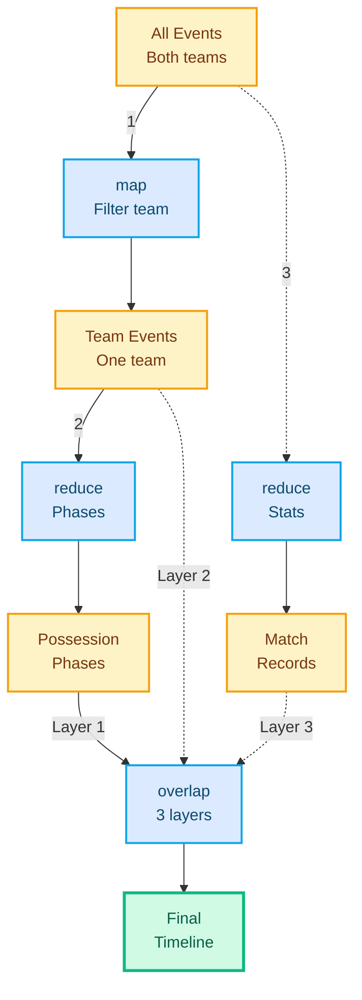
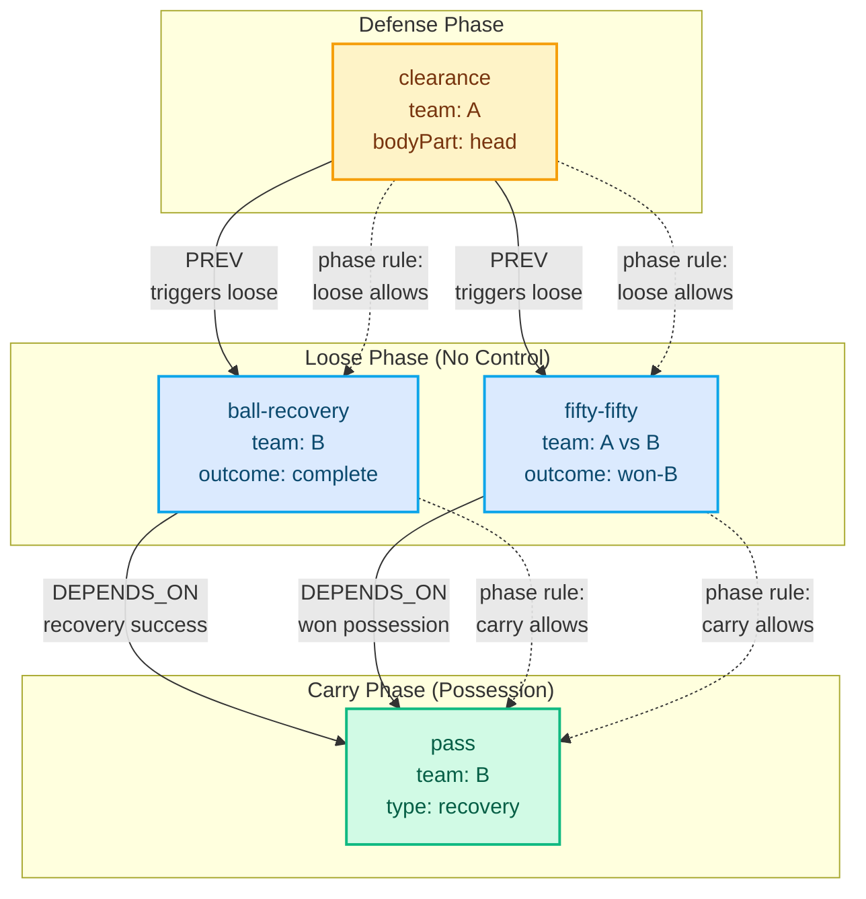
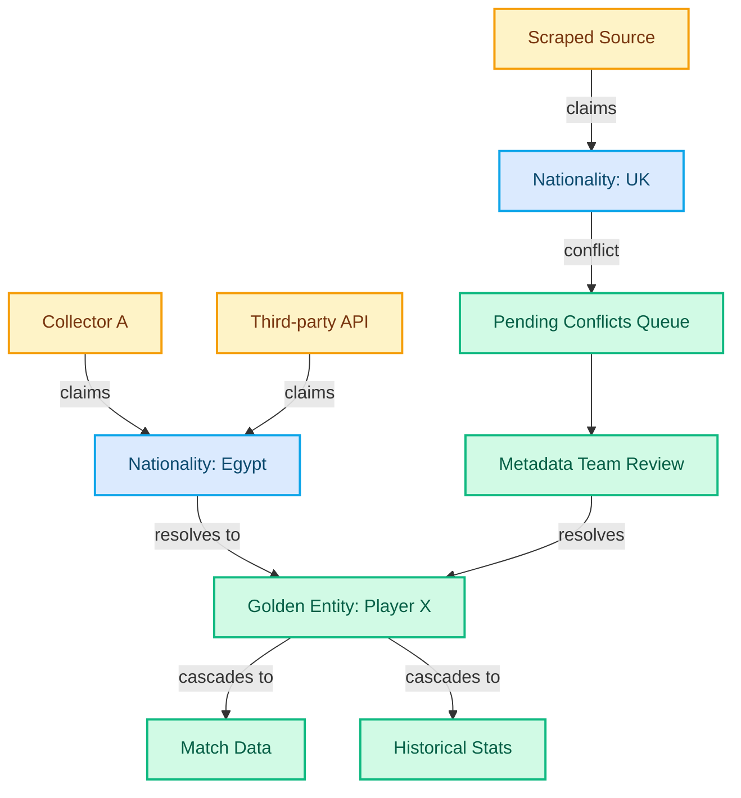

import Button from '../../components/Button.astro';
import Badge from '../../components/Badge.astro';
import Heading from '../../components/typography/Heading.astro';
import Body from '../../components/typography/Body.astro';
import MermaidDiagram from '../../components/MermaidDiagram.astro';

<div class="max-w-4xl mx-auto px-4 md:px-6 py-20">
  {/* Hero Section */}
  <div class="mb-8">
    <Button variant="secondary" href="/portfolio" class="mb-8">
      ← Back to Portfolio
    </Button>

    <Heading level={1} as="h1" class="mb-4">Statsbomb Real-Time Data Collection</Heading>
    <Body size="lg" as="p" class="text-neutral mb-6">Architecture as data enabled 10x scale, but building team ownership two years late meant racing geo-political constraints before completing the vision.</Body>

    <div class="flex flex-wrap gap-2 mb-4">
      <Badge variant="skill">XState</Badge>
      <Badge variant="skill">Electron</Badge>
      <Badge variant="skill">Ramda</Badge>
      <Badge variant="skill">Kafka</Badge>
      <Badge variant="skill">DSL Design</Badge>
      <Badge variant="skill">ANTLR</Badge>
    </div>

    <Body size="sm" as="div" class="text-neutral">
      Timeline: 2018-2022 • Principal engineer championing initiatives, Cairo team of 20
    </Body>
  </div>

  <hr class="border-neutral-light my-8" />

  {/* Problem Section */}
  <section class="mb-8">
    <Heading level={2} as="h2" class="mb-6">Problem: Manual Collection Doesn't Scale</Heading>

Week one. Ali and I sat down with paper. We hand-wrote sequencing rules for soccer matches—which events could follow which, what validated as legal, how phases transitioned. It was painful. But necessary.

The industry-standard tool—Dartfish—couldn't scale to what we needed. Rigid forms forced mouse clicks for every field. No keyboard shortcuts meant collectors couldn't build muscle memory. Two collectors per match, each following a team, manually entering 3000+ events over 16 hours. Duplicated effort. No prevention, only validation after mistakes happened.

Years of daily conversations with collectors revealed their actual workflows and friction points. They needed keyboard flows that built muscle memory. Contextual mappings that reduced cognitive load. Collaboration patterns that eliminated rework.

As Ali walked through how specs evolved—soccer v1, v2, v3—a pattern emerged. Soccer v1→v2 was the same problem as NFL v6→soccer v16. Versioning IS iteration. The dataspec itself needed to be data, not code, so product managers could express rules in one place that drove the entire system.

Event storming sessions mapped the domain: information, collection, operations, media,
aggregation. One insight stood out: arbitrary aggregation from atomic facts. Individual
passes and dribbles were atomic events. Multiple dribbles by the same player became a
"carry"—a player-level durational fact. Team possession spanned all team durational facts
(carry, foul-won, opponent-out) into a higher-level aggregation. Turnovers derived from possession changes.
The system needed to support any aggregation pattern, not just what we knew upfront.

**Match Metadata was different.** Players, clubs, referees, stadiums—reference data that
thousands of collectors needed but only 5 people managed. Crowd-sourced data meant conflicting
information: same player, different spellings; same club, multiple sources. The system required
automated golden entity resolution—5 people couldn't manually reconcile metadata for thousands
of collectors across hundreds of matches weekly.

**Every sport has different rules.** Soccer wasn't American football. Different
clients wanted different granularity—some needed basic event tracking, others demanded
positioning data, pressure metrics, or defensive line heights. Product managers couldn't
define new collection requirements without engineering bottlenecks. Collectors waited weeks for
tooling updates. Operations needed to scale from 100 collectors to thousands without proportional
support staff.
  </section>

  {/* Architecture Section */}
  <section class="mb-8">
    <Heading level={2} as="h2" class="mb-6">Architecture: Separation as First Principle</Heading>

Architecture emerges when you chase why/where users struggle, not what features they request.

    {/* DSL Subsection */}
    <div class="mb-4">
      <Heading level={3} as="h3" class="mb-4">Domain Logic as Configuration</Heading>

We separated three concerns: **entry validation** (dataspec), **sequencing logic**
(DSL), and **aggregation rules** (grouping DSL). Product managers wrote rules in readable
syntax. The system compiled to execution logic.

As I explained to our Head of Product: "By this we move the domain soul/logic/meaning from the
developers mind to the hands of the domain people." Ali's response was immediate: "I understand yeah.
It's a cool concept and v readable."

**Example: Soccer Possession Rules**

```yaml
# Rule 1: Successful pass completion (atomic event derivative)
# When: Player A passes, Player B receives successfully
# Derive: complete-pass metric with distance, angle, pressure
Derive event complete-pass from events sequence:
  - pass team mine
    then reception field outcome is complete team mine

# Rule 2: Player carry (player-level durational from atomic events)
# When: Same player performs multiple consecutive dribbles
# Derive: carry (player-level durational fact)
Derive event carry from events sequence:
  - reception player X
    then dribble player X +  # One or more dribbles by same player

# Rule 3: Defensive recovery counter-attack (simple derived event)
# When: Team intercepts, then successfully passes
# Derive: counter-attack-start (high-value transition)
Derive event counter-attack-start from events sequence:
  - interception field outcome is won team mine
    then pass team mine

# Rule 4: Team possession (team-level aggregation of durational facts)
# When: Team has active carry, foul-won, or ball out by opponent
# Derive: possession (spans all team durational facts)
Create group possession from events sequence:
  - carry team mine +
    ~ pass-complete team mine
    ~ foul-committed team opponent
    ~ out team opponent # ~ Means carries or more including team passes and play restarts

# Rule 5: Tiki-taka analysis (complex sequence)
# When: Team completes 3+ consecutive passes without loss
# Derive: tiki-taka
Create group tiki-taka from events sequence:
  - complete-pass team mine +
    ~ carry team mine # ~ Means 

# Rule 6: Turnover (derived from higher-level possession changes)
# When: Possession shifts from one team to opponent OR opponent shoots
# Derive: turnover metric
Derive event turnover from events sequence:
  - possession team mine
    then possession team opponent* # zero or more possession by the other team
    then shot-complete team opponent

```

<Body size="base" as="p" class="mb-6 leading-relaxed">
Each rule reads like a sports analyst explaining patterns: "When a team intercepts and then passes, that's a counter-attack." Product managers wrote these in hours, not weeks. The system compiled them to validators that ran in real-time during collection. No engineering bottleneck—the domain experts owned the logic.
</Body>

<Body size="base" as="p" class="mb-4 leading-relaxed">
  <strong>Example: American Football Drive Segmentation</strong>
</Body>

```yaml
# Rule 1: Successful snap play (atomic event derivative)
# When: Snap followed by successful gain (run or pass completion)
# Derive: snap-complete metric
Derive event snap-complete from events sequence:
  - snap team mine
    then run field outcome is complete team mine

# Rule 2: Offensive drive (team-level aggregation)
# When: Team gains possession and runs offensive plays
# Derive: offensive-drive (spans all plays until scoring/turnover)
Create group offensive-drive from events sequence:
  - kickoff-return field outcome is complete team mine
    ~ punt-return field outcome is complete team mine
    ~ turnover-recovery team mine
    then snap team mine +
    ~ snap-complete team mine # ~ Means snaps or more including completions
    until touchdown team mine OR field-goal team mine OR turnover team opponent

# Rule 3: Red zone conversion (simple derived event)
# When: Team enters red zone (20-yard line) and scores touchdown
# Derive: red-zone-conversion
Derive event red-zone-conversion from events sequence:
  - snap field yard-line is less-than 20 team mine
    then touchdown team mine

# Rule 4: Third-down success (derived from down resets)
# When: Successful play on 3rd down maintains possession (first down reset)
# Derive: third-down-success
Derive event third-down-success from events sequence:
  - snap field down is 3 team mine
    then snap field down is 1 team mine # Reset to first down

# Rule 5: Drive stall (complex sequence)
# When: Team fails to convert on 4th down or punts
# Derive: drive-stall
Derive event drive-stall from events sequence:
  - snap team mine +
    then turnover-on-downs team mine OR punt team mine

# Rule 6: Scoring drive (derived from higher-level drive outcome)
# When: Offensive drive ends with touchdown or field goal
# Derive: scoring-drive
Derive event scoring-drive from events sequence:
  - offensive-drive team mine
    then touchdown team mine*  # zero or more touchdowns
    then field-goal field outcome is good team mine
```

<Body size="base" as="p" class="mb-6 leading-relaxed">
American football rules are entirely different from soccer—downs, yards, drives. Yet the DSL abstraction held. Product managers familiar with the sport wrote drive segmentation rules, red-zone efficiency tracking, and third-down conversion logic without touching application code. The syntax stayed readable: "When snap at yard-line less-than 20 then touchdown, that's red-zone-conversion." Same language pattern, different sport. Versioning became iteration.
</Body>

When we expanded to American football, product managers wrote new dataspecs and grouping rules.
Minimal engineering bottleneck. The DSL syntax stayed readable—a non-engineer could understand the
domain logic without reading code.

**Visualizing the Data Flow**

        <Body size="sm" as="p" class="mb-4 text-neutral">
          Domain experts don't think in code—they think in sequences. We used visual timelines to translate
          their mental models into technical architecture. This diagram shows how atomic events (Layer 0)
          flow through time, and higher-level facts derive from event patterns.
        </Body>

        <MermaidDiagram
          id="data-flow"
          caption="Functional data pipeline: atomic events (Layer 0) flow through map/reduce transformations to derive team-specific facts, durational states, and compound metrics"
          relationships={[
            "Layer 0: Atomic event stream (pass, reception, dribble, shot, goal-keeper) with team colors",
            "Map transformation: teamAFacts = map(getTeamFacts(teamA), layer-0) filters to black team only",
            "Reduce transformation: teamADurationalFacts = reduce(durationalFactsReducer, teamAFacts) derives possession phases (carry, defense)",
            "Reduce transformation: officialRecords = reduce(officialRecordsReducer, layer-0) creates match records",
            "Overlap transformation: teamACompoundFacts = overlap(teamAFacts, teamADurationalFacts, officialRecords) combines all layers"
          ]}
        >



        </MermaidDiagram>

        <Body size="sm" as="p" class="mb-6 text-neutral italic">
          The functional pipeline splits into 3 paths, then recombines. Path 1: map filters events to one team. Path 2: reduce derives possession phases from team events. Path 3: reduce aggregates match statistics. The <strong>overlap</strong> function then stacks all 3 layers (events + phases + stats) onto a single timeline—like layers in Photoshop. Same temporal axis, multiple analytical dimensions visible simultaneously.
        </Body>

**The Functional Pipeline in Code**

```javascript
import { map, reduce, pipe } from 'ramda';

// Pure functions - no side effects
const getTeamFacts = (teamId) => (event) => event.teamId === teamId;

const durationalFactsReducer = (acc, event) => {
  // Derive possession phases: carry, defense, loose
  const phase = matchPhase(event, acc.lastPhase);
  return [...acc, { ...event, phase }];
};

const officialRecordsReducer = (acc, event) => {
  // Aggregate match records: shots, passes, tackles
  return updateOfficialRecords(acc, event);
};

// Compose the pipeline
const deriveCompoundFacts = (teamId, atomicEvents) =>
  pipe(
    // Layer 0 → Team-specific events
    map(getTeamFacts(teamId)),

    // Team events → Durational facts
    reduce(durationalFactsReducer, []),

    // Overlap with official records
    (teamAFacts) => overlap(
      teamAFacts,
      reduce(durationalFactsReducer, teamAFacts),
      reduce(officialRecordsReducer, [], atomicEvents)
    )
  )(atomicEvents);
```

Every transformation is pure. Every state transition is explicit. The entire match derives from atomic facts through composition—no hidden mutations, no implicit dependencies.
    </div>

    {/* Live-Collection-App Subsection */}
    <div class="mb-12">
      <Heading level={3} as="h3" class="mb-4"><span>The Live-Collection-App: UX as First Principle</span></Heading>

The first thing we built wasn't backend architecture. It was the tool collectors would use every day—an Electron desktop app that replaced Dartfish's rigid forms with keyboard-first workflows.

**State Machines for Impossible States**

We used XState to model collection workflows as explicit finite state machines. Traditional event handlers create implicit state explosions (`if (editing && !watching && hasBase)`). State machines make all transitions explicit and testable.

```javascript
// Main collection workflow
{
  id: 'main-room',
  type: 'parallel',
  states: {
    videoMode: ['manual', 'loop', 'editing'],
    collection: ['watching', 'collectingBase', 'addingPartials'],
    freezeFrame: ['idle', 'active', 'reviewing']
  }
}
```

Five major state machines orchestrated the app: main room, event entry, player customization, freeze frame queue, and batch validation. This prevented illegal states by design—you couldn't enter a freeze frame without an active event, couldn't submit without required fields.

**30+ Keyboard Shortcuts: Muscle Memory Over Mouse Clicks**

We used Mousetrap with module scoping. Same key, different action per context:

```javascript
// Context-aware shortcuts
traps['main-room'].bind('t', () => addEvent(x: pass | shot | ...));
traps['freeze-frame'].bind('t', () => toggleTeamView());
```

Collectors touch-typed events like Vim users touch-type code. Video control (arrow keys), event creation (letter keys), navigation (/, Z), editing (Shift+E), freeze frames (number keys). Hands stayed on keyboard. Eyes stayed on video.

**Contextual UI Adaptation**

The interface adapted based on game state and previous decisions. When a collector selected "Pass," the system showed only valid pass types for that player's position. Auto-filled mandatory fields with single valid options. Skipped irrelevant choices entirely.

```javascript
// Progressive field collection
if (fieldIsSingle && validOptionsCount === 1) {
  return getNewFields(fields, fieldSpec, head(options).value);
}
```

Cognitive load minimization: collectors never saw irrelevant options.

**Video Loop Mode**

Press `/` to toggle between manual playback and auto-replay. In loop mode, the system repeated a 5-second window around the active event. No manual rewinding. Collectors filled fields while watching the replay, then pressed `/` to move forward.

**Computer Vision Assistance**

Freeze frames (positioning data for all 22 players) were semi-automated. Collectors triggered frame extraction, CV service detected players and ball, system overlaid predictions on pitch canvas, collectors corrected misidentifications. Hybrid approach: 80-90% automation, human correction for edge cases.

**Real-Time Collaboration**

GraphQL subscriptions via WebSocket enabled Google Docs-style collaboration. Multiple collectors worked concurrently—one on base events, another on player assignments. Changes appeared instantly. Conflicts resolved through telemetry tracking.

This tool became the foundation. It proved that architecture as data worked in practice: the dataspec drove UI validation, the DSL defined legal event sequences, the state machines enforced correctness. 16 hours → 4 hours per match. The backend scaled to support what the UX tool proved collectors needed.
    </div>

    {/* Event Collection Subsection */}
    <div class="mb-10">
      <Heading level={3} as="h3" class="mb-4"><span>Backend Evolution: From Batch to Real-Time</span></Heading>

Architecture emerged from interpreting workflow friction, not transcribing requests. Breaking
matches down by decision rather than team—something no collector explicitly asked for—increased
correctness without additional effort. The collection experience was redesigned to be valid by
default: computer vision assisted input, contextual keyboard mappings reduced cognitive load,
and linting caught 99% of errors automatically.

This shifted validation to prevention. Collectors focused on judgment over correction—handling
the 1% edge cases where human expertise mattered (event type conflicts, judgment calls on data
points) rather than catching preventable mistakes. Systems designed for human capability let
practitioners work within their actual limits, not aspirational ones.

The technical architecture separated collection rules from execution logic. We built a DSL that
let product managers define sports rules without engineering involvement. The system treated
each sport's requirements as configuration, not code. When new sports arrived or client needs
changed, updates became data changes instead of application rewrites.

Making illegal states unrepresentable meant the system rejected invalid data by design.
Prevention, not validation. Operations scaled from 100 collectors to thousands without
proportional support staff.

**Beyond Simple Sequences: Event Dependency Graphs**

        <Body size="sm" as="p" class="mb-4 text-neutral">
          Events don't just flow sequentially—they form directed acyclic graphs. A foul-committed event
          might depend on a previous clearance, which itself connects to atomic pass events. The system
          modeled both temporal relationships (PREV/NEXT) and logical dependencies (DEPENDS_ON).
        </Body>

        <MermaidDiagram
          id="event-dependency"
          caption="Phase-driven event validation: clearance triggers 'loose' phase, enabling ball-recovery or fifty-fifty. Successful recovery enables 'carry' phase with pass. State machine prevents invalid transitions."
          relationships={[
            "clearance (team A) triggers loose phase - neither team controls ball",
            "Loose phase allows: ball-recovery or fifty-fifty (temporal successors)",
            "ball-recovery (outcome: complete) triggers carry phase - team B possession",
            "Carry phase allows: pass (type: recovery) - logical successor depends on successful recovery",
            "fifty-fifty (outcome: won-B) also triggers carry phase - alternative path to possession",
            "Phase state machine validates all transitions - prevents illegal sequences"
          ]}
        >



        </MermaidDiagram>

        <Body size="sm" as="p" class="mb-6 text-neutral italic">
          Solid lines show temporal flow (PREV - what happened next). Dashed lines show phase validation rules (what transitions are legal). The state machine prevents invalid sequences—you can't pass during "loose" phase, can't recover during "carry" phase. Architecture makes illegal states unrepresentable.
        </Body>
    </div>

    {/* Metadata Management Subsection */}
    <div class="mb-10">
      <Heading level={3} as="h3" class="mb-4"><span>Match Metadata: Temporal Stages with Automated Entity Resolution</span></Heading>

The metadata challenge required different architectural thinking. Match metadata had **temporal stages** that preceded live collection:

**Stage 1: Competition Schedules (Days/Weeks Before Kickoff)**

We organized competition schedules daily and observed the web for updates—fixtures announced, kickoff times changed, venues moved. Web scrapers monitored official sources. Any schedule changes propagated automatically.

**Stage 2: Matchday Lineups (Hours Before Kickoff)**

Ahead of kickoff, we scraped matchday lineups and match details—starting XI, formations, referees, stadium conditions. This is where most new entities entered the system.

**Stage 3: Automatic Entity Streaming**

Whenever scrapers or collectors encountered a new entity—player spelling variant, unknown referee, club name mismatch—the system automatically streamed it to the **info resolution team** (5 people managing metadata for thousands of collectors). No manual data entry. No waiting for batch imports.

With thousands of collectors crowd-sourcing data across multiple sources, conflicts were inevitable: same player, different spellings; same club, multiple sources. The system needed to resolve golden entities automatically—5 people couldn't manually reconcile every conflict.

Rather than key-value pairs, metadata became **claims from actors** with provenance
(who), confidence (reliability), and temporality (when). Each claim carried its source context.
When multiple sources asserted conflicting facts, the graph structure made conflicts explicit
and queryable.

        <Body size="sm" as="p" class="mb-4 text-neutral">
          The 5-person metadata team's workflow: query for pending conflicts → review side-by-side with
          full context → resolve once → system cascades to all dependent data.
        </Body>

        <MermaidDiagram
          id="metadata-claims"
          caption="Metadata claims flow showing data sources (collectors, scrapers, APIs) submitting claims that resolve into golden entities with automatic conflict resolution"
          relationships={[
            "Data sources (amber): Collector A, Scraped Source, and Third-party API submit nationality claims",
            "Claims (blue): \"Nationality: Egypt\" and \"Nationality: UK\" represent conflicting data",
            "Conflict resolution: Conflicting claim (Nationality: UK) routes to Pending Conflicts Queue",
            "System nodes (emerald): Metadata Team Review resolves conflicts and updates Golden Entity",
            "Cascade: Golden Entity (Player X) automatically updates dependent systems (Match Data, Historical Stats)",
            "Agreed claims resolve directly to golden entity; conflicts require human review"
          ]}
        >



        </MermaidDiagram>

        <Body size="sm" as="p" class="mb-6 text-neutral italic">
          Claims from data sources (amber) flow into the system. Conflicts (blue) route to a queue. The metadata
          team (emerald) resolves ambiguity. Golden entities cascade updates to dependent systems automatically.
        </Body>

The same principle as event collection: shift validation to prevention, let humans focus on
judgment over correction. The system prevented duplicate entities by design, caught conflicts
automatically, and escalated true ambiguity. The 5-person team focused on the 1-2% of ambiguous
cases requiring domain expertise (is "FC Barcelona" the same as "Barcelona FC"? yes; but
"Manchester United" vs "Manchester City"? no).

Architecture as multiplier, not bottleneck: 5 people supporting thousands through claims-based
systems designed for small teams at massive scale.
    </div>
  </section>

  {/* Impact Section */}
  <section class="mb-16">
    <Heading level={2} as="h2" class="mb-6"><span>Impact: From Bottleneck to Multiplier</span></Heading>

      <Body size="base" as="p" class="mb-8 leading-relaxed italic">
        Design for the 80% common case; production iteration reveals the 20% edge cases.
      </Body>

**Quantitative Results**

**75% reduction in manual effort:** Collection time dropped from 16 hours to 4 hours
per match through decision-based splitting (not team-based). Breaking matches by decision rather
than team—something no collector explicitly asked for—increased correctness without additional
effort.

**Minimal engineering bottleneck:** When we expanded to American football, product managers
wrote new dataspecs and grouping rules. Minimal code changes required. The DSL investment paid off when
we hit scale and needed sport flexibility.

**99% error prevention:** Linting and contextual validation caught errors automatically.
Collectors focused on the 1% judgment calls where human expertise mattered—event type conflicts,
ambiguous data points—rather than catching preventable mistakes.

**Non-linear leverage:** Operations scaled from 100 to 1000+ collectors without
proportional staffing increases. The architecture created leverage that only materialized at
scale (1000+, not 100).

**Qualitative Changes**

**Collector experience improved:** Keyboard flows built muscle memory. Contextual
mappings reduced cognitive load. Computer vision assisted input. The shift from correction to
judgment meant collectors worked within their actual capabilities, not aspirational ones. Systems
designed for human constraints, not against them.

**Client customization became self-service:** Different granularity requirements—basic
event tracking or advanced positioning data—handled through configuration. Clients could define
custom aggregations without engineering involvement. The DSL syntax stayed readable enough that
domain experts could understand the logic.

**Metadata team stayed small despite 10x growth:** The claims-based architecture with
automated conflict detection meant the 5-person team queried pending conflicts, reviewed side-by-side,
resolved once, and the system cascaded updates. They focused on the 1-2% of ambiguous cases requiring
domain expertise.

**The leverage principle:** Small teams achieve massive scale when architecture is
designed around human constraints. Separation of rules from execution creates non-linear leverage—but
only at scale. The same patterns that feel like over-engineering at 100 collectors become essential
at 1000+.
  </section>

  {/* Team Building Section */}
  <section class="mb-16">
    <Heading level={2} as="h2" class="mb-6"><span>The Team Building Challenge: Learning to Lead</span></Heading>

The architecture worked. But building it was only half the story.

**Year One: Starting Alone**

Week one was me and Ali hand-writing rules. Month one backend: a single Go endpoint called `sync`—batch, offline. I started building the live-collection-app with an airplane engineer friend who was shifting careers to software. No team. No process. Just the urgent need to replace Dartfish.

**Years Two-Three: The Bottleneck**

It took two years before I got involved in hiring and mentoring. I was young. Doing this for the first time. Leading engineers? I didn't know how.

The tension: I didn't want to compromise on the innovative ideas the domain and scale enforced us to explore. "Architecture as data" wasn't optional—it was structural. But innovation without transmission meant I became the bottleneck. Every new context, every subsystem expansion, every architectural decision required me.

**The Breakthrough: Team Ownership**

When we finally hired engineers and built mentoring, something shifted. Adham, Hadeel, Waheed, and Abdallah didn't just implement—they took ownership and iterated beyond my original vision:

- **Adham**: Built an innovative GraphQL-based web scraper. We modeled DOM operations as GraphQL queries—querying the web like an API.
- **Hadeel**: Owned the collection service (Kafka, GraphQL, real-time subscriptions).
- **Waheed**: Owned the metadata system (claims-based resolution, conflict detection).
- **Abdallah**: Owned the live-collection-app (Electron, XState, UX evolution).

They took the foundational concepts—architecture as data, separation of rules from execution, prevention over validation—and applied them to contexts I hadn't reached yet.

**The Geo-Political Constraint**

In 2022, I had to leave Egypt for geo-political reasons. The timing was brutal. We'd scaled 100 → 1000+ collectors. Internal DSLs shipped. American football expansion worked. But the final vision—a customer-facing DSL letting clients define their own derived facts from atomic events—never shipped.

**The Lesson**

Team building isn't separate from technical work. It's the multiplier that makes ambitious architecture sustainable. Two years building alone meant racing against time when external constraints intervened.

If I could rewind: I would invest in Adham, Hadeel, Waheed, and Abdallah from day one. Not year three. The technical concepts would have propagated faster. The subsystem ownership would have emerged earlier. And maybe—maybe—we would have finished the customer-facing DSL before I left.

Architecture shapes what's possible. But people make it real.
  </section>

  {/* Lessons Section */}
  <section class="mb-16">
    <Heading level={2} as="h2" class="mb-6"><span>Lessons: What Worked and What I'd Change</span></Heading>

**What Worked: Validation Through 4 Years**

The core approach held from soccer through American football expansion. Three principles proven
in production:

      <Body size="base" as="p" class="mb-4 leading-relaxed pl-6">
        <strong>1. Architecture emerges when you chase why/where users struggle, not what features they request.</strong>
      </Body>

      <Body size="base" as="p" class="mb-6 leading-relaxed pl-6">
        Breaking matches by decision (not team) came from observing collector friction, not explicit
        requests. The best insights came from watching where people slowed down, what made them hesitate,
        where they needed workarounds—patterns no feature request would reveal.
      </Body>

      <Body size="base" as="p" class="mb-4 leading-relaxed pl-6">
        <strong>2. Separation of rules from execution creates non-linear leverage at scale.</strong>
      </Body>

      <Body size="base" as="p" class="mb-6 leading-relaxed pl-6">
        The DSL investment paid off when we hit 1000+ collectors and needed American football support.
        At 100 collectors, the separation felt like over-engineering. At 1000+, it became the only path
        forward. Product managers could write new sport rules without engineering bottlenecks—exactly what
        we needed when scaling.
      </Body>

      <Body size="base" as="p" class="mb-4 leading-relaxed pl-6">
        <strong>3. Design for the 80% common case; production iteration reveals the 20% edge cases.</strong>
      </Body>

      <Body size="base" as="p" class="mb-6 leading-relaxed pl-6">
        We didn't predict every aggregation pattern upfront—we built the system to handle arbitrary patterns
        as they emerged. The DSL syntax was flexible enough that new requirements became configuration
        changes, not architecture rewrites. This prevented premature optimization while staying adaptable.
      </Body>

**What I'd Change**

**Invest in team building from day one, not year three.** The two-year delay in hiring and mentoring meant racing against geo-political constraints when they hit. Adham, Hadeel, Waheed, and Abdallah proved that engineers with ownership iterate beyond the original vision—but they came too late to complete the customer-facing DSL before I left Egypt.

**Event storming sooner.** We did domain modeling 6 months in—I'd start Day 1 next time. Understanding bounded contexts (information, collection, operations, media, aggregation) shaped every technical decision afterward.

The separation principle itself held under production load for 4 years. The approach—listen for friction, separate rules from execution, design for 80% and iterate for 20%—proved resilient across sports, client needs, and scale. But architecture alone isn't enough. Team transmission matters as much as technical innovation.

**When to Apply These Principles**

**Scale threshold matters:** Separation creates leverage at 1000+, not 100. Don't
over-engineer for small scale. If you're at 50 users with stable requirements, build directly.
If you're projecting 10x growth with variant needs, invest in separation early.

**Human-in-the-loop domains:** When experts have tacit knowledge worth capturing in
systems—sports analytics, medical diagnosis, legal review. These domains benefit from DSLs that
let domain experts express rules without coding. The more complex the domain expertise, the more
value in externalizing logic as configuration.

**Multi-tenant/multi-variant requirements:** When configuration beats code—multiple
sports, client customization needs, regional variations. If every customer wants slightly different
behavior, separation prevents maintaining N codebases. One system, many configurations.
  </section>

  <hr class="border-neutral-light my-8" />

  {/* Footer Navigation */}
  <div class="flex justify-between items-center">
    <Button variant="secondary" href="/portfolio">
      ← Back to Portfolio
    </Button>
    <Button variant="primary" href="/contact">
      Start a Conversation →
    </Button>
  </div>
</div>
