```mermaid
gantt
    title Sequential Collection (32-40h total)
    dateFormat HH
    axisFormat %Hh

    section Collector A
    Team A Collection    :a1, 00, 16h

    section Collector B
    Team B Collection    :b1, 00, 16h

    section Post-Match
    Resolve Conflicts    :crit, p1, 16, 8h
    Slack Clarifications :crit, p2, 16, 2h
```

```mermaid
gantt
    title Concurrent Collection (4h total)
    dateFormat HH
    axisFormat %Hh

    section Collector 1
    Team A Events    :done, c1, 00, 4h

    section Collector 2
    Team A Events    :done, c2, 00, 4h

    section Collector 3
    Team B Events    :done, c3, 00, 4h

    section Collector 4
    Team B Events    :done, c4, 00, 4h

    section System
    Auto Merge       :done, m1, 04, 5m
```

import Button from '../../components/Button.astro';
import Badge from '../../components/Badge.astro';
import Card from '../../components/Card.astro';
import Callout from '../../components/Callout.astro';
import Heading from '../../components/typography/Heading.astro';
import Body from '../../components/typography/Body.astro';
import MermaidDiagram from '../../components/MermaidDiagram.astro';
import PhotoGallery from '../../components/PhotoGallery.astro';
import statsbombPhotos from '../../data/statsbomb-photos.json';
import Accordion from '../../components/Accordion.astro';
import DefinitionList from '../../components/DefinitionList.astro';
import ScrollProgress from '../../components/ScrollProgress.astro';
import SectionDivider from '../../components/SectionDivider.astro';
import ReadingMetadata from '../../components/ReadingMetadata.astro';
import MetricCard from '../../components/MetricCard.astro';
import ComparisonCard from '../../components/ComparisonCard.astro';

<ScrollProgress />

  {/* Hero Section with integrated TL;DR */}
  <section class="mb-12">

    
Case Study

    <h1 class="text-base md:text-lg text-navy font-medium mb-2">Statsbomb Sports Data Collection</h1>
    <Body size="base" as="p" class="text-text-lighter mb-6">2018-2022: What if 1000 collectors could work concurrently without choosing between speed and correctness?</Body>

    

      {/* Core system characteristic */}
      <Badge variant="category">Real-Time Data Collection</Badge>

      {/* Differentiating technologies */}
      <Badge variant="status">XState</Badge>
      <Badge variant="skill">ANTLR</Badge>
    

    {/* Reading metadata */}
    <ReadingMetadata readingTime="25 min" sectionCount={6} class="mb-8" />

    {/* Integrated TL;DR as expandable details */}
    

      
TL;DR: What We Built (2 min)

      {/* Hook - outcome-focused, concrete impact */}
      <Body size="lg" as="p" class="my-6 text-text font-medium leading-relaxed">Built a real-time sports data collection system (2018-2022) through configuration-driven architecture that scaled from 2 founding engineers to distributed teams across multiple sports.</Body>

      <ul class="space-y-3 mb-6 text-text-lighter">
        <li><strong>What Shipped:</strong> Concurrent collection at scale across multiple sports during live matches</li>
        <li><strong>Core Architecture:</strong> Separated domain rules (DSLs) from execution (state machines), enabling configuration-driven expansion without code rewrites for each new sport</li>
        <li><strong>Business Impact:</strong> Product managers shipped new sports independently, 5-person metadata team scaled to 1000+ collectors, automated validation prevented errors before they happened</li>
      </ul>

      {/* Core lesson callout */}
      <Callout variant="primary" icon="lightbulb" title="Core Lesson">
        
Team building multiplies architectural leverage—waiting until year three to expand beyond two-person partnership meant racing external constraints before completing customer-facing features.

      </Callout>
    

  </section>

  {/* Origins: Week One Partnership */}
  <section class="mb-12" id="origins">
    <Heading level={3} as="h2" class="mb-6 text-navy">Origins: Week One Partnership</Heading>

We shipped twice daily. Every morning, I'd push a new build of the freezeframe tool—replacing Dartfish's 12-minute manual clicking with computer vision-assisted positioning. By afternoon, collectors would test it during matches. By evening, I'd see their feedback in Slack.

*"This saved me 9 minutes per frame."*
*"My hand doesn't cramp anymore."*
*"Eyes stay on video, not the mouse."*

I felt like a star. Not from Ali, not from product—from the collectors. The people doing the work thanked me. That feeling—that mutual trust—became the foundation for everything we built over four years. When you ship for people who thank you, architecture stops being abstract.

**The Partnership: Domain Expertise Meets Systems Thinking**

Ali had spent years analyzing sports data—he could articulate possession rules, drive sequences, phase transitions. I'd been thinking about systems since I was 14, reading "Pragmatic Programmer" on Egyptian buses, squinting at my phone screen.

Week one, Ali and I sat with VSCode open. He spoke rules aloud, I typed them as text:

`start → [middle] → break`

As I typed what Ali dictated, I realized: I wasn't writing documentation. I was encoding his mental model as executable text. **That's when it clicked: the dataspec can't be code. It has to be data we can iterate without deploys.**

That partnership—domain expert + systems thinker—is why the DSL approach worked. Without Ali's mental models, I'd have built generic forms. Without my systems thinking, his knowledge would've stayed tacit.

{/* Visual proof: Week One sketches */}

  <figure>
    
    <figcaption class="text-xs text-text-lighter mt-1 text-center italic">
      Viewport calculations & shot extrapolation
    </figcaption>
  </figure>

  <figure>
    
    <figcaption class="text-xs text-text-lighter mt-1 text-center italic">
      Soccer field geometry & positioning
    </figcaption>
  </figure>

  Week One sketches (2018): From these rough drawings to production tool in days

  </section>

  <SectionDivider spacing="minor" />

  {/* Problem Section */}
  <section class="mb-8" id="problem">
    <Heading level={3} as="h2" class="mb-6 text-navy">The 70% Hell: When Ambiguity Costs Time</Heading>

Two collectors, same match, different interpretations.

"Was that a tackle or a press?"
"Did possession start at the dribble or the pass?"
"Is this a defensive action or a duel?"

Post-match, they'd sit for hours resolving conflicts. One thought event X was valid, the other flagged it as incorrect. The tool allowed ambiguity—permitted both interpretations to exist simultaneously. People paid the cost.

**We were losing 70% of collection time to post-validation arguments.** Another 10% to Slack messages: "What does 'defensive action' even mean in this context?" "When does possession phase actually begin?"

Two collectors per match, each following a team, manually entering 3000+ events over 16 hours. Duplicated effort. No prevention through design—only validation after mistakes happened. The business stakes were real: Statsbomb's revenue model depended on data velocity and granularity. Every hour saved in collection = more matches analyzed = higher data quality premium for professional clubs and broadcasters. Collector efficiency wasn't just operational; it was the constraint on market expansion.

{/* Workflow Comparison: Before vs. After */}

  <ComparisonCard variant="before" title="Before: Offline Sequential Collection">
    <figure>
      <MermaidDiagram
        id="workflow-before"
        caption="Offline sequential workflow: 2 collectors work independently for 16 hours each, then spend hours resolving conflicts"
        relationships={[
          "Collector A: Hours 0-16 collecting Team A events independently",
          "Collector B: Hours 0-16 collecting Team B events independently",
          "Hours 16-24: Post-match validation resolving interpretation conflicts (the 70% Hell)",
          "Hours 16-24: Slack messages clarifying dataspec ambiguities (10% overhead)",
          "Total: 32-40 hours per match with quality uncertainty until post-validation"
        ]}
      >

      </MermaidDiagram>
      

        
Text alternative for screen readers

        
Timeline showing two collectors working independently for 16 hours each (hours 0-16), followed by 8-10 hours of post-match conflict resolution and clarifications (hours 16-24). Total time: 32-40 hours per match.

      

    </figure>
  </ComparisonCard>

  <ComparisonCard variant="after" title="After: Concurrent Parallel Collection">
    <figure>
      <MermaidDiagram
        id="workflow-after"
        caption="Concurrent parallel workflow: 4 collectors work simultaneously for 4 hours with automated prevention, no post-validation needed"
        relationships={[
          "Collector 1-4: All work hours 0-4 concurrently with real-time validation",
          "State machines prevent illegal workflows (XState phase constraints)",
          "DSL rules prevent ambiguity (clear dataspec definitions)",
          "Automated merge: No post-match conflicts to resolve",
          "Total: 4 hours per match with structural correctness guaranteed"
        ]}
      >

      </MermaidDiagram>
      

        
Text alternative for screen readers

        
Timeline showing four collectors working simultaneously for 4 hours (hours 0-4), followed by 5-minute automated merge with no conflicts. Total time: 4 hours per match with prevention-based quality.

      

    </figure>
  </ComparisonCard>

<Heading level={4} as="h4" class="mb-4 mt-8">The Industry Baseline: Dartfish's Limitations</Heading>

The industry-standard tool—Dartfish—couldn't scale to what we needed. Button-heavy interface forced mouse clicks for every selection. It had keyboard shortcuts, but they weren't contextual. Each key could only map to one event type—globally, across the entire data spec. No overlap possible. With 50+ event types but only 40 usable keys, we hit a ceiling. Collectors memorized which arbitrary key triggered which event, at all times, regardless of game context. **Cognitive overload**.

<Heading level={4} as="h4" class="mb-4 mt-8">What Collectors Actually Needed</Heading>

Years of daily conversations with collectors revealed their actual workflows and friction points: contextual keyboard mappings that adapted to game state, automated validation to prevent errors before they happened, and clear definitions so two collectors watching the same play would record the same events.

<Heading level={4} as="h4" class="mb-4 mt-8">Why This Mattered to Statsbomb's Business</Heading>

Statsbomb provided granular sports analytics to professional clubs and broadcasters—markets where data velocity creates competitive advantage. Broadcasters needed live insights during matches for real-time commentary. Clubs needed opponent patterns within minutes, not hours, to adjust tactics. **The constraint: real-time collection with zero compromise on correctness.** Most systems choose one—velocity or correctness. We needed both.

The efficiency gains weren't just operational—they unlocked strategic capabilities. Operations scaled 10x (100 → 1000+ collectors) without proportional staffing increases, preserving margins while growing coverage. Client customization happened through configuration: Premier League club wanting detailed positioning data and Championship club needing basic events ran on same system—different configurations, same codebase.

**The Scaling Challenge**: Product managers couldn't define new collection requirements without engineering bottlenecks. Operations needed to scale from 100 collectors to thousands without proportional support staff. At 100 collectors, two product managers coordinated manually. At 1000+? Support requests would consume entire workdays, blocking evolution.
  </section>

  <SectionDivider spacing="major" />

  {/* Real-Time Collection: The 2am Test - NEW SECTION */}
  <section class="mb-12" id="realtime-test">
    <Heading level={3} as="h2" class="mb-6 text-navy">Real-Time Collection: The 2am Test</Heading>

We tested for months before committing to broadcasters. "Real-time" wasn't a feature—it was an obligation. One failure during a live match = lost client.

I'd start at 10am, leave at 3am. Not grinding for grinding's sake—I needed to see what broke when collectors rotated shifts. The edge cases revealed themselves at 2am: Premier League match goes into extra time, collector's keyboard mapping glitches mid-possession change, WebSocket drops during penalty review.

Ali stayed nights for company. Not to supervise—he wasn't debugging TypeScript with me. But he understood the stakes. Broadcasters needed real-time commentary data. Collectors needed tools that didn't break at 2am when fatigue set in.

That's when we'd debug together: Adham tracing the Kafka lag, me testing state machine transitions with a tired collector who just wanted to finish the match and go home.
  </section>

  {/* Visual proof: 2am debugging */}
  <figure class="my-6 mx-auto">
    
    <figcaption class="text-xs text-text-lighter mt-2 text-center italic">
      Late night, Cairo (2019): Debugging real-time collection with Adham and Waheed
    </figcaption>
  </figure>

  <SectionDivider spacing="minor" />

  {/* Architecture Section */}
  <section class="mb-8" id="architecture">
    <Heading level={3} as="h2" class="mb-6 text-navy">Architecture: Separation as First Principle</Heading>

<Body size="sm" as="p" class="mb-6 text-text-lighter italic">
  Understanding the business value explains *why* we built this. Now: *how* did architectural decisions enable 10x scale and multi-sport expansion without code rewrites?
</Body>

<Callout variant="primary" icon="lightbulb" title="User Struggle → Architecture">
  
Architecture emerges when you chase why/where users struggle, not what features they request.

</Callout>

We built three systems in parallel, not sequentially:

  {/* 3-Column Card Grid */}
  

    {/* System 1: Domain Logic */}
    <Card variant="minimal" href="#technical-sections" data-target="domain-config" class="border-l-4 border-l-skill hover:shadow-lg transition-shadow">
      <Heading level={4} as="h4" class="text-base font-semibold mb-3" style="text-wrap: balance;">Domain Configuration</Heading>
      <Body size="sm" as="p" class="text-text-lighter">Product managers ship dataspec rules without engineering deploys—configuration over code</Body>
    </Card>

    {/* System 2: Live-Collection-App */}
    <Card variant="minimal" href="#technical-sections" data-target="collection-app" class="border-l-4 border-l-category hover:shadow-lg transition-shadow">
      <Heading level={4} as="h4" class="text-base font-semibold mb-3" style="text-wrap: balance;">Live-Collection-App</Heading>
      <Body size="sm" as="p" class="text-text-lighter">Prevention over validation—state machines make illegal workflows impossible structurally</Body>
    </Card>

    {/* System 3: Backend Evolution */}
    <Card variant="minimal" href="#technical-sections" data-target="backend-evolution" class="border-l-4 border-l-status hover:shadow-lg transition-shadow">
      <Heading level={4} as="h4" class="text-base font-semibold mb-3" style="text-wrap: balance;">Backend Evolution</Heading>
      <Body size="sm" as="p" class="text-text-lighter">Temporal dependencies and provenance tracking—event graphs resolve causality at scale</Body>
    </Card>
  

  {/* Plain paragraph - less visual weight */}
  <Body size="sm" as="p" class="mb-8 text-text-lighter leading-relaxed italic">
    <strong>Why this order matters:</strong> Each system's constraints shaped the others. The DSL drove UI validation. State machines constrained invalid workflows. Metadata resolution enabled concurrent collection. Understanding how they connect reveals why separation creates leverage.
  </Body>

  {/* Link to Technical Appendix */}
  <Callout variant="secondary" title="Implementation Details in Technical Appendix" icon="code" class="my-8">
    <Body size="sm">This section focuses on architectural decisions under constraint—the "why" behind technical choices. For implementation details (ANTLR grammar, XState configuration, functional pipelines, complete code examples), see the Technical Appendix.</Body>
    <Fragment slot="cta">
      <Button variant="ghost" size="sm" href="/portfolio/statsbomb-technical-appendix">View Technical Appendix →</Button>
    </Fragment>
  </Callout>

  {/* Technical sections wrapper for card link scroll target */}
  

    <Accordion
      grouped
      position="first"
      id="domain-config"
      summary="Domain Logic as Configuration"
      variant="default"
      defaultOpen={false}
    >
Product managers needed to express domain logic—entry validation, sequencing logic, aggregation rules—in readable syntax that compiled to execution logic. The dataspec as configuration, not code.

Atomic events (passes, shots) aggregated into derived facts (possession phases, drives, turnovers). Store unchanging truth, recompute everything else when rules evolved.

**The payoff came in 2020.** When we expanded to American football, product managers wrote drive segmentation rules using the same DSL patterns. New sport, same architectural separation. Zero engineering bottleneck.

Without DSLs, every new rule required engineering deploys. With DSLs, product managers shipped dataspec changes independently—velocity without correctness trade-offs.
    </Accordion>

    <Accordion
      grouped
      position="middle"
      id="collection-app"
      summary="The Live-Collection-App: UX as First Principle"
      variant="default"
      defaultOpen={false}
    >
The first thing we built was the tool collectors would use every day—an Electron desktop app replacing Dartfish's rigid forms with keyboard-first workflows.

**State Machines for Prevention**: We modeled collection workflows as explicit finite state machines with XState. Define workflows as explicit states with clear transitions, and illegal states become structurally impossible. Can't skip steps. Can't submit incomplete data. Prevention, not validation.

**Context-Aware Keyboard Mappings**: Same key, different actions per context. Press 'P' for pass—the DSL determined valid pass types for that player's position. If only one option remained, auto-filled and skipped. Collectors touch-typed like Vim users. Eyes on video, hands on keyboard.

**Computer Vision Integration**: Ashmawy, Andrew, and Shash built the CV service for automated player position detection. Collectors corrected edge cases.

**Concurrent Collection**: Hadeel implemented GraphQL subscriptions via WebSocket. One collector published the base event, others subscribed with specialized contributions (positions, attributes, timing). Zero overlapping responsibility = zero merge conflicts.

The dataspec drove UI validation, DSL defined legal sequences, state machines constrained invalid states. Architecture caught errors before collectors saw them.
    </Accordion>

    <Accordion
      grouped
      position="last"
      id="backend-evolution"
      summary="Backend Evolution: Event Graphs + Claims-Based Metadata"
      variant="default"
      defaultOpen={false}
    >
**Event Graphs**: Sequential event logs couldn't answer "what caused this turnover?" We needed both temporal relationships (clearance BEFORE recovery) AND logical relationships (clearance CAUSED loose phase). Events formed directed acyclic graphs with typed edges—enabling timeline replay and root-cause analysis for data quality debugging.

**Waheed's Claims Breakthrough**: Match metadata from thousands of collectors meant inevitable conflicts—same player, different spellings. Waheed built claims-based metadata resolution. **The insight: metadata isn't key-value pairs, it's claims from actors.** System detected conflicts automatically, routed 1-2% ambiguous cases to the 5-person metadata team. They resolved once via claims interface—system cascaded to all dependent data. The team handled ambiguity; the system handled scale.

**Backend Evolution**: Month one: Omar Negm built the single Go endpoint called `sync`—batch, offline. In year two (2019), when Omar left to teach kids software, Adham joined and designed the evolution to Kafka as persistence center, event logs as foundation—enabling real-time collection at broadcaster scale.
    </Accordion>
  

  </section>

  <SectionDivider spacing="major" />

  {/* The Dataspec Paradox - NEW SECTION */}
  <section class="mb-12" id="dataspec-paradox">
    <Heading level={3} as="h2" class="mb-6 text-navy">The Dataspec Paradox: How Do You Change Rules Without Invalidating History?</Heading>

By 2020, we had two years of historical matches. Thousands of games, millions of events. Then we realized: "possession" in 2020 meant something different than "possession" in 2018. We'd learned more about the sport. The rules evolved.

Most systems would version the data: v1 events stay v1, new matches use v2. But that breaks analysis—you can't compare 2018 Liverpool to 2020 Liverpool if possession definitions changed between them.

The solution: **tiered evolution.** When the dataspec changed, we'd backfill historical data through the new rules—recomputing derived facts from the atomic events we stored. The graph structure made this possible: we knew what cascaded when one definition changed.

The dataspec itself had to be uncertain. I knew from week one we'd iterate, have versions, experiment. Our historical data needed to evolve with our understanding—not versioned snapshots frozen in time, but living data that grew smarter as we did.
  </section>

  <SectionDivider spacing="major" />

  {/* Team Building Section */}
  <section class="mb-16" id="team-building">
    <Heading level={3} as="h2" class="mb-6 text-navy">The Team Building Challenge: From Week One to Distributed Ownership</Heading>

Remember that first-week feeling? Shipping the freezeframe tool twice daily, getting thanked by collectors, feeling like I was there to help. **That feeling needed to scale.**

I could iterate quickly alone—ship twice daily, no coordination overhead, direct feedback from collectors. As the system grew (DSLs, state machines, metadata resolution), that velocity became a bottleneck. The technical architecture took three years to evolve. The harder lesson: building a team that could iterate beyond my initial vision while learning to lead for the first time.

  <Accordion
    grouped
    position="first"
    id="year-one"
    variant="status"
    summary="Year One: Finding the Core Partnership"
    defaultOpen={false}
  >
Year one (2018): Omar Negm had already built foundational systems when I joined. Working with Ali and Omar, we developed the live-collection-app—data as configuration, state machines, DSLs.

Year two (2019): Omar left to teach kids software. Adham joined and took ownership of backend evolution.
  </Accordion>

  <Accordion
    grouped
    position="last"
    id="years-two-three"
    variant="status"
    summary="Years Two-Three: Scaling from Partnership to Distributed Team"
    defaultOpen={false}
  >
Adham and I could execute together, but the domain kept expanding. The transition from two-person partnership to distributed team took longer than it needed—I was learning how to lead engineers while building production systems. By year three, we had built the hiring and mentoring systems needed to scale beyond the core partnership.
  </Accordion>

<Heading level={4} as="h4" class="mb-4 mt-6">The Breakthrough: Distributed Ownership</Heading>

**Adham** joined in year two (2019) when Omar left to teach kids software. He took ownership of backend development and advocated for Kafka as persistence center, event logs as foundation. I hesitated—felt like complexity. He was right. That decision enabled real-time collection at broadcaster scale. He built the backend services, Kafka streaming, and GraphQL scraper architecture that let product managers define dataspecs without engineering deploys.

When **Waheed, Hadeel, and Abdallah** joined, something shifted. They didn't just implement—they took ownership and iterated beyond what we started with. They felt the same urgency to serve collectors, product managers, and ops teams directly.

Waheed built claims-based metadata resolution—the automated conflict detection system we'd only sketched conceptually. He took provenance + confidence + temporality and made it production-ready, enabling 5 people to resolve conflicts for 1000+ collectors.

Hadeel implemented real-time GraphQL subscriptions—the concurrent collection we'd prototyped but hadn't hardened for 1000+ collectors working simultaneously on live matches.

Abdallah maintained the Electron app state machines and evolved keyboard workflows, including handling NFL-specific edge cases (possession turnover during penalty review) we hadn't mapped when we started. He kept the collector experience smooth as we expanded sports.

<Accordion variant="status" summary="The External Constraint" class="mb-6">

In 2022, I left Egypt. By then: 1000+ collectors, internal DSLs shipped, American football expansion worked. The customer-facing DSL that would let clients define their own derived facts remained unfinished when I left—team scaling became the bottleneck, not the architecture.

</Accordion>

<Callout variant="primary" icon="lightbulb" title="The Team Building Lesson">
  
Team building isn't separate from technical work. It's the multiplier that makes ambitious architecture sustainable. Waiting until year three to expand beyond the two-person partnership meant racing against time when external constraints intervened.

  
The lesson: distributed ownership from day one, not year three. The architecture proved its value—scaling to 1000+ collectors across multiple sports. The team multiplied that value. Waheed, Hadeel, and Abdallah should have joined alongside Adham in year two, not year three. The technical concepts would have propagated faster, subsystem ownership would have emerged earlier, and the customer-facing DSL would have shipped.

  
<strong>Architecture shapes what's possible. But people make it real.</strong>

</Callout>
  </section>

  <SectionDivider spacing="major" />

  {/* Impact Section */}
  <section class="mb-16" id="impact">
    <Heading level={3} as="h2" class="mb-6 text-navy">Impact: Timeline Comparison (2018 → 2021)</Heading>

<Body size="sm" as="p" class="mb-6 text-text-lighter">
  <strong>What actually changed on the ground?</strong> Here's the operational transformation from Dartfish baseline to production at scale.
</Body>

  <ComparisonCard variant="before" title="Engineering Bottleneck">
    <ul class="space-y-3">
      <li><strong>American football expansion:</strong> Scoped at 1 year engineering work, product blocked on roadmap</li>
      <li><strong>New event type:</strong> Deploy + regression testing required for every rule change</li>
      <li><strong>Support burden:</strong> Product managers fielded 50+ daily Slack questions about dataspec rules</li>
    </ul>
  </ComparisonCard>

  <ComparisonCard variant="after" title="Configuration-Driven Scale">
    <ul class="space-y-3">
      <li><strong>NFL dataspecs—first iteration shipped day one:</strong> Product managers wrote drive rules, shipped day one</li>
      <li><strong>New event type:</strong> JSON config + UI test, deployed same day through DSL system</li>
      <li><strong>Automated resolution:</strong> System resolved 98% automatically, 5-person team handled ambiguous cases</li>
    </ul>
  </ComparisonCard>

<Callout variant="neutral" icon="quote" title="Collector Voice" class="mb-6">
  
<strong>Before (Dartfish):</strong> "12 minutes per freeze frame clicking 22 player positions manually. By minute 60, my hand cramped from mouse clicks."

  
<strong>After (CV-assisted UI):</strong> "Computer vision detected 90%, I corrected edge cases in 3 minutes. Eyes stayed on video, hands on keyboard."

  
— A.Magdy, 360 Collection Lead

</Callout>

<Callout variant="primary" icon="lightbulb" title="The 80/20 Lesson" class="mb-6">
  
**Design for the 80% common case**; production iteration reveals the 20% edge cases. This principle drove every architectural decision—from DSL syntax to state machine transitions to metadata resolution logic. Most collectors collected standard matches; we optimized for that, not edge cases.

</Callout>

<Heading level={4} as="h4" class="mb-4 mt-6">What Made This Possible</Heading>

  <Accordion
    size="inline"
    variant="default"
    summary="Non-linear leverage"
    defaultOpen={false}
  >
    <Body size="sm" as="p">Non-linear scaling without proportional staffing increases. The 5-person metadata team (Muhanad led ops context) queried pending conflicts, resolved once via claims interface, and the system cascaded updates to all affected events.</Body>
  </Accordion>

  <Accordion
    size="inline"
    variant="default"
    summary="Minimal engineering bottleneck"
    defaultOpen={false}
  >
    <Body size="sm" as="p">When we expanded to American football in 2020, product managers wrote new dataspecs and grouping rules. Engineering only intervened for state machine edge cases (e.g., possession turnover during penalty review—an NFL-specific complexity).</Body>
  </Accordion>

  <Accordion
    size="inline"
    variant="default"
    summary="Collector experience transformation"
    defaultOpen={false}
  >
    <Body size="sm" as="p">Keyboard flows built muscle memory. Contextual mappings reduced cognitive load (press 'P' for pass, but context changes based on phase). Computer vision assisted bounding box input, reducing manual pixel-perfect clicking.</Body>
  </Accordion>

  <Accordion
    size="inline"
    variant="default"
    summary="Client customization through configuration"
    defaultOpen={false}
  >
    <Body size="sm" as="p">Different granularity requirements—basic event tracking or advanced positioning data with x/y coordinates—handled through dataspec configuration, not separate codebases.</Body>
  </Accordion>

<Body size="sm" as="p" class="mb-6 text-text-lighter italic">
  The system scaled horizontally as load increased. Product managers could ship new dataspecs without engineering bottlenecks, though some edge cases still required technical collaboration for complex state transitions.
</Body>
  </section>

  <SectionDivider spacing="major" />

  {/* Hudl Acquisition - NEW SECTION */}
  <section class="mb-12" id="hudl-acquisition">
    <Heading level={3} as="h2" class="mb-6 text-navy">Epilogue: Hudl Acquisition (2024)</Heading>

In 2024, two years after I left Egypt, Hudl acquired Statsbomb.

Hudl is the industry standard—the platform most college and professional teams use globally for video analysis and performance tracking. They didn't acquire Statsbomb for the data alone. They acquired the collection system, the DSLs, the real-time infrastructure that enabled 1000+ collectors to work concurrently.

The patterns Ali and I sketched in VSCode during week one became valuable enough for an industry leader to buy. The architecture that emerged from serving collectors directly, from watching what slowed them down and making it faster, had legs beyond what we imagined.
  </section>

  {/* Lessons Section */}
  <section class="mb-16" id="lessons">
    <Heading level={3} as="h2" class="mb-6 text-navy">Lessons: What Transfers? What Only Worked Here?</Heading>

<Body size="sm" as="p" class="mb-6 text-text-lighter italic">
  Four years, three systems, distributed ownership learned the hard way. Which principles transfer to other domains? Which only worked because of sports analytics constraints?
</Body>

**What I'd Change**

I had to leave Egypt in early 2022. Not a choice I wanted—leaving Ali, Waheed, Hadeel, Abdallah, the collectors, the work still unfinished.

Adham had already left months before. His absence made staying harder—then circumstances forced me to leave. The backend partnership, the late-night Kafka debates, the distributed ownership we'd just started scaling—it fragmented before I left.

By then: 1000+ collectors worldwide, internal DSLs shipped and scaling, American football expansion working. But the customer-facing DSL—the one that would let clients define their own derived facts without us—remained unfinished when I left.

The people I worked with deserved more time together. The systems we built deserved to reach their full potential. Neither happened.

**If I Could Rewind**

What if distributed ownership wasn't a year-three discovery but a founding principle?

Adham, Waheed, Hadeel, Abdallah took concepts—state machines, DSLs, event graphs—and evolved them. That emergence happened despite late investment, not because of early planning. By the time distributed ownership became structural (year three), half the team had fragmented.

The harder pattern: teams don't scale architectures—they reveal what architecture should've been from the start. Knowledge centralization creates beautiful bottlenecks, no matter how elegant the separation of concerns.

**What Month Six Revealed**

Bounded contexts didn't exist on day one because we didn't know what we were building yet. Match metadata, event collection, people coordination, media management, contextual aggregation—these boundaries emerged from production pain, not upfront design.

Month six, the boundaries became visible. Not because we got smarter, but because collectors showed us where the seams were. You can't shortcut that discovery. The mess is the curriculum.

Event storming from day one sounds wise in hindsight. In practice? We would've drawn wrong boundaries around problems we hadn't experienced yet. Some architecture reveals itself through building, not planning.

**When These Patterns Apply**

These aren't universal truths—they worked because of specific conditions:

  <Accordion
    size="inline"
    variant="default"
    summary="Scale: 1000+ collectors, not 100"
    defaultOpen={false}
  >
    <Body size="sm" as="p">Separation creates leverage at scale. At 100 collectors, two product managers answered Slack questions faster than building DSLs. At 1000+, manual coordination broke—five people couldn't handle 50+ daily dataspec questions while evolving the spec. Configuration became cheaper than human time.</Body>
  </Accordion>

  <Accordion
    size="inline"
    variant="default"
    summary="Domain: Tacit expertise worth externalizing"
    defaultOpen={false}
  >
    <Body size="sm" as="p">Sports analytics, medical diagnosis, legal review—domains where experts have tacit knowledge worth externalizing. The more complex the expertise, the more value in DSLs that let non-engineers express rules.</Body>
  </Accordion>

  <Accordion
    size="inline"
    variant="default"
    summary="Multi-variant: N configurations, not N codebases"
    defaultOpen={false}
  >
    <Body size="sm" as="p">Multiple sports, client customization, regional variations. When every customer wants different behavior, configuration prevents maintaining N codebases.</Body>
  </Accordion>

  <Accordion
    size="inline"
    variant="default"
    summary="Meta-lesson: Context determines what works"
    defaultOpen={false}
  >
    <Body size="sm" as="p">More domain knowledge → better problem diagnosis → better architectural decisions → concepts that create value instead of complexity. Context always determines what works.</Body>
  </Accordion>

  </section>

  <SectionDivider spacing="major" />

  {/* Behind the Scenes Section */}
  <section class="mb-8" id="behind-the-scenes">
    <Heading level={2} as="h2" class="mb-6">Behind the Scenes</Heading>

The human side of building production systems: our team in Cairo (2018-2022), where "make illegal states unrepresentable" went from paper sketches to production reality.

<PhotoGallery class="mb-8" photos={statsbombPhotos} columns={3} />

  Cairo, 2018-2022: Our team at Statsbomb (internally known as Arqam). Clockwise from top: Collection leadership during night shift chatting about their ambitions and dreams, Ali pairing with collectors during Week One (April 2018), planning sessions with Hesham and Abdallah, Adham and Ali in temporary coworking space, team gathering at Ali's Sahel house for Muhanad's farewell.

  </section>

  <SectionDivider spacing="minor" />

  {/* Footer Navigation */}
  

    <Button variant="primary" href="/contact" class="w-full md:w-auto">Start a Conversation →</Button>
  

