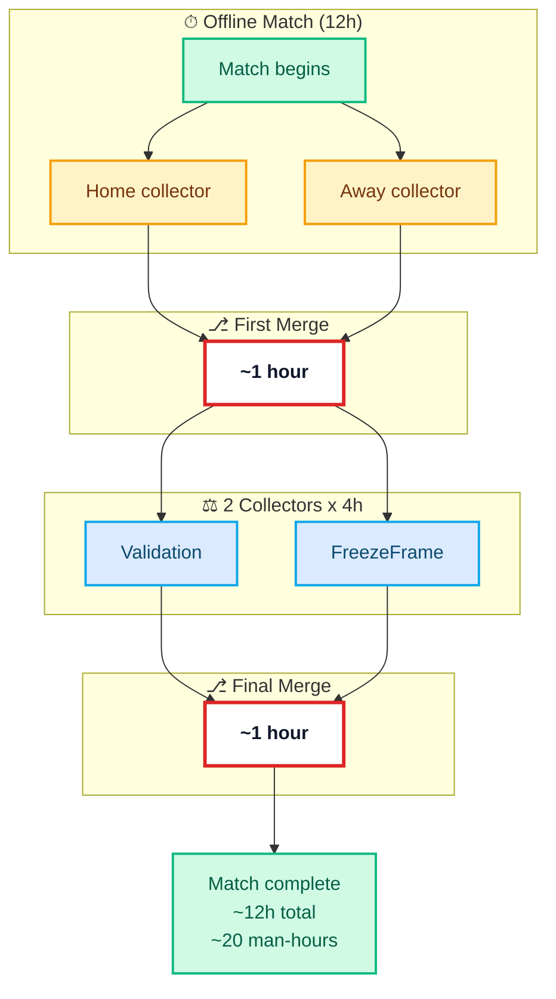
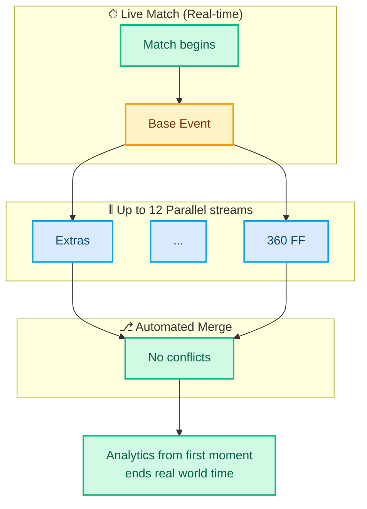

import Container from "../../components/Container.astro";
import Section from "../../components/Section.astro";
import Figure from "../../components/Figure.astro";
import PhotoGrid from "../../components/PhotoGrid.astro";
import CaseStudyTLDR from "../../components/CaseStudyTLDR.astro";
import EditorialNote from "../../components/EditorialNote.astro";
import BadgeList from "../../components/BadgeList.astro";
import Button from "../../components/Button.astro";
import Badge from "../../components/Badge.astro";
import Card from "../../components/Card.astro";
import Callout from "../../components/Callout.astro";
import Heading from "../../components/typography/Heading.astro";
import Body from "../../components/typography/Body.astro";
import WavyUnderline from "../../components/typography/WavyUnderline.astro";
import MermaidDiagram from "../../components/MermaidDiagram.astro";
import MediaGallery from "../../components/MediaGallery.astro";
import statsbombMedia from "../../data/statsbomb-photos.json";
import Accordion from "../../components/Accordion.astro";
import DefinitionList from "../../components/DefinitionList.astro";
import SectionDivider from "../../components/SectionDivider.astro";
import ReadingMetadata from "../../components/ReadingMetadata.astro";
import MetricCard from "../../components/MetricCard.astro";
import ComparisonCard from "../../components/ComparisonCard.astro";
import ComparisonGrid from "../../components/ComparisonGrid.astro";
import Quote from "../../components/Quote.astro";

import { MoveRight } from "@lucide/astro";

<Container width="narrow" spacing="default">
  {/* Hero Section with integrated TL;DR */}
  <Section spacing="spacious">

    
Case Study

    <h1 class="text-base md:text-lg text-navy font-medium mb-2">Statsbomb Sports Data Collection</h1>
    <Body size="base" as="p" class="text-text-lighter mb-6">2018-2022: What if 1000 collectors could work concurrently without choosing between speed and correctness?</Body>

    <BadgeList
      badges={[
        { label: "Real-Time Data Collection", variant: "category" },
        { label: "State Machines", variant: "status" },
        { label: "DSLs", variant: "status" },
        { label: "Stream Processing", variant: "status" },
        { label: "Distributed Teams", variant: "skill" }
      ]}
      class="mb-8"
    />

    {/* Reading metadata */}
    <ReadingMetadata readingTime="25 min" sectionCount={10} class="mb-8" />

    {/* Integrated TL;DR as expandable details */}
    <CaseStudyTLDR>
      {/* Hook - human story + validation */}
      <Body size="lg" as="p" class="my-6 text-text font-medium leading-relaxed">Built real-time sports data collection with Ali from week one sketches to 5000+ collectors across multiple sports. When Hudl acquired Statsbomb in 2024, they bought the collection infrastructure—the system that made concurrent data capture possible at broadcaster scale. What started as "my hand doesn't cramp anymore" feedback became the foundation for industry-standard tooling.</Body>

    </CaseStudyTLDR>

  </Section>

{/* Origins: Week One Partnership */}

  <Section spacing="compact" id="origins" titleLevel={3} title="Origins: Week One Partnership">

We shipped twice daily. Every morning, I'd push a new build of the FreezeFrame tool—replacing Dartfish's 12-minute manual clicking with computer vision-assisted positioning. By afternoon, collectors would test it during matches. By evening, I'd see their feedback in Slack.

_"This saved me 9 minutes per frame."_
_"My hand doesn't cramp anymore."_
_"Eyes stay on video, not the mouse."_

That feedback loop—collectors telling us what slowed them down, seeing it fixed the next day—became the foundation for everything we built over four years. Not from management validation or product roadmaps, but from the people doing the actual work shaping the tool directly. When you ship for people who trust their feedback will change tomorrow's build, architecture stops being abstract.

**The Partnership: Domain Expertise Meets Systems Thinking**

Ali had spent years analyzing sports data—he could articulate possession rules, drive sequences, phase transitions. I'd been thinking about systems since I was 14, reading "Pragmatic Programmer" on Egyptian buses, squinting at my phone screen.

Week one, Ali and I sat with VSCode open. He spoke rules aloud, I typed them as text:

  <WavyUnderline color="secondary" as="div" class="text-center md:text-left">`start → [middle] → break`</WavyUnderline>

  
evolved to<MoveRight class="w-5 h-5 inline"/>

  

    <WavyUnderline color="primary" class="mr-3">`carry`</WavyUnderline>
    <WavyUnderline color="primary" class="mr-3">`flight`</WavyUnderline>
    <WavyUnderline color="primary">`loose`</WavyUnderline>
  

 

As I typed what Ali dictated, I realized: I wasn't writing documentation. I was encoding his mental model as executable text. **That's when it clicked: the dataspec can't be code. It has to be data we can iterate without deploys.**

That partnership—domain expert + systems thinker—is why the DSL approach worked. Without Ali's mental models, I'd have built generic forms. Without my systems thinking, his knowledge would've stayed tacit.

{/* Visual proof: Week One sketches → Production Evolution */}

<PhotoGrid
  columns="4"
  photos={[
    {
      src: "/images/statsbomb/ff-initial-sketches-1.jpg",
      alt: "Hand-drawn viewport calculations for FreezeFrame tool",
      caption: "Viewport calculations",
      aspectRatio: "portrait"
    },
    {
      src: "/images/statsbomb/ff-initial-sketches-2.jpg",
      alt: "Soccer field perspective sketch showing goal positioning",
      caption: "Soccer field geometry & positioning",
      aspectRatio: "portrait"
    },
    {
      src: "/images/statsbomb/live-collection-v1-2018.png",
      alt: "First production run of live collection tool in 2018",
      caption: "First production run (2018)",
      aspectRatio: "portrait"
    },
    {
      src: "/images/statsbomb/live-collection-v2-2019.png",
      alt: "Ragdoll feature for goalkeeper reactions in freeze frames, requested by Liverpool",
      caption: "Ragdoll feature (2019)",
      aspectRatio: "portrait"
    }
  ]}
  groupCaption="Week One sketches (2018): From these rough drawings to production tool in days, evolving with customer-driven features like Liverpool's goalkeeper reaction tracking"
/>
  </Section>

{" "}

<SectionDivider spacing="minor" />

{/* Problem Section */}

  <Section spacing="default" id="problem" titleLevel={3} title="The Two-Merge Bottleneck">

Two collectors, same match. Hours after the final whistle, they're still arguing.

"That's a recovery."
"No, interception—he anticipated the pass."
"But possession hadn't transferred yet."

Collectors spent 2 hours post-match reconciling across two merge points.

**First merge:** Align on what events happened during collection—that's a recovery at 23:45, this is an interception at 42:10.

**Then came post-processing:** Each collector spent 4 hours validating, positioning, and adding freeze frames to the now-agreed-upon events. Same events, but two collectors enriching them independently with different interpretations.

**Second merge:** Reconcile how those events were tagged and positioned. The tool prevented conflicts during collection but created them during post-processing. Two bottlenecks instead of one.

{/* Workflow Comparison: Before vs. After */}

  

    

      <svg class="w-5 h-5 text-text-lighter" fill="none" viewBox="0 0 24 24" stroke="currentColor">
        <path stroke-linecap="round" stroke-linejoin="round" stroke-width="2" d="M12 9v2m0 4h.01m-6.938 4h13.856c1.54 0 2.502-1.667 1.732-3L13.732 4c-.77-1.333-2.694-1.333-3.464 0L3.34 16c-.77 1.333.192 3 1.732 3z" />
      </svg>
      <Heading level={4} as="h4" class="text-base text-text-lighter">Before: Sequential Collection</Heading>
    

    <figure>
      <MermaidDiagram
        id="workflow-before"
        caption="~12h total: Collection (4h each) → First merge (1h) → Post-processing (4h each) → Final merge (1h) = 20 man-hours"
        relationships={[
          "Parallel collection: Home & Away collectors (4h each)",
          "First merge: Reconcile collection conflicts (1h)",
          "Parallel post-processing: Validation, conflicts, freeze frames (4h each)",
          "Final merge: Reconcile post-processing conflicts (1h)",
          "Total: ~12h wall-clock = 20 man-hours"
        ]}
      >

      </MermaidDiagram>
      

        
Text alternative

        
Offline workflow taking 12 hours: Home and Away collectors work in parallel. First merge reconciles collection conflicts (~1h). Then 2 collectors work in parallel (4h each) on Validation and FreezeFrame. Final merge reconciles post-processing conflicts (~1h). Total: ~12h wall-clock = 20 man-hours.

      

    </figure>

  

  

    

      <svg class="w-5 h-5 text-text-lighter" fill="none" viewBox="0 0 24 24" stroke="currentColor">
        <path stroke-linecap="round" stroke-linejoin="round" stroke-width="2" d="M9 12l2 2 4-4m6 2a9 9 0 11-18 0 9 9 0 0118 0z" />
      </svg>
      <Heading level={4} as="h4" class="text-base text-text-lighter">After: Concurrent Collection</Heading>
    

    <figure>
      <MermaidDiagram
        id="workflow-after"
        caption="~2h total: Base events created during match, enriched in parallel (Extras, Location, FreezeFrame)"
        relationships={[
          "Base event creation happens first (name, timestamp)",
          "3 parallel enrichments: Extras, Location, FreezeFrame",
          "Real-time validation prevents conflicts during match",
          "Automated merge at match end (~2h)"
        ]}
      >

      </MermaidDiagram>
      

        
Text alternative

        
Live real-time workflow: Base events created during match with up to 12 parallel enrichments (Extras, ... , 360 FF) based on desired collection granularity and speed SLA. Automated merge with no conflicts. Analytics available from first moment, ending at real world time.

      

    </figure>

  

The merge tax scaled linearly with collectors. At 100 collectors, two product managers mediated conflicts manually—tedious but manageable. At 1000 collectors? The math broke. Manual conflict resolution couldn't scale without proportional staffing increases, blocking market expansion.

What collectors needed: prevention during collection, not reconciliation after. We architected the tool to make ambiguous interpretations structurally impossible—if you can't express it in the UI, you can't collect it wrong.

  </Section>

{" "}

<SectionDivider spacing="major" />

{/* Real-Time Collection: The 2am Test - NEW SECTION */}

  <Section spacing="spacious" id="realtime-test" titleLevel={3} title="Real-Time Collection: The 2am Test">

We tested for months before committing to broadcasters. "Real-time" wasn't a feature—it was an obligation. One failure during a live match = lost client.

I'd start at 10am, leave at 3am. Not grinding for grinding's sake—I needed to see what broke when collectors rotated shifts. The edge cases revealed themselves at 2am: World Cup match goes into extra time, VAR ref review not in the spec yet—iterate, release, loop until broadcasters got what they needed.

Ali stayed nights for company. Not to supervise—he wasn't debugging TypeScript with me. But he understood the stakes. Broadcasters needed real-time commentary data. Collectors needed tools that didn't break at 2am when fatigue set in.

That's when we'd debug together: Adham tracing the Kafka lag, me testing state machine transitions with a tired collector who just wanted to finish the match and go home.

  </Section>

{/* Visual proof: 2am debugging */}

{" "}

<Figure
  src="/images/statsbomb/df52f41a-686e-4989-8f34-08b1487920b6.jpg"
  alt="Late night debugging session with Adham and Waheed"
  caption="Late night, Cairo (2019): Debugging real-time collection with Adham and Waheed"
  aspectRatio="auto"
  class="mx-auto"
/>

{" "}

<SectionDivider spacing="major" />

{/* Architecture Section */}

  <Section spacing="default" id="architecture" titleLevel={3} title="Architecture: Three Systems in Parallel">

<EditorialNote>
  Understanding the business value explains *why* we built this. Now: *how* did
  architectural decisions enable 10x scale and multi-sport expansion without
  code rewrites?
</EditorialNote>

  Three systems evolved in parallel:

  

    <Accordion
      grouped
      position="first"
      id="domain-config"
      variant="default"
      defaultOpen={false}
    >
      
        Domain Logic as Configuration
         — Product managers owned the rules
      

Remember week one—Ali and I sketching `start → [middle] → break` as sequential chains while I typed in notepad? That's when it clicked: the dataspec can't be code. It has to be data we iterate without deploys.

Product managers needed to express domain logic—entry validation, sequencing, aggregation—in readable syntax that compiled to execution. Rules as data, not code.

Atomic events (passes, shots) aggregated into derived facts (possession phases, drives, turnovers). Store unchanging truth, recompute everything when the dataspec evolved.

Production revealed ball possession had states—`carry`, `flight`, `loose`—not sequence positions. Early classification asked 'is this recovery offensive?' Later versions asked 'whose team has the ball?'—simpler question, impossible to misinterpret. Pass tracking shifted from outcome-based (did it complete?) to state-based (ball in flight → resolution). Flight became its own phase with clear resolution paths.

**The payoff came in 2020.** When we expanded to American football, product managers wrote drive segmentation rules using the same patterns. New sport, same architectural separation. Zero engineering bottleneck.

Without DSLs, every new rule required engineering deploys. With DSLs, product managers shipped independently—velocity without correctness trade-offs.

</Accordion>

    <Accordion
      grouped
      position="middle"
      id="collection-app"
      variant="default"
      defaultOpen={false}
    >
      
        Live-Collection-App
         — State machines owned correctness
      

Remember the 2am Test? World Cup extra time, exhausted collectors, keyboard glitches, WebSocket drops. Those failures taught us: when humans are depleted, tools must guide them.

The industry standard (Dartfish) forced button-heavy mouse clicks with rigid keyboard shortcuts—50+ event types mapped to 40 keys, memorized regardless of context.

We built context-aware: press 'P' for pass, the system knew valid pass types for that player's position. One option remaining? Auto-filled and advanced. Collectors touch-typed like Vim users. Eyes on video, hands on keyboard.

Ashmawy, Andrew, and Shash built computer vision for automated position detection—collectors corrected edge cases.

When it mattered most, the architecture protected collectors: dataspec validated inputs, state machines prevented illegal sequences, DSLs defined legal transitions. Errors became structurally prevented, not just caught.

</Accordion>

    <Accordion
      grouped
      position="last"
      id="backend-evolution"
      variant="default"
      defaultOpen={false}
    >
      
        Backend Evolution
         — Event graphs owned time
      

**Event Graphs**: Sequential event logs couldn't answer "what caused this turnover?" We needed both temporal relationships (clearance BEFORE recovery) AND logical relationships (clearance CAUSED loose phase). Events formed directed acyclic graphs with typed edges—enabling timeline replay and root-cause analysis for data quality debugging.

**Waheed's Claims Breakthrough**: Match metadata from thousands of collectors meant inevitable conflicts—same player, different spellings. Waheed built claims-based metadata resolution. **The insight: metadata isn't key-value pairs, it's claims from actors.** System detected conflicts automatically, routed 1-2% ambiguous cases to the 5-person metadata team. They resolved once via claims interface—system cascaded to all dependent data. The team handled ambiguity; the system handled scale.

**Backend Evolution**: Month one: Omar Negm built the single Go endpoint called `sync`—batch, offline. In year two (2019), when Omar left to teach kids software, Adham joined and designed the evolution to Kafka as persistence center, event logs as foundation—enabling real-time collection at broadcaster scale.

</Accordion>

  

  </Section>

{" "}

<SectionDivider spacing="major" />

{/* The Dataspec Paradox - NEW SECTION */}

  <Section spacing="default" id="dataspec-paradox">
    <Heading level={3} as="h2" class="mb-6 text-navy">The Dataspec Velocity Tradeoff: How Do You Change Rules Without Invalidating History?</Heading>

By 2020, we had two years of historical matches. Thousands of games, millions of events. Then we realized: "possession" in 2020 meant something different than "possession" in 2018. We'd learned more about the sport. The rules evolved.

Most systems would version the data: v1 events stay v1, new matches use v2. But that breaks analysis—you can't compare 2018 Liverpool to 2020 Liverpool if possession definitions changed between them.

The solution: **tiered evolution.** When the dataspec changed, we'd backfill historical data through the new rules—recomputing derived facts from the atomic events we stored. The graph structure made this possible: we knew what cascaded when one definition changed.

The dataspec itself had to be uncertain. By week one, the question shifted: not _if_ we'd iterate, but _how often_. Our historical data needed to evolve with our understanding—not versioned snapshots frozen in time, but living data that grew smarter as we did.

  </Section>

{" "}

<SectionDivider spacing="major" />

{/* Team Building Section */}

  <Section spacing="default" id="team-building" titleLevel={3} title="Distributed Ownership: Learning to Scale">

What enables fast iteration at the start? Simplicity—ship twice daily, direct collector feedback, zero coordination. As complexity grew (DSLs, state machines, metadata resolution), the question shifted: how do you maintain velocity with a team? The technical architecture took three years to evolve. The harder part: building a team that could iterate beyond the initial design while learning to distribute ownership.

<Heading level={4} as="h4" class="mb-4 mt-6">
  The Breakthrough: Distributed Ownership
</Heading>

**Adham** advocated for Kafka in year two. I resisted—unnecessary complexity. His counter: the domain will demand it. By year three, he was right. Event streaming became essential for parallel collection and historical corrections.

When **Waheed, Hadeel, and Abdallah** joined, something shifted. They didn't just implement—they took ownership and iterated beyond what we started with. Waheed transformed conceptual sketches into production systems. Hadeel hardened prototypes for live match scale. Abdallah evolved workflows I thought were complete. They felt the same urgency to serve collectors directly—that partnership from week one had become distributed ownership.

  </Section>

{" "}

<SectionDivider spacing="major" />

{/* Hudl Acquisition - Narrative Closure */}

  <Section spacing="default" id="hudl-acquisition" titleLevel={3} title="Epilogue: Hudl Acquisition (2024)">

In 2024, two years after I left Egypt, Hudl acquired Statsbomb.

Hudl is the industry standard—the platform most college and professional teams use globally for video analysis and performance tracking. They didn't acquire Statsbomb for the data alone. They acquired the collection system, the DSLs, the real-time infrastructure that enabled 5000+ collectors to work concurrently.

The patterns Ali and I sketched in notepad during week one became valuable enough for an industry leader to buy. The architecture that emerged from serving collectors directly, from watching what slowed them down and making it faster, had legs beyond what we imagined.

  </Section>

{" "}

<SectionDivider spacing="major" />

{/* Impact Section - Collapsible */}

  

    

      <Heading level={3} as="h2" class="mb-6 text-navy flex items-center justify-center gap-2 leading-tight">
        <svg
          class="w-5 h-5 transition-transform duration-200 group-open:rotate-180 text-text-lighter shrink-0"
          aria-hidden="true"
          fill="none"
          viewBox="0 0 24 24"
          stroke="currentColor"
          stroke-width="2"
        >
          <path stroke-linecap="round" stroke-linejoin="round" d="M19 9l-7 7-7-7" />
        </svg>
        

          Impact: Before/After 
          (click to expand)
        

      </Heading>
    

  <Body size="sm" as="p" class="text-text-lighter"><strong>What actually changed on the ground?</strong> Here's the operational transformation from Dartfish baseline to production at scale.</Body>
  <Quote class="my-12" attribution="A.Magdy, 360 Lead">With Dartfish, 12 minutes just to freeze a single shot. Now we freeze every event in the match—passes, tackles, everything. The tool made this scope possible.</Quote>
  <ComparisonGrid spacing="default">
    <ComparisonCard title="Before">
      <ul class="space-y-3">
        <li><strong>New sports:</strong> 12 months blocked</li>
        <li><strong>Rule changes:</strong> 5-day engineering cycles</li>
        <li><strong>Conflict resolution:</strong> 8 hours</li>
      </ul>
    </ComparisonCard>

    <ComparisonCard title="After">
      <ul class="space-y-3">
        <li><strong>New sports:</strong> day-one deploys</li>
        <li><strong>Rule changes:</strong> 5-minute deploys</li>
        <li><strong>Conflict resolution:</strong> eliminated</li>
      </ul>
    </ComparisonCard>

  </ComparisonGrid>

    <Callout variant="neutral" size="inline" icon="lightbulb" title="The 80/20 Lesson" class="mb-6">
      <Body size="sm">"Design for the 80% case"—The Pragmatic Programmer. That principle shaped most decisions: DSL for standard sequences, state machines for common flows, metadata for typical events. When 95% of matches follow patterns, build for patterns.</Body>
    </Callout>

    <Heading level={4} as="h4" class="mb-4 mt-6">What Made This Possible</Heading>

    

      <Accordion
        size="inline"
        variant="default"
        summary="Non-linear leverage"
        defaultOpen={false}
      >
        <Body size="sm" as="p">Non-linear scaling without proportional staffing increases. The 5-person metadata team (Muhanad led ops context) queried pending conflicts, resolved once via claims interface, and the system cascaded updates to all affected events.</Body>
      </Accordion>

      <Accordion
        size="inline"
        variant="default"
        summary="Minimal engineering bottleneck"
        defaultOpen={false}
      >
        <Body size="sm" as="p">When we expanded to American football in 2020, product managers wrote new dataspecs and grouping rules. Engineering only intervened for state machine edge cases (e.g., possession turnover during penalty review—an NFL-specific complexity).</Body>
      </Accordion>

      <Accordion
        size="inline"
        variant="default"
        summary="Collector experience transformation"
        defaultOpen={false}
      >
        <Body size="sm" as="p">Keyboard flows built muscle memory. Contextual mappings reduced cognitive load (press 'P' for pass, but context changes based on phase). Computer vision assisted bounding box input, reducing manual pixel-perfect clicking.</Body>
      </Accordion>

      <Accordion
        size="inline"
        variant="default"
        summary="Client customization through configuration"
        defaultOpen={false}
      >
        <Body size="sm" as="p">Different granularity requirements—basic event tracking or advanced positioning data with x/y coordinates—handled through dataspec configuration, not separate codebases.</Body>
      </Accordion>
    

    <EditorialNote>From 100 to 5000+ collectors, product managers shipped new dataspecs without proportional engineering investment, though complex state transitions occasionally required technical collaboration.</EditorialNote>

  

{" "}

<SectionDivider spacing="major" class="mt-2" />

{/* Lessons Section */}

  <Section spacing="default" id="lessons" titleLevel={3} title="Lessons: What Transfers? What Only Worked Here?">

<EditorialNote>
  Four years, three systems, distributed ownership learned the hard way. Which
  principles transfer to other domains? Which only worked because of sports
  analytics constraints?
</EditorialNote>

**What I'd Change**

I had to leave Egypt in early 2022. Not a choice I wanted—leaving Ali, Waheed, Hadeel, Abdallah, the collectors, the work still unfinished.

Adham had already left months before. His absence made staying harder—then circumstances forced me to leave. The backend partnership, the late-night Kafka debates, the distributed ownership we'd just started scaling—it fragmented before I left.

By then: 5000+ collectors remotely, internal DSLs shipped and scaling, American football expansion working. But the customer-facing DSL—the one that would let clients define their own derived facts without us—remained unfinished when I left.

The people I worked with deserved more time together. The systems we built deserved to reach their full potential. Neither happened.

**If I Could Rewind**

What if distributed ownership wasn't a year-three discovery but a founding principle?

Adham, Waheed, Hadeel, Abdallah took concepts—state machines, DSLs, event graphs—and evolved them. That emergence happened despite late investment, not because of early planning. By the time distributed ownership became structural (year three), half the team had fragmented.

The harder pattern: teams don't scale architectures—they reveal what architecture should've been from the start. Knowledge centralization creates beautiful bottlenecks, no matter how elegant the separation of concerns.

**What Month Six Revealed**

The bounded contexts existed in the domain from day one—match metadata, event collection, people coordination, media management, contextual aggregation were always separate concerns. We just didn't have the fluency to recognize them yet.

Month one, everything felt coupled. Month three, listening to how collectors, analysts, and product managers talked revealed distinct vocabularies: metadata queries used different language than event recording, coordination had its own mental models separate from data quality. Month six, those linguistic boundaries became undeniable architectural seams.

The domain had structure all along. Developing fluency to recognize it took three months of production work. You can't shortcut that curriculum—event storming from day one would've drawn boundaries around our assumptions, not the domain's reality. Some architecture must be discovered through listening, not imposed through planning.

**When These Patterns Apply**

These aren't universal truths—they worked because of specific conditions:

  <Accordion
    size="inline"
    variant="default"
    summary="Scale: 100k events/minute peak, 5000+ collectors processing live matches"
    defaultOpen={false}
  >
    <Body size="sm" as="p">During peak live match time, the system processes 100,000+ atomic events per minute—touches, passes, tackles, runs—streaming through arbitrary validation layers in real-time. With 100 collectors, manual coordination could absorb this velocity. At 1000+ collectors, 2 product managers couldn't handle 50+ daily dataspec questions while the spec evolved. Today at 5000+ collectors processing live matches simultaneously, architectural separation isn't optimization—it's the only way to handle this streaming intensity without engineering bottlenecks.</Body>
  </Accordion>

{" "}

<Accordion
  size="inline"
  variant="default"
  summary="Domain: Tacit expertise worth externalizing"
  defaultOpen={false}
>
  <Body size="sm" as="p">
    Sports analytics, medical diagnosis, legal review—domains where experts have
    tacit knowledge worth externalizing. The more complex the expertise, the
    more value in DSLs that let non-engineers express rules.
  </Body>
</Accordion>

{" "}

<Accordion
  size="inline"
  variant="default"
  summary="Multi-variant: N configurations, not N codebases"
  defaultOpen={false}
>
  <Body size="sm" as="p">
    Multiple sports, client customization, regional variations. When every
    customer wants different behavior, configuration prevents maintaining N
    codebases.
  </Body>
</Accordion>

  <Accordion
    size="inline"
    variant="default"
    summary="Meta-lesson: Context determines what works"
    defaultOpen={false}
  >
    <Body size="sm" as="p">More domain knowledge → better problem diagnosis → better architectural decisions → concepts that create value instead of complexity. Context always determines what works.</Body>
  </Accordion>

  </Section>

{" "}

<SectionDivider spacing="major" />

{/* Behind the Scenes Section */}

  <Section spacing="default" id="behind-the-scenes" titleLevel={2} title="Behind the Scenes">

Cairo, 2018-2022: Arqam (Statsbomb)—night shifts, onboarding, farewells. From hand-drawn rules to collectors analyzing their own game nights.

<MediaGallery class="mb-8" items={statsbombMedia} columns={3} />

  </Section>

{/* Footer Navigation */}

  

    <Button variant="primary" href="/contact" class="w-full md:w-auto" trackLocation="case-study-end">Start a Conversation →</Button>
  

</Container>

{/* Scroll depth tracking: Measures engagement with case study content */}

