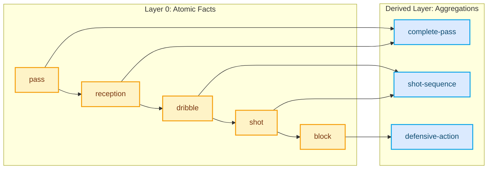
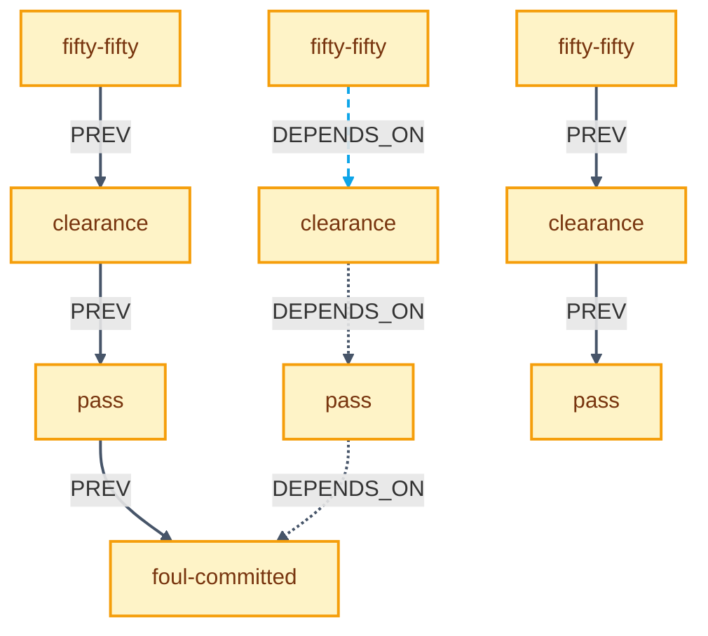
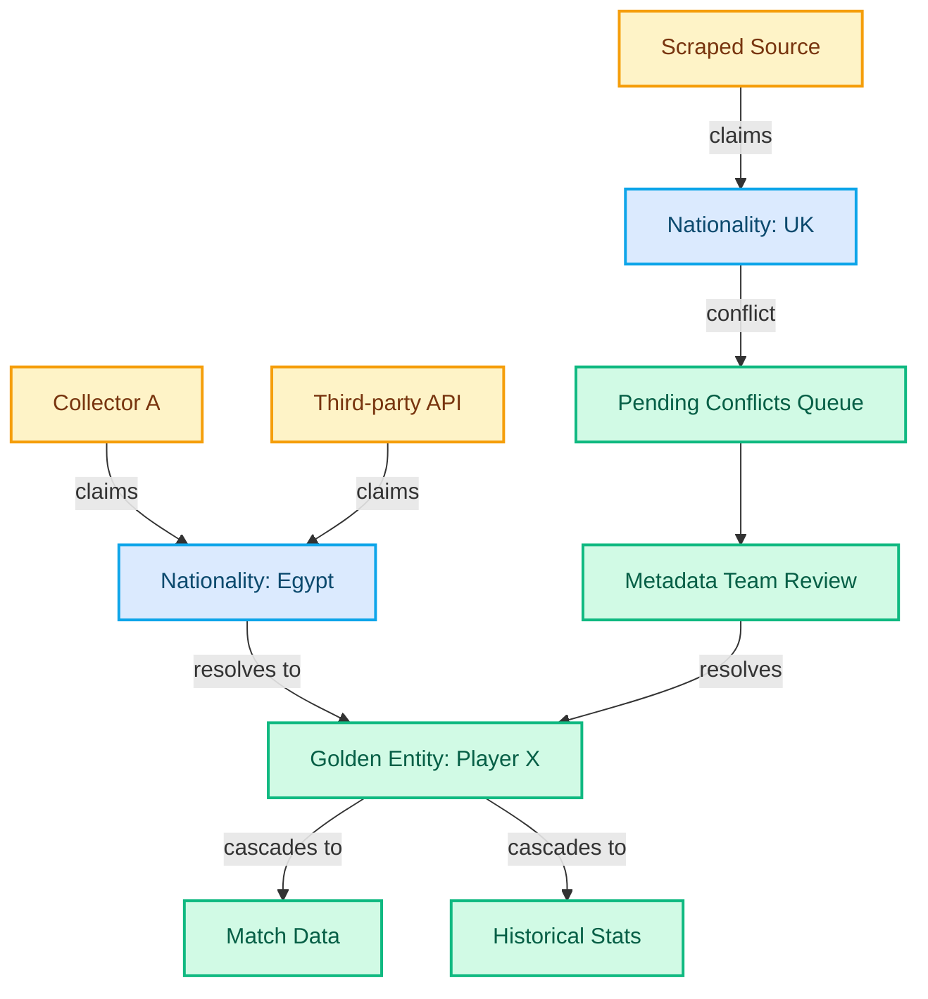

import Button from '../../components/Button.astro';
import Badge from '../../components/Badge.astro';
import Heading from '../../components/typography/Heading.astro';
import Body from '../../components/typography/Body.astro';

<div class="max-w-4xl mx-auto px-4 md:px-6 py-20">
  {/* Hero Section */}
  <div class="mb-16">
    <Button variant="secondary" href="/portfolio" class="mb-8">
      ← Back to Portfolio
    </Button>

    <Heading level={1} as="h1" class="mb-4"><span>Statsbomb Real Time Data Collection System</span></Heading>
    <Body size="lg" as="p" class="text-neutral mb-6 leading-normal">
      How architectural separation enabled scaling from 100 to 1000+ collectors, expanding
      to American football with zero engineering bottleneck.
    </Body>

    <div class="flex flex-wrap gap-2 mb-4">
      <Badge variant="skill">JavaScript</Badge>
      <Badge variant="skill">Ramda</Badge>
      <Badge variant="skill">Kafka</Badge>
      <Badge variant="skill">DSL Design</Badge>
    </div>

    <Body size="sm" as="div" class="text-neutral">
      Timeline: 2018-2022 • Led engineering team of 20 in Cairo
    </Body>
  </div>

  <hr class="border-neutral-light my-16" />

  {/* Problem Section */}
  <section class="mb-16">
    <Heading level={2} as="h2" class="mb-6"><span>Problem: Manual Collection Doesn't Scale</span></Heading>

    <div class="prose prose-lg max-w-none">
      <Body size="base" as="p" class="mb-6 leading-relaxed">
        How do you collect 90-minute matches when collectors need 16 hours per match?
        At Statsbomb, we built the most detailed sports analytics data. Each match meant
        trained analysts watching video feeds to capture 3000+ events: passes, shots,
        defensive actions, positioning data.
      </Body>

      <Body size="base" as="p" class="mb-6 leading-relaxed">
        Years of daily conversations with collectors meant I knew all 1000+ of them—their workflows,
        friction points, patterns—better than operations or HR captured in metrics. They needed keyboard
        flows that built muscle memory, contextual mappings that reduced decision-making load, and
        collaboration patterns that eliminated rework. The existing approach—2 collectors per match,
        each following a team—looked redundant. It was duplicated effort.
      </Body>

      <Body size="base" as="p" class="mb-6 leading-relaxed">
        Event storming sessions mapped the domain: information, collection, operations, media,
        aggregation. One insight stood out: arbitrary aggregation from atomic facts. Individual
        passes and carries were atomic events, but multiple carries in sequence became a
        "possession"—a higher-level fact. The system needed to support any aggregation pattern,
        not just what we knew upfront.
      </Body>

      <Body size="base" as="p" class="mb-6 leading-relaxed">
        <strong>Metadata was different.</strong> Players, clubs, referees, stadiums—reference data that
        thousands of collectors needed but only 5 people managed. Crowd-sourced data meant conflicting
        information: same player, different spellings; same club, multiple sources. The system required
        automated golden entity resolution—5 people couldn't manually reconcile metadata for thousands
        of collectors across hundreds of matches weekly.
      </Body>

      <Body size="base" as="p" class="mb-6 leading-relaxed">
        <strong>Every sport has different rules.</strong> Soccer wasn't American football. Different
        clients wanted different granularity—some needed basic event tracking, others demanded
        positioning data, pressure metrics, or defensive line heights. Product managers couldn't
        define new collection requirements without engineering bottlenecks. Analysts waited weeks for
        tooling updates. Operations needed to scale from 100 collectors to thousands without proportional
        support staff.
      </Body>
    </div>
  </section>

  {/* Architecture Section */}
  <section class="mb-16">
    <Heading level={2} as="h2" class="mb-6"><span>Architecture: Separation as First Principle</span></Heading>

    <Body size="base" as="p" class="mb-12 leading-relaxed">
      Architecture emerges when you chase why/where users struggle, not what features they request.
    </Body>

    {/* DSL Subsection */}
    <div class="mb-12">
      <Heading level={3} as="h3" class="mb-4"><span>Domain Logic as Configuration</span></Heading>

      <div class="prose prose-lg max-w-none">
        <Body size="base" as="p" class="mb-6 leading-relaxed">
          We separated three concerns: <strong>entry validation</strong> (dataspec), <strong>sequencing logic</strong>
          (DSL), and <strong>aggregation rules</strong> (grouping DSL). Product managers wrote rules in readable
          syntax. The system compiled to execution logic.
        </Body>

        <Body size="base" as="p" class="mb-6 leading-relaxed">
          As I explained to our Head of Product: "By this we move the domain soul/logic/meaning from the
          developers mind to the hands of the domain people." Ali's response was immediate: "I understand yeah.
          It's a cool concept and v readable."
        </Body>

        <Body size="base" as="p" class="mb-4 leading-relaxed">
          <strong>Example: Soccer Possession Rules</strong>
        </Body>

```yaml
Create group start from events sequence:
  - start-pass field type is not open-play then end-pass field outcome is complete
  - ball-recovery field state is not offensive and field outcome is complete
  - fifty-fifty field outcome is won

Create group break from events:
  - pass field outcome is not complete and field type is open-play

Ensure sequence of groups: [(start | row-chain) -> (middle | break)]

Derive event complete-pass from events sequence:
  - pass then ball-recovery field outcome complete
```

        <Body size="base" as="p" class="mb-4 leading-relaxed">
          <strong>Example: American Football Drive Segmentation</strong>
        </Body>

```yaml
Create group drive-start from events sequence:
  - kickoff-return field outcome is complete
  - punt-return field outcome is complete
  - turnover-on-downs field possession-change is true

Derive event red-zone-efficiency from events sequence:
  - snap field yard-line is less-than 20 then touchdown
  - snap field yard-line is less-than 20 then field-goal field outcome is good

Ensure sequence of groups: [drive-start -> (play-action)+ -> (scoring-play | turnover | punt)]
```

        <Body size="base" as="p" class="mb-6 leading-relaxed">
          When we expanded to American football, product managers wrote new dataspecs and grouping rules.
          Zero engineering bottleneck. The DSL syntax stayed readable—a non-engineer could understand the
          domain logic without reading code.
        </Body>

        <Body size="base" as="p" class="mb-4 leading-relaxed">
          <strong>Visualizing the Data Flow</strong>
        </Body>

        <Body size="sm" as="p" class="mb-4 text-neutral">
          Domain experts don't think in code—they think in sequences. We used visual timelines to translate
          their mental models into technical architecture. This diagram shows how atomic events (Layer 0)
          flow through time, and higher-level facts derive from event patterns.
        </Body>

        <figure role="img" aria-labelledby="diagram-data-flow" class="my-8 bg-surface border border-neutral-light rounded-lg px-6 pb-6">
          <figcaption id="diagram-data-flow" class="sr-only">
            Data flow diagram showing atomic events (pass, reception, dribble, shot, block) deriving aggregated metrics (complete-pass, shot-sequence, defensive-action)
          </figcaption>



          <details class="mt-4">
            <summary class="cursor-pointer text-xs font-normal text-text-lighter hover:text-accent">Text description of relationships</summary>
            <ul class="mt-2 ml-4 text-xs font-light text-text-lighter space-y-1">
              <li>Pass event leads to reception event (temporal sequence)</li>
              <li>Reception leads to dribble, dribble leads to shot, shot leads to block (event chain)</li>
              <li>Pass and reception combine to create complete-pass metric (derived aggregation)</li>
              <li>Dribble and shot combine to create shot-sequence metric (derived aggregation)</li>
              <li>Block event creates defensive-action metric (derived aggregation)</li>
            </ul>
          </details>
        </figure>

        <Body size="sm" as="p" class="mb-6 text-neutral italic">
          Atomic events (amber/gold) capture "what happened." Derived facts (blue) represent "what it means"—
          computed through functional transformations like teamAFacts = map(getTeamFacts(teamA), layer-0).
        </Body>
      </div>
    </div>

    {/* Event Collection Subsection */}
    <div class="mb-12">
      <Heading level={3} as="h3" class="mb-4"><span>Event Collection: Aggregation from Atomic Facts</span></Heading>

      <div class="prose prose-lg max-w-none">
        <Body size="base" as="p" class="mb-6 leading-relaxed">
          Architecture emerged from interpreting workflow friction, not transcribing requests. Breaking
          matches down by decision rather than team—something no collector explicitly asked for—increased
          correctness without additional effort. The collection experience was redesigned to be valid by
          default: computer vision assisted input, contextual keyboard mappings reduced cognitive load,
          and linting caught 99% of errors automatically.
        </Body>

        <Body size="base" as="p" class="mb-6 leading-relaxed">
          This shifted validation to prevention. Collectors focused on judgment over correction—handling
          the 1% edge cases where human expertise mattered (event type conflicts, judgment calls on data
          points) rather than catching preventable mistakes. Systems designed for human capability let
          practitioners work within their actual limits, not aspirational ones.
        </Body>

        <Body size="base" as="p" class="mb-6 leading-relaxed">
          The technical architecture separated collection rules from execution logic. We built a DSL that
          let product managers define sports rules without engineering involvement. The system treated
          each sport's requirements as configuration, not code. When new sports arrived or client needs
          changed, updates became data changes instead of application rewrites.
        </Body>

        <Body size="base" as="p" class="mb-6 leading-relaxed">
          Making illegal states unrepresentable meant the system rejected invalid data by design.
          Prevention, not validation. Operations scaled from 100 collectors to thousands without
          proportional support staff.
        </Body>

        <Body size="base" as="p" class="mb-4 leading-relaxed">
          <strong>Beyond Simple Sequences: Event Dependency Graphs</strong>
        </Body>

        <Body size="sm" as="p" class="mb-4 text-neutral">
          Events don't just flow sequentially—they form directed acyclic graphs. A foul-committed event
          might depend on a previous clearance, which itself connects to atomic pass events. The system
          modeled both temporal relationships (PREV/NEXT) and logical dependencies (DEPENDS_ON).
        </Body>

        <figure role="img" aria-labelledby="diagram-event-dependency" class="my-8 bg-surface border border-neutral-light rounded-lg px-6 pb-6">
          <figcaption id="diagram-event-dependency" class="sr-only">
            Event dependency graph showing temporal relationships (solid lines) and logical dependencies (dashed lines) between football events
          </figcaption>



          <details class="mt-4">
            <summary class="cursor-pointer text-xs font-normal text-text-lighter hover:text-accent">Text description of relationships</summary>
            <ul class="mt-2 ml-4 text-xs font-light text-text-lighter space-y-1">
              <li><strong>Temporal flow (PREV):</strong> fifty-fifty → clearance → pass → foul-committed (sequence 1)</li>
              <li><strong>Logical dependency (DEPENDS_ON):</strong> fifty-fifty depends on clearance depends on pass (sequence 2)</li>
              <li><strong>Temporal flow (PREV):</strong> fifty-fifty → clearance → pass (sequence 3)</li>
              <li>Solid lines represent temporal order ("what happened next")</li>
              <li>Dashed lines represent logical dependencies ("what this derives from")</li>
            </ul>
          </details>
        </figure>

        <Body size="sm" as="p" class="mb-6 text-neutral italic">
          Solid lines show temporal flow (what happened next). Dashed lines show logical dependencies
          (what this event derives from). This graph structure let us model complex game situations
          beyond simple timelines.
        </Body>
      </div>
    </div>

    {/* Metadata Management Subsection */}
    <div class="mb-8">
      <Heading level={3} as="h3" class="mb-4"><span>Metadata Management: Automated Entity Resolution</span></Heading>

      <div class="prose prose-lg max-w-none">
        <Body size="base" as="p" class="mb-6 leading-relaxed">
          The metadata challenge required different architectural thinking. With thousands of collectors
          crowd-sourcing player, club, and referee data across multiple sources, a 5-person team couldn't
          manually reconcile conflicts—same entity, different spellings; different sources, conflicting
          information. The system needed to resolve golden entities automatically.
        </Body>

        <Body size="base" as="p" class="mb-6 leading-relaxed">
          Rather than key-value pairs, metadata became <strong>claims from actors</strong> with provenance
          (who), confidence (reliability), and temporality (when). Each claim carried its source context.
          When multiple sources asserted conflicting facts, the graph structure made conflicts explicit
          and queryable.
        </Body>

        <Body size="sm" as="p" class="mb-4 text-neutral">
          The 5-person metadata team's workflow: query for pending conflicts → review side-by-side with
          full context → resolve once → system cascades to all dependent data.
        </Body>

        <figure role="img" aria-labelledby="diagram-metadata-claims" class="my-8 bg-surface border border-neutral-light rounded-lg px-6 pb-6">
          <figcaption id="diagram-metadata-claims" class="sr-only">
            Metadata claims flow showing data sources (collectors, scrapers, APIs) submitting claims that resolve into golden entities with automatic conflict resolution
          </figcaption>



          <details class="mt-4">
            <summary class="cursor-pointer text-xs font-normal text-text-lighter hover:text-accent">Text description of relationships</summary>
            <ul class="mt-2 ml-4 text-xs font-light text-text-lighter space-y-1">
              <li><strong>Data sources (amber):</strong> Collector A, Scraped Source, and Third-party API submit nationality claims</li>
              <li><strong>Claims (blue):</strong> "Nationality: Egypt" and "Nationality: UK" represent conflicting data</li>
              <li><strong>Conflict resolution:</strong> Conflicting claim (Nationality: UK) routes to Pending Conflicts Queue</li>
              <li><strong>System nodes (emerald):</strong> Metadata Team Review resolves conflicts and updates Golden Entity</li>
              <li><strong>Cascade:</strong> Golden Entity (Player X) automatically updates dependent systems (Match Data, Historical Stats)</li>
              <li>Agreed claims resolve directly to golden entity; conflicts require human review</li>
            </ul>
          </details>
        </figure>

        <Body size="sm" as="p" class="mb-6 text-neutral italic">
          Claims from data sources (amber) flow into the system. Conflicts (blue) route to a queue. The metadata
          team (emerald) resolves ambiguity. Golden entities cascade updates to dependent systems automatically.
        </Body>

        <Body size="base" as="p" class="mb-6 leading-relaxed">
          The same principle as event collection: shift validation to prevention, let humans focus on
          judgment over correction. The system prevented duplicate entities by design, caught conflicts
          automatically, and escalated true ambiguity. The 5-person team focused on the 1-2% of ambiguous
          cases requiring domain expertise (is "FC Barcelona" the same as "Barcelona FC"? yes; but
          "Manchester United" vs "Manchester City"? no).
        </Body>

        <Body size="base" as="p" class="mb-6 leading-relaxed">
          Architecture as multiplier, not bottleneck: 5 people supporting thousands through claims-based
          systems designed for small teams at massive scale.
        </Body>
      </div>
    </div>
  </section>

  {/* Impact Section */}
  <section class="mb-16">
    <Heading level={2} as="h2" class="mb-6"><span>Impact: From Bottleneck to Multiplier</span></Heading>

    <div class="prose prose-lg max-w-none">
      <Body size="base" as="p" class="mb-8 leading-relaxed italic">
        Design for the 80% common case; production iteration reveals the 20% edge cases.
      </Body>

      <Body size="base" as="p" class="mb-4 leading-relaxed">
        <strong>Quantitative Results</strong>
      </Body>

      <Body size="base" as="p" class="mb-6 leading-relaxed">
        <strong>75% reduction in manual effort:</strong> Collection time dropped from 16 hours to 4 hours
        per match through decision-based splitting (not team-based). Breaking matches by decision rather
        than team—something no collector explicitly asked for—increased correctness without additional
        effort.
      </Body>

      <Body size="base" as="p" class="mb-6 leading-relaxed">
        <strong>Zero engineering bottleneck:</strong> When we expanded to American football, product managers
        wrote new dataspecs and grouping rules. No code changes required. The DSL investment paid off when
        we hit scale and needed sport flexibility.
      </Body>

      <Body size="base" as="p" class="mb-6 leading-relaxed">
        <strong>99% error prevention:</strong> Linting and contextual validation caught errors automatically.
        Collectors focused on the 1% judgment calls where human expertise mattered—event type conflicts,
        ambiguous data points—rather than catching preventable mistakes.
      </Body>

      <Body size="base" as="p" class="mb-6 leading-relaxed">
        <strong>Non-linear leverage:</strong> Operations scaled from 100 to 1000+ collectors without
        proportional staffing increases. The architecture created leverage that only materialized at
        scale (1000+, not 100).
      </Body>

      <Body size="base" as="p" class="mb-4 leading-relaxed">
        <strong>Qualitative Changes</strong>
      </Body>

      <Body size="base" as="p" class="mb-6 leading-relaxed">
        <strong>Collector experience improved:</strong> Keyboard flows built muscle memory. Contextual
        mappings reduced cognitive load. Computer vision assisted input. The shift from correction to
        judgment meant collectors worked within their actual capabilities, not aspirational ones. Systems
        designed for human constraints, not against them.
      </Body>

      <Body size="base" as="p" class="mb-6 leading-relaxed">
        <strong>Client customization became self-service:</strong> Different granularity requirements—basic
        event tracking or advanced positioning data—handled through configuration. Clients could define
        custom aggregations without engineering involvement. The DSL syntax stayed readable enough that
        domain experts could understand the logic.
      </Body>

      <Body size="base" as="p" class="mb-6 leading-relaxed">
        <strong>Metadata team stayed small despite 10x growth:</strong> The claims-based architecture with
        automated conflict detection meant the 5-person team queried pending conflicts, reviewed side-by-side,
        resolved once, and the system cascaded updates. They focused on the 1-2% of ambiguous cases requiring
        domain expertise.
      </Body>

      <Body size="base" as="p" class="mb-6 leading-relaxed">
        <strong>The leverage principle:</strong> Small teams achieve massive scale when architecture is
        designed around human constraints. Separation of rules from execution creates non-linear leverage—but
        only at scale. The same patterns that feel like over-engineering at 100 collectors become essential
        at 1000+.
      </Body>
    </div>
  </section>

  {/* Lessons Section */}
  <section class="mb-16">
    <Heading level={2} as="h2" class="mb-6"><span>Lessons: What Worked and What I'd Change</span></Heading>

    <div class="prose prose-lg max-w-none">
      <Body size="base" as="p" class="mb-4 leading-relaxed">
        <strong>What Worked: Validation Through 4 Years</strong>
      </Body>

      <Body size="base" as="p" class="mb-6 leading-relaxed">
        The core approach held from soccer through American football expansion. Three principles proven
        in production:
      </Body>

      <Body size="base" as="p" class="mb-4 leading-relaxed pl-6">
        <strong>1. Architecture emerges when you chase why/where users struggle, not what features they request.</strong>
      </Body>

      <Body size="base" as="p" class="mb-6 leading-relaxed pl-6">
        Breaking matches by decision (not team) came from observing collector friction, not explicit
        requests. The best insights came from watching where people slowed down, what made them hesitate,
        where they needed workarounds—patterns no feature request would reveal.
      </Body>

      <Body size="base" as="p" class="mb-4 leading-relaxed pl-6">
        <strong>2. Separation of rules from execution creates non-linear leverage at scale.</strong>
      </Body>

      <Body size="base" as="p" class="mb-6 leading-relaxed pl-6">
        The DSL investment paid off when we hit 1000+ collectors and needed American football support.
        At 100 collectors, the separation felt like over-engineering. At 1000+, it became the only path
        forward. Product managers could write new sport rules without engineering bottlenecks—exactly what
        we needed when scaling.
      </Body>

      <Body size="base" as="p" class="mb-4 leading-relaxed pl-6">
        <strong>3. Design for the 80% common case; production iteration reveals the 20% edge cases.</strong>
      </Body>

      <Body size="base" as="p" class="mb-6 leading-relaxed pl-6">
        We didn't predict every aggregation pattern upfront—we built the system to handle arbitrary patterns
        as they emerged. The DSL syntax was flexible enough that new requirements became configuration
        changes, not architecture rewrites. This prevented premature optimization while staying adaptable.
      </Body>

      <Body size="base" as="p" class="mb-4 leading-relaxed">
        <strong>What I'd Change</strong>
      </Body>

      <Body size="base" as="p" class="mb-6 leading-relaxed">
        <strong>Event storming sooner.</strong> We did domain modeling 6 months in—I'd start Day 1 next time.
        Domain modeling before architecture prevents wrong abstractions. Understanding bounded contexts
        (information, collection, operations, media, aggregation) shaped every technical decision afterward.
        The earlier you map the domain with experts, the fewer wrong turns you take in implementation.
      </Body>

      <Body size="base" as="p" class="mb-6 leading-relaxed">
        That said, nothing major to the separation principle itself. It held under production load for
        4 years. The approach—listen for friction, separate rules from execution, design for 80% and iterate
        for 20%—proved resilient across sports, client needs, and scale.
      </Body>

      <Body size="base" as="p" class="mb-4 leading-relaxed">
        <strong>When to Apply These Principles</strong>
      </Body>

      <Body size="base" as="p" class="mb-6 leading-relaxed">
        <strong>Scale threshold matters:</strong> Separation creates leverage at 1000+, not 100. Don't
        over-engineer for small scale. If you're at 50 users with stable requirements, build directly.
        If you're projecting 10x growth with variant needs, invest in separation early.
      </Body>

      <Body size="base" as="p" class="mb-6 leading-relaxed">
        <strong>Human-in-the-loop domains:</strong> When experts have tacit knowledge worth capturing in
        systems—sports analytics, medical diagnosis, legal review. These domains benefit from DSLs that
        let domain experts express rules without coding. The more complex the domain expertise, the more
        value in externalizing logic as configuration.
      </Body>

      <Body size="base" as="p" class="mb-6 leading-relaxed">
        <strong>Multi-tenant/multi-variant requirements:</strong> When configuration beats code—multiple
        sports, client customization needs, regional variations. If every customer wants slightly different
        behavior, separation prevents maintaining N codebases. One system, many configurations.
      </Body>
    </div>
  </section>

  <hr class="border-neutral-light my-16" />

  {/* Footer Navigation */}
  <div class="flex justify-between items-center">
    <Button variant="secondary" href="/portfolio">
      ← Back to Portfolio
    </Button>
    <Button variant="primary" href="/contact">
      Discuss Your Project →
    </Button>
  </div>
</div>
